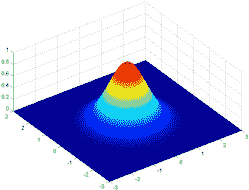
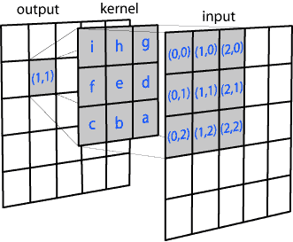
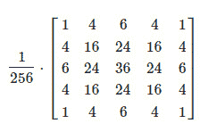
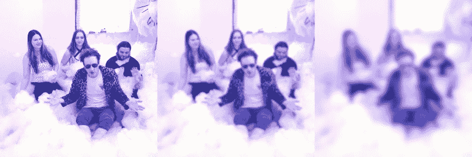

# 高斯模糊到底是什么？

> 原文：<https://hackaday.com/2021/07/21/what-exactly-is-a-gaussian-blur/>

模糊是数码编辑照片和视频时常用的视觉效果。这些领域中最常用的模糊之一是高斯模糊。您可能已经使用这个工具数千次，但从未给予它更多的思考。毕竟，它做得很好，确实让事情变得更加模糊。

当然，我们经常喜欢在 Hackaday 这里更深入地挖掘，所以这里是我们的速成班，讨论当你运行高斯模糊操作时会发生什么。

## 是数学！都是数学。

A 2D Gaussian distribution shown in a 3D plot. Note the higher values towards the center, and growing smaller towards the outside in a bell curve shape.

数字图像实际上只是许多数字，所以我们可以用数学方法处理它们。构成典型数字彩色图像的每个像素都有三个值——红、绿、蓝亮度。当然，灰度图像每个像素只有一个值，代表从黑到白的亮度，中间是灰色。

不管图像是彩色的还是灰度的，高斯模糊的基本原理是一样的。我们希望模糊的图像中的每个像素都被独立考虑，其值根据自己的值和周围的值而变化，这是基于一个称为*内核*的过滤矩阵。

内核由遵循高斯分布(也称为正态分布或钟形曲线)的矩形数字数组组成。

This diagram shows the manner in which each pixel is processed. For a 3×3 kernel, the pixel of interest and all directly surrounding pixels are sampled. The kernel is then used to generate a new output pixel value based on a weighted average of the sampled pixels based on the Gaussian distribution.

我们的矩形内核由中间较高的值组成，并向方形数组的外部边缘下降，就像二维钟形曲线的高度。内核对应于我们在模糊每个像素时考虑的像素数量。较大的内核将模糊扩展到更宽的区域，因为每个像素都被其周围的更多像素修改。

对于要进行模糊操作的每个像素，在感兴趣的像素本身周围取一个等于内核大小的矩形部分。这些周围的像素值用于根据内核本身的高斯分布计算原始像素新值的加权平均值。

A 5×5 Gaussian kernel. Note the external factor, which ensures that the total values all add up to 1\. This avoids adding any intensity to the image, solely average the pixels without otherwise changing their intensity.

由于这种分布，中心像素的原始值具有最高的权重，因此它不会完全抹杀图像。对新像素具有次高影响的紧邻像素等等。这种局部平均消除了像素值，这就是模糊。

边缘情况也很简单。在对边缘像素进行采样的情况下，其他不存在的周围像素或者被赋予与其最近邻居相同的值，或者被赋予与采样区域中与其镜像相反的像素相匹配的值。

对要模糊的原始图像中的每个像素运行相同的计算，最终输出图像由通过该过程计算的像素值组成。对于灰度图像，就是这么简单。彩色图像也可以用同样的方法，分别计算每个像素的红色、绿色和蓝色值的模糊度。或者，您可以在其他颜色空间中指定[像素值，并在那里平滑它们。](https://hackaday.com/2018/03/30/color-spaces-the-model-at-the-end-of-the-rainbow/)

这里我们看到一个原始图像，以及一个使用核大小为 3 和核大小为 10 的高斯模糊过滤的版本。请注意，随着内核大小的增加，模糊也在增加。平均中包含的像素越多，平滑程度越高。

当然，较大的图像需要更多的计算来处理更多的像素，较大的内核大小对每个感兴趣的像素采样更多的周围像素，因此可能需要更长的计算时间。然而，在现代计算机上，即使是模糊内核大小巨大的高分辨率图像也可以在眨眼之间完成。然而，通常情况下，使用大于 50 左右的内核大小是不常见的，因为到那时事物通常已经非常模糊了。

高斯模糊是简单数学在图像处理中强大应用的一个很好的例子。现在你知道它是如何工作的了！