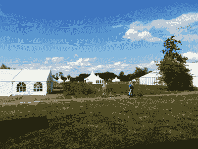
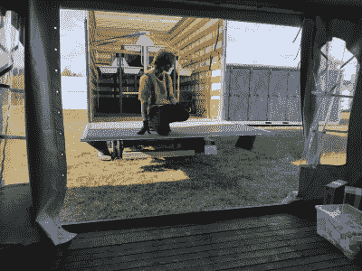

# 什么进入了黑客阵营

> 原文：<https://hackaday.com/2022/08/10/what-goes-into-a-hacker-camp/>

Hackaday 的长期读者会知道我们参加了很多活动，包括黑客夏令营。今年在欧洲这里有两个大事件，英国电磁场，和荷兰 MCH，或者可能包含黑客。这些活动是由社区内的志愿者组织的，作为妇幼保健机构的一部分，我注意到他们需要司机进行场外物流。我有在欧洲驾驶中型卡车的执照，所以看起来非常合适。在第一个成立日的早些时候，我前往荷兰城市乌得勒支，发现自己坐在一辆大型大众箱式货车的方向盘后面。我短暂的卡车司机生涯开始了！

## 梦的空场

The tents stand in isolation at the end of day one.

荷兰是一个相对较小的国家，位于 Zeewolde 的妇幼保健站大致位于其中心，所以虽然交通可能很拥挤，但按照美国甚至英国的标准，距离并不算远。然而，有各种各样的货物在等着我和我的司机同伴，还有一些障碍，如今年最热的日子和愤怒的荷兰农民封锁道路。如果你对一个大型黑客营地背后的后勤感兴趣，那么我们的旅程提供了一种洞察力，也许在这个领域游荡并不能完全传递这种洞察力。

第一天到达现场可以让我们看到有多少基础设施来自专业承包商，而不是由黑客提供的。来自 marquee 公司的铰接式卡车正在卸下主帐篷，他们的工作人员在创纪录的时间内熟练地组装它们。厕所和淋浴间作为独立的吊钩提升集装箱单元到达，但更多的承包商提供围栏或桌椅。我可以将电力基础设施添加到这个列表中，但由于我被告知在另一个活动中出现延迟，这在第一天没有在现场。

## 黑客移动一些令人惊讶的东西

My Hackaday colleague Arya Voronova pausing for a moment during unloading.

在所有这些繁重的工作中，留给场外运输人员的是什么？仍然有一些营地基础设施的负载，例如我从这个国家遥远的东南角带来了几车洗手槽。

除此之外，更多的是在黑客营中，你在其他活动中找不到的东西。我的司机同事从荷兰黑客空间搬了一堆网络基础设施，从赫尔曼德的[家用电脑博物馆](https://www.homecomputermuseum.nl)搬了一堆珍贵的逆向计算硬件，而我则转移了不止一批令人难以置信的视觉糖果，deco 团队为此付出了大量工作。从喷烟的龙到水晶灯饰等等，这些都是在我们的社区内，在荷兰的家庭和黑客空间里组装的。

随着越来越多的人来帮助组装营地，我们的小团队成长起来，更多的货车被租用，到了我们可以形成一个整洁的小运输业务，如果我们有足够的鲁莽这样做。在拆除所要求的更有限的时间内，额外的人手确实非常受欢迎，在此期间，我非常不幸地在一条被那些农民的成堆粪便堵塞的高速公路上呆了半天。

如果你曾经去过黑客训练营，想知道我坐在一辆大众箱式货车的环场座位上，所有的东西是如何组合在一起的，我希望我已经给了你一些想法。承包商和志愿者做了大量的工作来创建这些活动，我会告诉你们中的任何人，如果你想延长你的黑客营体验，就在创建和拆除期间做一次志愿者。这份工作可能会很热很辛苦，但作为结识朋友的一种方式，它是首屈一指的。也许下一次我会回到方向盘后面。