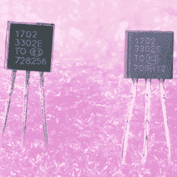

# 假冒零件有什么好处？信不信由你，也许可以退款

> 原文：<https://hackaday.com/2018/11/10/what-good-are-counterfeit-parts-believe-it-or-not-maybe-a-refund/>

[Charles Ouweland]从全球速卖通购买了一些零件，并注意到他的一些零件上的德州仪器徽标根本不是德州仪器的徽标，它只是某种抽象的形状，与该徽标有些相似。出于怀疑和好奇，他决定仔细看看他订购的 MCP1702 3.3v LDO 稳压器。测试显示它们是性能很差的假货。

Left: counterfeit part. Right: genuine Microchip MCP1702-3302

从包装上看，假冒的 MCP1702 与 Microchip 的正品零件在标记上有一些表面上的差异，但没有明显的不同。为了最终测试这些设备，[查尔斯]查阅了微芯片的数据表。它指出，器件的压差应通过调节器在短脉冲中提供最大额定 250 mA 来测量，以避免器件发热带来的任何并发症。在用一个 555 定时器设置了一个合适的测试电路来产生低占空比激活脉冲后，[Charles]发现假冒的部件不符合微芯片的规格。虽然可疑单元输出 3.3 V，但激活后输出振荡严重，压差为 1.2 V，远高于器件的典型压差 525 mV，甚至高于最大值 725 mV。他的结论？这些零件在适当的条件下是可以使用的，但它们显然是赝品。

当一个人收到假冒零件时，通常的办法是将它们倒入零件箱(或垃圾桶)，也许是为了在未来不那么倒霉，但[Charles]决定提交退款请求，让他有点意外的是，速卖通很快批准了对不合格零件的退款。

虽然退款是适当的，但[Charles]似乎将迅速退款理解为经销商承认有罪。获得假冒零件退款是最好的结果，是不法行为的证据，还是仅仅表明低价值退款申请更容易获得批准？你可以自己判断，但至少，[查尔斯]提醒我们，假零件可能对一些意想不到的事情有用:退款。