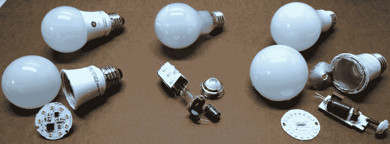
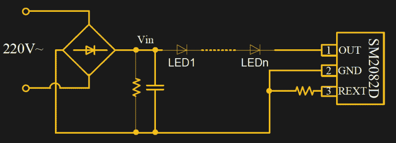
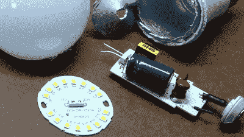
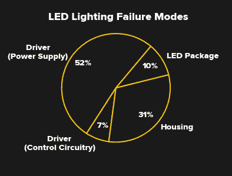
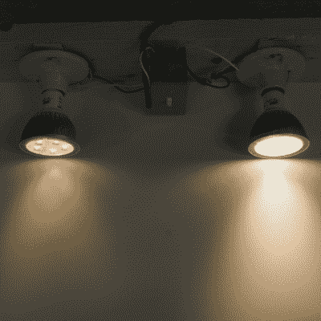
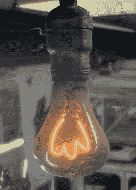

# 10 万小时的 LED 灯泡后来怎么样了？

> 原文：<https://hackaday.com/2019/02/05/what-happened-to-the-100000-hour-led-bulbs/>

LED 照明的早期采用者会记得印在盒子上的 50，000 小时甚至 100，000 小时的寿命额定值。但在最近一次去五金店时，我发现最长的广告寿命是 25000 小时。其他人声称只有 7500 或 15000 小时。而且没错，这些都是 Cree 和 GE 的名牌灯泡。

那么，那些 100，000 小时的住宅 LED 灯泡发生了什么？最初的估计是否过于乐观？这都是营销炒作吗？或者，我们对 LED 老化的了解还不足以预测灯泡的实际使用寿命吗？

我对这些问题进行了测试。休息之后，请和我一起了解白炽灯泡时代灯泡卡特尔的一些背景知识(不是开玩笑，卡特尔控制了你的灯泡的寿命)，以及一些现代 led 灯泡的破坏，看看为什么寿命比最初的 LED 替代品浪潮低得多。

## 灯泡的鬼魂成群结队地走过

如果不提到 Phoebus 卡特尔，任何关于灯泡寿命的讨论都是不完整的。Phoebus 卡特尔是一个国际组织，成立于 1924 年，由世界领先的灯泡制造商组成，目的是操纵灯泡市场。正如 Markus Krajewski 在[“伟大的灯泡阴谋”](https://spectrum.ieee.org/tech-history/dawn-of-electronics/the-great-lightbulb-conspiracy)中所讨论的，卡特尔将领土分配给成员公司，限制生产，并规定灯泡寿命缩短 1000 小时。以前的灯泡已经燃烧了 1500-2500 个小时。据称是为了提高质量、效率和光输出，新的 1000 小时限制也导致了更多的灯泡销售。存档文件显示，为了设计能持续 1000 小时或更长时间的灯泡，进行了大量的研究。受到打击的不仅仅是家庭照明:原本使用三组电池的手电筒灯泡被减少到两个，并提议将它们的寿命限制在一组。再次，亮度增加被吹捧为原因。然而，最后一步，将灯泡寿命减半，只能增加 11%-16%的亮度，而销量却翻了一番。这是为了卖出更多的灯泡，赚更多的钱。

在通用电气专利组合的支持下，卡特尔通过罚款制度强制执行生产配额和灯泡寿命。对每个生产商的灯泡进行了测试，并对持续时间明显短于或长于 1000 小时的灯泡进行了处罚。福玻斯继续对市场施加影响，直到第二次世界大战结束其统治。该卡特尔经常被援引为有计划淘汰的首批案例之一:设计出寿命被人为缩短的产品。2010 年的纪录片[《电灯泡阴谋》(The Light Bulb 阴谋)](https://www.youtube.com/watch?v=kdHIqa53-tY)探讨了卡特尔的历史，以及一些更近期的有计划淘汰的例子。我想知道阴谋家们会如何看待据说能持续 10 万小时的灯泡？甚至 7500？

五金店灯光区的一个较低的架子上，几个孤零零的白炽灯泡正等待着一些勒德派的消费者。拿起一个盒子，我看了看额定寿命:1000 小时。

## 测量灯泡的寿命

这个盒子对于 1000 小时的使用寿命到底意味着什么？这是灯泡的平均额定寿命(ARL)——它是灯泡初始样本的 50%失效的时间长度(缩写为 B [50] )。“失败”的意思取决于灯泡的类型；稍后我们将对此进行更深入的探讨。B [50] 的定义揭示了一个普遍的误解，即灯泡将持续其额定寿命。实际上，只有一半能持续那么长时间，尽管这个评级不能告诉你任何关于中位寿命内故障分布的信息。

制造商根据每天使用灯泡的特定小时数(通常为 3 小时)，使用这些 ARL 值来预测灯泡的使用寿命。与白炽灯泡相比，LED 灯泡在电源循环中的磨损更小，因此转换只是一个除法:使用年限= ARL/(3*365)。例如，根据这种计算，一套 100，000 小时灯泡中的一半在 91 年后仍将继续使用。但是这个简单的指标并不能说明全部情况。LED 灯泡的故障机制很复杂，与众所周知的白炽灯有着本质的不同。为了了解更多，我们需要阐明灯泡的内部工作原理。

在离开商店之前，我往购物车里扔了几个灯泡，这样我就能直接看到里面有什么了。

## 灯泡里有什么？让我们撕开一些！

Left-to-right: Teardown of GE 7,500 hour “Basic”, GE 15,000 hour “Classic”, and 25,000-hour Cree A19 LED bulbs.

LED 灯泡不仅仅是 LED。我们家中的插座实际上是相当脏的交流电源。LED 需要干净、恒定电流的 DC 源，因此灯泡内部的电路必须对输入的交流电进行整流和过滤，然后限制流向 LED 封装的电流。为了了解这是如何做到的，我解剖了三种不同的 A19 风格灯泡:通用电气“基本”和“经典”系列各一种(7500 和 15000 小时)，以及一种寿命为 25000 小时的 Cree 型号。

### 通用电气基本 A19 灯泡(广告 7500 小时)

GE Basic A19 Bulb uses a circuit straight from the SM2082D datasheet.

这款 GE 灯泡有一个塑料圆顶，覆盖在一个圆形铝制 PCB 上，PCB 上有八个 LED 封装和驱动电子设备。该驱动器由一个 MB10F 桥式整流器、一个额定温度为 105°C 的电解电容和一个 SM2082D 线性恒流驱动器组成。PCB 上有三个电阻:一个在灯泡关闭时从电容中释放电荷，另外两个将 SM2082D 电流设置为 54 mA。事实上，该电路看起来像是直接取自 SM2082D 数据手册。

当以 50 mA 驱动时，7 个 3.5 x 2.8 mm LED 封装显示约 18 V 的正向压降，这表明它们包含 6 个串联的 LED 芯片。板上一个 LED 显示压降 9 V，所以它只有三个 LED 芯片。所有的发光二极管，总共 45 个芯片，串联连接，降低约 135 伏。

### 通用电气经典 A19 灯泡(15，000 小时广告)

 他们说经典，就是这个意思。这种灯泡就像白炽灯泡一样装在玻璃封套里，而且像那些旧灯泡一样，玻璃很容易用圆头锤拿掉。代替钨丝的是折叠成一个矮胖方尖碑的铝制印刷电路板。电路板上串联了 16 个 3.5 x 2.8 mm LED 封装，每个封装在 50 mA 时的正向电压约为 9 V。因此，这个版本有 48 个 LED 芯片，而基本灯泡有 45 个，只是它们的封装数量增加了一倍——这有利于保持 LED 的冷却。

这种寿命更长的灯泡的另一个不同之处在于，驱动电子器件没有热耦合到 LEDs 它们隐藏在螺旋底座中的一个单独的 PCB 上。这可以防止其余组件被 led 加热。驱动器 PCB 上有一个桥式整流器、一个额定温度为 105 C 的电解电容和一个 SOIC-8 IC。有趣的是，这种灯泡还包含一个金属氧化物变阻器，用于瞬态抑制。虽然我无法确定标有“BYSACT”的驱动器 IC 是什么，但 PCB 上没有任何电感元件表明这是另一个线性电源。

### Cree A19 灯泡(25，000 小时广告)

Cree 灯泡有一个像 GE 基本款一样的扩散塑料圆顶。在内部，一个更大的铝制 PCB 容纳(16)个 3.5 x 2.8 毫米 LED 封装。每个发光二极管在 50 毫安时下降约 8.5 伏，因此它们包含 3 个芯片；像 GE 经典灯泡一样，这款灯泡总共使用了 48 个 LED 晶粒。led 连接为两个并联 LED 的八个部分，因此总压降约为 68v。LED PCB 与一个厚铝制散热器相连，散热器上涂有硅树脂导热化合物。

与 GE Classic 灯泡一样，电源电子设备位于单独的 PCB 上，与 led 散热隔离。驱动器 IC 是 SOT23-5 封装，上面标有“SaAOC ”,但变压器和结实的肖特基二极管表明这是一个开关模式电源。开关输出端的滤波电容是铝电解电容，额定温度为 130°c。

没什么可继续的，但是从这三个灯泡的设计中我们能得出什么结论呢？这有助于考虑他们通常是如何失败的，以及哪些因素会影响他们的寿命。

## led 比其他组件“耐用”

 由于 LED 灯泡包含许多零件，人们很自然会问哪些零件可能会导致故障。美国能源部(DoE)的[固态照明项目](https://www.energy.gov/eere/ssl/solid-state-lighting)支持 LED 技术的研发，他们的网站包含大量关于 LED 照明系统的数据。他们的[寿命和可靠性数据表](https://www1.eere.energy.gov/buildings/publications/pdfs/ssl/life-reliability_fact-sheet.pdf)包含了超过 3400 万小时运行的 5400 个户外灯的故障率数据。有趣的是，led 本身只占故障的 10%；另一方面，驱动电路负责几乎 60%的时间。其余的故障是由于外壳问题，这可能不适用于室内使用的灯泡。该数据表明，至少对于灾难性故障(灯停止发光)，延长寿命意味着改善电源。

## 找到最薄弱的环节:组件寿命

灯泡(或电源)的寿命不会比其任何组件的寿命更长。在灯泡内部发现的组件中，有两个明显是寿命限制因素:半导体和电解电容器。这两个部件都有故障率，故障率是温度的强函数。基于阿伦尼乌斯方程的这种效应的典型模型预测，至少在有限的范围内，温度每降低 10 摄氏度，寿命就会增加一倍。

这两种寿命更长的灯泡使用两倍多的封装来承载大约与 GE Basic 灯相同数量的 LED 芯片，从而降低了各自散热器的热阻，并可能降低了它们的温度。这些灯泡还将容易发生故障的驱动电子设备安装在独立于 led 的 PCB 上，以保持冷却。最后，25，000 小时的 Cree 灯泡使用额定温度为 130 C 的电解电容器，而其他两种灯泡的电容为 105 C。对于类似的工作温度，这可以使电容器的预期寿命增加五倍。这些措施中的每一项都可能有助于延缓灯泡的灾难性故障，从而延长额定寿命。

但是当涉及到 led 本身时，除了预测灾难性故障之外，还有更多寿命评估。

## 慢慢消失

就像道格拉斯·麦克阿瑟著名台词中的士兵一样，旧的发光二极管不会死，它们只是逐渐消失。我们都知道白炽灯失灵是什么样子:前一秒还亮着；下一秒，它就不存在了(每隔一段时间，你会听到砰的一声，然后是微弱的叮当声，因为被释放的灯丝在灯泡内聚集)。撇开电源不谈，led 通常不会如此大张旗鼓地失灵。相反，随着年龄的增长，它们会逐渐失去亮度。在照明行业，这被称为流明折旧，是一种独立于我们通常认为的灾难性故障的故障模式。

事实证明，白炽灯泡的流明也会下降。到 1000 小时寿命结束时，产量通常会下降 10-15%，但没有人会注意到。对于 led，效果更差，随着设备老化，输出继续下降。在某种程度上，LED 不再产生足够的光来实现其最初的目的，即使它还没有“烧坏”研究表明，大多数用户不会注意到光线水平逐渐下降 30%;因此，业界定义 L [70，]输出下降到其初始水平的 70%的时间，作为测量 LED 灯泡寿命的终点。基于如何估计，这一措施通常被称为 B [50] -L [70] ，在这一点上，50%的初始灯泡样本将保持其额定输出的 70%。

## 颜色偏移会发生，但不可预测

随着磷光白光 led 的老化，还会发生其他的事情:它们会变色。美国能源部关于 [LED 灯具可靠性的报告:色偏的影响](https://www.energy.gov/sites/prod/files/2017/04/f34/lsrc_colorshift_apr2017.pdf)定义了在 LED 灯中观察到的四种色偏(蓝色、黄色、红色和绿色)，尽管黄色色偏在高功率白光 LED 中占主导地位。这种光输出的逐渐变黄是由磷光体开裂、分层和热效应造成的，因为磷光体的温度可能超过 LED 结的温度 30°C–50°C，建模和预测 LED 的色移是一项艰巨的任务，所有机制尚未完全了解。因此，还没有建立加速测试或预测颜色稳定性随时间变化的标准。

最终，这些影响会像灾难性故障一样损害灯泡的功能。考虑到流明损耗和颜色偏移最终会导致 led 失效，制造商设计具有很长电寿命的灯泡可能没有意义。我们在当前灯泡上看到的寿命额定值的降低可能只是反映了对现有 LED 技术随着时间推移的实际性能的更好了解。

## 厨房流明贬值

Heavily-used LED bulb (left) vs seldom-used bulb (right) after 8+ years.

我亲眼见过流明贬值和色偏。2010 年 6 月，我把厨房里的 12 个 65W 的 PAR30 白炽灯泛光灯换成了 LED 灯泡。同时，我还把另一个房间的三盏灯换成了一模一样的 LED 灯泡。这三个灯泡的用途要少得多，所以在准备这篇文章时，我从每个位置拿了一个灯泡，把它们并排放在一起，看看我是否能看出输出的不同。两个房间里的嵌入式灯具是一样的，所以我认为灯泡在打开时暴露在相似的温度下:任何差异都应该只是由于老化的影响。结果令人震惊。由于这两个灯泡在不同的房间，我从来没有看到他们并排，所以没有注意到流明贬值和颜色偏移变得多么糟糕。当然，我知道它们比我安装时更暗、更黄，但没想到会这么糟糕。

这些灯泡的广告寿命为 30，000 小时。我估计总使用时间在 15000-20000 小时。在服役的 8 年中，有一个完全失效。我没有换上与旧灯泡颜色不匹配的新灯泡(或者全部换掉)，而是让插座空着。

在五金店，我注意到新的 9 瓦 BR30 LED 灯泡，每个 5 美元。我在 2010 年购买的 PAR30s 售价 45 美元，耗电 11 瓦。快速计算表明，旧灯泡比它们所取代的白炽灯节省了三倍多的电能，并且向大气中排放的碳也少得多。它们很可能会继续燃烧 15，000 个小时，但在权衡了降级的输出和用更亮、更高效的版本替换它们的成本后，我将返回商店。

## 理解这一切

This bulb has burned for over 1 million hours.

我研究了 LED 照明的一些技术问题。当然，LED 灯泡不仅仅是寿命问题——色温和显色指数(CRI)应该是任何购买决定的考虑因素。还涉及一些更大的问题，包括经济和可持续性问题。其中一些问题在 j . b . MacKinnon 2016 年发表在《纽约客》上的文章[“l . e . d .的困境:为什么没有“持久建造”](https://www.newyorker.com/business/currency/the-l-e-d-quandary-why-theres-no-such-thing-as-built-to-last)中有所涉及。

当然，从白炽灯泡转向更高效的照明是有道理的，但也许我们一开始就不需要 10 万小时的灯泡。与照明技术的快速发展相比，即使是 7500 小时的灯泡寿命也很长。当更好、更便宜、更高效的灯泡可能在不久的将来出现时，今天购买昂贵的长寿命灯泡有意义吗？

现存最古老的白炽灯，被称为[百年灯泡(点击查看灯泡的网络摄像头)](http://www.centennialbulb.org/)，是一种昏暗的碳丝灯泡，自 1901 年以来几乎一直在燃烧——超过 100 万小时。在目前的状态下，它发出的光和现代的 4 瓦白炽灯一样多。如果我们对未来 117 年的进步有所了解，在 20 世纪初为这种“百万小时灯泡”支付额外费用有意义吗？

我刚刚在厨房安装的新的 5 美元 BR30 LED 灯泡令人惊讶地明亮和清晰:用勒克斯计测试显示照度高出 60%以上。此外，与被他们取代的老旧、低效的 LED 灯泡相比，他们节省的电费将远远超过他们自己的支出。