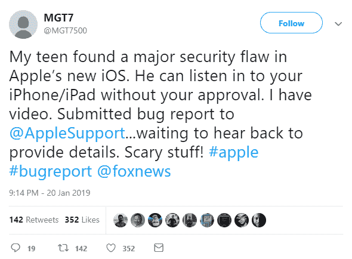

# 一个普通人发现一个巨大的安全漏洞会怎么样？

> 原文：<https://hackaday.com/2019/01/29/what-happens-when-a-regular-person-finds-a-huge-security-flaw/>

信息安全领域最大的新闻是，除了由于美国各地创纪录的低温，头套越来越受欢迎之外，leet haxors 甚至可以在你不接电话的情况下，使用 FaceTime [从你的 iPhone 上听你说话。这个漏洞有明显的安全隐患:电话*应该*只在你接电话后才打开麦克风。这有效地将任何运行 iOS 12.1 或更高版本的 iPhone 变成了一条党线。作为回应，苹果已经让 group FaceTime 离线，为本周晚些时候的软件更新做准备。](https://9to5mac.com/2019/01/28/facetime-bug-hear-audio/)

那么，这个 FaceTime bug 是如何工作的呢？其实出奇的简单。首先，与 iPhone 联系人开始 FaceTime 通话。拨打电话时，向上推送，然后轻按“添加联系人”。在添加联系人屏幕中添加您自己的电话号码。这会创建一个群组通话，其中包含您的 iPhone 的两个实例和您正在通话的人。您现在可以收听您最初呼叫的人的音频，即使他们没有选择接听电话。哑巴？是的。没有安全感？可怕地。如果你的 iPhone 在响，电话那头的人可能在偷听。

但这不是一个关于苹果如何再次失败的故事。这是一个关于这个安全漏洞是如何被发现的故事，以及一个正常人如果发现这样的事情会做些什么。

这个 bug 的第一个报告来自一个完全随机的人。仅仅九天前，Twitter 用户@MGT7500 第一次向苹果技术支持部门发布了这个 bug ,然后又在 Twitter 上发布了这个问题:

就是这样。这是负责任的披露。我们听说过一些故事，说一些随机的人在互联网上发现了安全漏洞，这些漏洞让那些管理着数万亿美元公司的人的脑袋着火了，但这里有证据，以推特的形式呈现出来。此外，[MGT7]还向苹果、福克斯新闻频道(非附属公司)、美国消费者新闻与商业频道、CNN 和 9to5Mac 发送了关于这一安全漏洞的电子邮件。直到八天后 9to5Mac 发表了这篇报道，才得到回应。

如果网上随便一个人发现了安全漏洞，他们该怎么办？这属于黑客和信息安全领域，因此最常见的建议是[请求 CVE](https://www.kb.cert.org/vuls/report/) ，联系相关方(在这种情况下，是苹果，联系他们的最佳电子邮件是本页上的第 21 个链接[，并协商漏洞将被披露的时间。这叫做](https://support.apple.com/en-us/HT201220)[责任公开](https://en.wikipedia.org/wiki/Responsible_disclosure)。你可能会想查看臭虫奖励，因为可能会有现金奖励。或者，你可以联系调查相同平台的安全研究人员，看看他们是否可以利用他们在 Twitter 上的影响力来关注这个问题。如果安全研究人员是诚实，你甚至可能成为你的发现所产生的任何论文的 PI。

The greatest security researcher this year.

网上随便一个人都不是信息安全专家。互联网上随机出现的人*只是想解决问题，*而在这种情况下【MG做了完全正确的事情:他们给苹果支持部门、[发了电子邮件，包括注册成为开发者并通过正确的渠道](https://twitter.com/MGT7500/status/1090163397788745728)。这种报告过程应该更容易、更明显，并且反应应该迅速。

在信息安全领域，我们迎来了一位新英雄。这是一个已经存在几个月的 Twitter 帐户，对亚利桑那州的大学足球有意见，并且仍然使用默认的头像。无论[MGT7]是谁，我们都要说，如果你发现了安全漏洞，他们是你应该做的最好例子:在公司页面上为安全团队找到一个电子邮件地址。给他们发邮件，然后坐下来等待。你只需要知道这些。这也与安全研究人员所建议的完全相反，这是整个社区的失败。