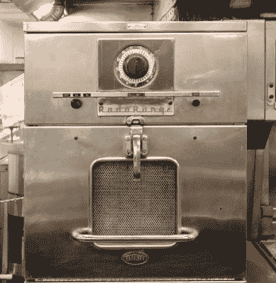
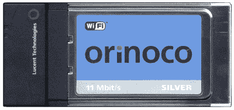

# 多出来的 1.2 千兆赫你会做什么？

> 原文：<https://hackaday.com/2020/05/07/what-will-you-do-with-an-extra-1-2-gigahertz/>

虽然我们的集体思维已经转向全球疫情，但令人耳目一新的是，在一些地区，生活仍在继续，在更正常的时期会成为新闻的事件继续发生，而它们在报道中被更紧迫的考虑所取代。

在过去的几周里，美国有一个例行公事的官僚机构在雷达下飞行，但它将对全球技术产生重大影响；美国联邦通信委员会首先提出了 T1，然后 T2 批准了 T3，在 6 GHz 频段中额外分配 1200 MHz 的频谱给 ISM 使用。这种分配过程可能会在全球其他地区重复，从而为未经许可的使用腾出另一个重要的频谱。

在实践中，这意味着将会创建一组全新的 WiFi 频道，我们都将有更多的频谱可以使用，因此值得更详细地研究一下。

## 我们把 WiFi 归功于微波炉

A Raytheon RadaRange microwave oven, on board the nuclear-powered *NS Savannah*. Acroterion / [CC BY-SA 3.0](https://commons.wikimedia.org/wiki/File:NS_Savannah_microwave_oven_MD8.jpg).

对 ISM 频段的枯燥描述，或者使用其完整术语*工业、科学和医学*，掩盖了漫长的历史和大量意想不到的频率分配，以及我们大多数人只与无线网络和一些额外协议(如 LoRa 或 UHF 遥控)相关的频谱使用。

它们的历史可以追溯到 20 世纪中期，当时它们被国际电信联盟作为频率分配而搁置，在该频率分配中可以进行无线电的非通信应用。

一个特殊的应用是射频加热，流行的 2.4 GHz 频段首次出现在微波炉的全新技术中，这反过来又来自于战时的雷达工作。事实上，雷神公司的一名员工发明了一种流行的烹饪工具。

有一系列不同的频率被保留为 ISM 波段，范围从 HF 波段到亚毫米微波，尽管(或者可能*因为*)当时几乎不存在利用这些更高频率的技术。除了微波炉，使用 ISM 频段的设备通过第一代无绳家庭电话以及无线电控制的玩具和模型进入了消费者的手中。曾经有一段时间，拥有一架模型飞机、一辆汽车、[或者甚至是一个战斗机器人](https://hackaday.com/2018/03/23/ever-wonder-how-the-bots-on-robot-wars-were-built/)，意味着在使用中的每个独立频道(通常是 27 MHz 或 40 MHz)都有一包晶体。

A Lucent Orinoco WiFi card. This card’s chipset appeared in a host of early WiFi cards. Shootthedevgru ([Public domain](https://commons.wikimedia.org/wiki/File:Orinoco_silver_pc_card.jpg)).

导致我们今天拥有 WiFi 网络的转折点出现在 1985 年，当时 FCC 放宽了规则，允许在一组指导原则内未经许可使用 ISM 频段，特别是将其用于扩频通信设备。在通过一系列专有产品开发技术之后，到了 20 世纪 90 年代，出现了 802.11 系列标准，到了 20 世纪 90 年代末，每个人都希望在他们的笔记本电脑中安装 Lucent Orinoco PCMCIA 卡。

我们现在有一系列跨越 2.4 GHz 和 5 GHz 频段的 WiFi 信道，虽然前者非常拥挤，以至于在一些建筑区已经退化，但后者现在已经成为人们经常使用的选择频段。联网设备数量的增加以及物联网设备的激增只会增加对无线带宽的需求，因此 6 GHz 频段的额外新空间只会受到欢迎。

## 为什么我们有不用的无线网络？

Olivetti’s promotional image for their Net³ DECT network card

在对新的分配欣喜若狂之前，有必要花一分钟时间看看其他选择。2.4 GHz 和 5 GHz 频段并不是唯一部署了消费者无线网络的频段，那么为什么其他频段不能填补一些空白呢？答案在于市场力量和竞争技术的复杂组合:一个有前途的产品可能会因为在市场需要它之前过早出现，或者在市场发展之后过晚出现而变得默默无闻。

DECT 是前者的一个例子，虽然我们今天知道它是一个数字无绳电话标准，但它拥有 3G 手机网络的所有特征，包括数据信道。可悲的是，它出现在 20 世纪 90 年代初，当时移动计算用户对无线网络几乎没有需求，所以它的这一方面从未有过重大用途。同时 [802.11ah](https://en.wikipedia.org/wiki/IEEE_802.11ah) 是 900 MHz ISM 频段的 WiFi 标准，提供了你可能期望无处不在的扩展范围，但它的晚到[导致它被其他技术取代](https://www.theregister.co.uk/2015/10/21/questionable_future_subghz_wifi/)。802.11ah 芯片组和模块由一些制造商生产，如果市场条件合适，可能会像 2.4 GHz WiFi 或 LoRa 一样丰富，但由于使用率低，它们仍然非常罕见。

因此， [802.11ax](https://en.wikipedia.org/wiki/List_of_WLAN_channels#6_GHz_(802.11ax)) 标准将提供的 24 个额外的 6 GHz 信道将是对现有分配的迫切需要的补充。但是仅仅因为他们在那里并不一定意味着他们会看到重要的用途。就像前面提到的 802.11ah 一样，当足够多的受支持设备被发运以允许消费者使用它时，市场可能已经采取了不同的路线。

例如，5G 移动电话的承诺之一是未来将实现普遍的高速连接。这能消除未来几年对额外 WiFi 的迫切需求吗？或者即将到来的 802.11bb 所谓的基于光的网络的 LiFi 标准怎么样？每个天花板上都安装一个便宜得多的 LED 灯泡会让 WiFi 路由器显得过时吗？有一件事是肯定的，如果你认为无线网络是板上钉钉的事，那么在接下来的几年里，你会大吃一惊。