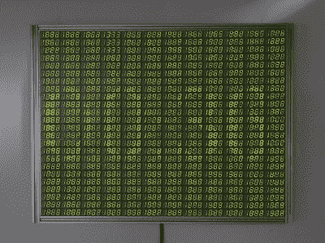

# 有什么比 7 段显示器更酷？7200 段显示器！

> 原文：<https://hackaday.com/2021/09/14/whats-cooler-than-a-7-segment-display-a-7200-segment-display/>

如果你现在环顾你的桌子，很可能你会看到一个或两个 7 段显示屏，向你显示一些重要信息，如时间或今天的天气。但是想想看，你可以用超过 1100 位数字看到多少信息，就像用[【克里斯·库姆斯(Chris Combs)】7200 段显示器一样。](https://hackaday.io/project/181483-7200-segment-1152-digit-7-seg-display)

对[Chris]来说，这个项目的启动方式与我们许多项目的启动方式相同；寻找那些太划算而不能错过的组件。只需“一两首歌外加运费”，他就自豪地拥有了两箱共 500 个模块的 7 段显示器。与其坐着用光宝贵的搁板空间，[克里斯]决定把它们变成可以挂在墙上的精美物品。

is 31fl 3733 可以产生 8 级调光 8 位 PWM，允许【Chris】以灰度显示

第一个挑战是试图以某种方式将信号发送到所有单独的段。在一台设备上运行少量显示器的解决方案是存在的，但肯定没有现成的解决方案可以支持这么多显示器。甚至连[Chris]为这个项目选择的 IS31FL3733 驱动 IC 可能的 16 个地址都不够，所以他必须发挥创意。由于担心简单地使用 i2C 多路复用器可能会产生电容问题，他选择在 Raspberry Pi 4 上运行 3 条不同的 i2C 总线，以便与所有 48 个控制器接口。

第二个挑战是如何实际连接所有东西。最终的显示屏宽 26 英寸，高 20.5 英寸，对于一块 PCB 来说太大了。相反，[Chris]选择设计一系列独立的面板，每个面板有 6 个显示模块和一个 IS31FL3733 来驱动它们。虽然多路复用安排确实为每个面板上的更多片段留下了空间，但他选择了这种安排，因为它为最终显示带来了漂亮、干净、4:3 的纵横比。

最终的结果是一个独特而美丽的作品，克里斯将其命名为“一对多”。用他的话来说，他用它来展示与自动化的必然性、机器取代人类以及其他“温暖人心的美好事物”相关的图像和艺术。休息后会有一个视频，但如果你有兴趣亲自观看展览，它将于 2021 年 9 月 3 日至 10 月 17 日在马里兰州洛克维尔的 VisArt 中央大厅画廊展出。[更多信息请访问【克里斯的】网站](https://chriscombs.net/2021/09/03/one-to-many/index.html)。

这不是[Chris]第一次以如此独特的方式使用 7 段显示器，[单击此处阅读我们去年报道过的该项目的前身](https://hackaday.com/2020/01/18/bask-in-the-glory-of-this-336-led-digit-display/)。

 [https://www.youtube.com/embed/QmcZ1bD-8gI?version=3&rel=1&showsearch=0&showinfo=1&iv_load_policy=1&fs=1&hl=en-US&autohide=2&wmode=transparent](https://www.youtube.com/embed/QmcZ1bD-8gI?version=3&rel=1&showsearch=0&showinfo=1&iv_load_policy=1&fs=1&hl=en-US&autohide=2&wmode=transparent)

