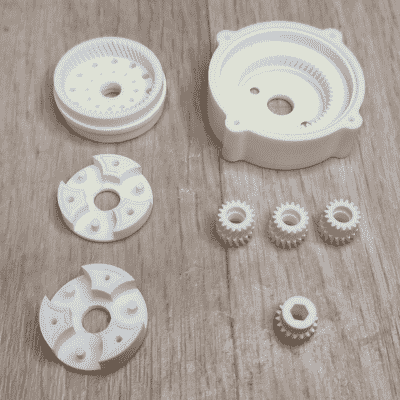

# 当 3D 打印齿轮时，使用正确的树脂是值得的

> 原文：<https://hackaday.com/2022/09/26/when-3d-printing-gears-it-pays-to-use-the-right-resin/>

有许多树脂被宣传为适用于功能性应用和零件，但哪种是最好的，用于什么目的？

 根据【扬·莫泽克】的说法，如果一个是印刷齿轮，那么它们肯定不都一样。[他最近在 Siraya Tech Fast Mecha 上取得了惊人的成果](https://blog.honzamrazek.cz/2022/02/testing-siraya-tech-fast-mecha-a-revolution-in-functional-3d-printing/)，这是一种复合树脂，含有改善其性能的填料，他有大量的图片和数据可以分享。

[Jan]确定了一些对齿轮等功能性零件很重要的关键特征。尺寸精度很重要，在配合表面上应该有低的表面摩擦，并且印刷物体应该耐用。当然，没有什么能打败一个好的真实世界的测试。[Jan]用他最喜欢的方法让树脂发挥作用:打印出一个 1:85 的复合行星齿轮箱，并测试它是否失败。

结果呢？复合树脂的表现令人钦佩，令他有些惊讶的是，小齿轮上的齿没有磨损的迹象。我们建议在他的页面上查看结果。[Jan]已经使用相同的方法测试了许多不同的材料，并且它总是随着他迄今为止所做的所有测试而更新。

无论是[解决所有可能出错的问题](https://hackaday.com/2022/07/04/fighting-all-that-can-go-wrong-with-resin/)，还是[在柔性建筑板冷却之前制作柔性建筑板](https://hackaday.com/2020/10/26/improved-flexible-build-plate-for-sla-is-ready-to-rock/)，我们都非常钦佩【Jan Mrázek】充分利用树脂 3D 打印的承诺。