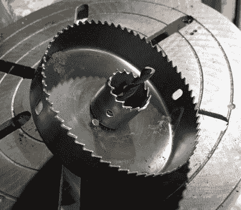
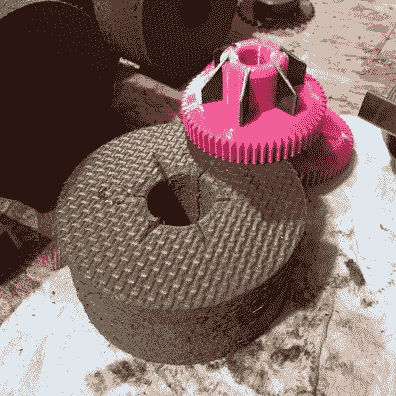
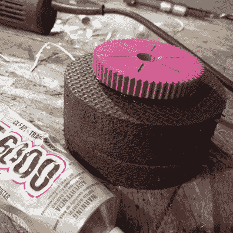

# 当战斗机器人轮子需要又好又便宜(但大多是便宜)时

> 原文：<https://hackaday.com/2022/07/10/when-combat-robot-wheels-need-to-be-nice-and-cheap-but-mostly-cheap/>

它始于[乔尔]对自己做出一个关于建造新战斗机器人的承诺:**不在新机器人上花钱**。

这条规则被违反了(但只是一点点),因为[用](https://www.etotheipiplusone.net/?p=5382) [伊娃](https://www.etotheipiplusone.net/?p=5382) [跪垫](https://www.etotheipiplusone.net/?p=5382)制作了他的机器人轮子。EVA(乙烯-醋酸乙烯酯)是一种闭孔泡沫，用于制作耐用的瑜伽垫、跪垫和类似性质的产品。[乔尔]找到了一种方法把它们变成他的机器人的轻便但可使用的轮子:萨斯奎汉纳货车车厢。

Nested hole saws create concentric holes. Perfect for wheels.

轮子是这样制造的:从两把孔锯开始。将两个小孔锯放在同一个心轴上，将两个小孔锯嵌套到一个大孔锯中，就形成了一个有两个孔的锯，两个孔都相对于彼此居中。唯一的问题是，这个孔锯实际上不够深，无法完全穿透厚厚的泡沫。幸运的是，在一边切割大约一半，然后翻转纸张，从另一边切割是一个很好的解决方法。它负责将厚泡沫板变成圆形轮子。

一个 3D 打印的零件充当了传动系统的轮毂和齿轮。我们想提醒大家注意加强各部分之间联系的巧妙方法。[乔尔]不想只是把齿轮轮毂直接粘在泡沫车轮的表面，因为他怀疑它可能会在压力下分离。为了解决这个问题，他在轮毂上设计了六个槽，在泡沫车轮上切割了匹配的槽，并以手头的一些 ABS 条的形式插入了六个样条状的加强件。用 E-6000 将它们粘合在一起，并让它在重压下固化一整夜，结果产生了一个齿轮组件，它被[CHORL]判断为与车轮应该达到的圆形和刚性差不多，因此机器人有了一个解决方案来制造漂亮的轻型车轮，最重要的是，它很便宜！

    

许多机器人需要轮子，不出所料， [DIY 解决方案是常见的项目](https://hackaday.com/2019/12/19/super-easy-small-robot-wheels/)。[CHORL]的方法在这里看起来相当可扩展，只要你能切一些精确的洞。

有兴趣了解更多关于这些轮子的机器人吗？[乔尔]仍在进行萨斯奎哈纳棚车的工作，但它几乎完成了，你可以在这里阅读更多关于它的内容(并看到更多图片)[。](https://www.etotheipiplusone.net/?p=5403)