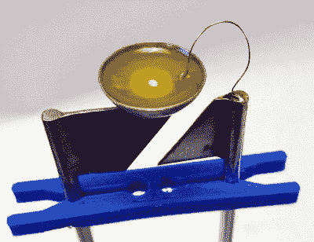

# LED 什么时候是灯？当宽度为 50 毫米时

> 原文：<https://hackaday.com/2022/07/03/when-is-an-led-a-lamp-when-its-50mm-wide/>

你可以说我们幼稚，但我们确实从大于生命的和微小的事物中得到乐趣，尤其是当它们像“正常大小”的对应物一样工作的时候。所以你可以想象当我们看到[【JGJMatt】的 50 毫米 LED 灯](https://www.instructables.com/The-50mm-LED/)时的喜悦，它看起来就像你随时可能在你的长凳上连线的一个巨型版本——一个弯曲腿的 LED，连线并准备闪烁。

【JGJMatt】一开始在 Fusion360 设计模具制作镜片，然后用 PLA 打印出来。然而，由于固化树脂会产生热量(尤其是像这样封闭的)，他建议使用 PETG 或 ABS 代替，以避免任何潜在的翘曲问题。

这就是事情变得有点危险的地方。对于内部构件，[JGJMatt]全力以赴，用铜管手工制作了一个反射杯，阳极板和阴极板由 1 毫米厚的黄铜制成，镀成银灰色。光源本身是一个 1 W 的冷白色 LED，位于反射杯中，安全地位于一层混合有少量黄色油漆的环氧树脂之下，黄色油漆代表标准 5 mm 白色 LED 中的磷光体层。

一旦内脏准备好了，是时候把巨大的透镜安全地塞进去了。树脂固化后，[JGJMatt]用砂纸打磨掉层线，并用透明漆喷涂，以清理镜头，防止它在路上变黄。接下来，只需将腿弯曲成一个支架，然后用电线连接起来。多么棒的点亮工作台的方式啊！或者任何地方，真的。

这不是我们第一次看到一个巨大的工作 LED，尽管这可能是自 2019 年[【Mike Szczys】在 Maker Faire: Rome](https://hackaday.com/2019/10/25/giant-leds-ruby-lasers-hologram-displays-and-other-cool-stuff-seen-at-maker-faire-rome/) 上看到一些实物以来的第二次。[顺便说一句](https://www.tindie.com/products/partfusion/giant-led/)，那些在 Tindie 上出售，尽管在可预见的时间里商店会放假，所以你现在只能自己做了。