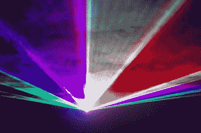

# 什么时候一个像素比几百万还酷？

> 原文：<https://hackaday.com/2022/07/09/when-is-one-pixel-cooler-than-millions/>

在假期，我们去看了一场激光表演——这是一场老派的表演，它将多束不同颜色的不同激光组合成一束，调制它们以产生不同的颜色，然后将它从检流计反射到天文馆的屋顶。很自然地，和一个乐谱。

当我还是个孩子的时候，我不知道它们是如何工作的，但是激光表演太棒了。作为一名年轻的成年黑客，在一些朋友向我介绍了黑魔法之后，我建立了自己的系统。我现在知道它们是如何从最深处运作[的，它们同样令人敬畏。如今，你可以从远东花 100 美元左右买到一套功能强大的 galvos 和驱动器，可以说已经没有魔力了，但令人敬畏的依然存在。](http://www.lasersam.org/sam/lasersam.htm)

[“laser show”](https://www.flickr.com/photos/115089924@N02/12212669496) by Ilmicrofono Oggiono

与此同时，激光和激光表演极其复古。最令人震惊的例子发生在几年前，当时我正在拆开一台卡西欧投影仪，以取出原本无法获得的全新 455 纳米蓝色激光二极管。在那里，我从投影仪内部的 24 个二极管阵列中取出一个二极管，扔掉了极其强大的 DSP 处理器，拆开了精密的光路，取出了带有近*百万个*小镜子的 MEMS DLP 镜子阵列，用由大型旧线圈电磁体驱动的*两个镜子*来取代它。像穴居人一样。

但是，激光秀有一些我从未见过复制的东西——它们可以产生的疯狂的色域。你从显示器中得到的不仅仅是 RGB，或者可以是更多的东西。你可以从激光(或棱镜)中获得的一些颜色，以一种我无法解释的方式简单地呈现出来。我*可以*告诉你，你可以通过组合红色、蓝色、绿色、青色，甚至深紫色激光得到它们。

与普通电影院的数百万像素放映机相比，激光放映的效果相形见绌。见鬼，你真的有*一个*像素。但是，如果你足够快地移动它，并伴随着一个体面的配乐，你仍然有一个值得拥有的经历。

[横幅图片来自[一个绝对古老的 RGB 激光黑客](https://hackaday.com/2009/10/04/rgb-laser/)。我们需要更多！把你的发给我们！]

This article is part of the Hackaday.com newsletter, delivered every seven days for each of the last 200+ weeks. It also includes our favorite articles from the last seven days that you can see on [the web version of the newsletter](https://mailchi.mp/hackaday.com/hackaday-newsletter-649368). Want this type of article to hit your inbox every Friday morning? [You should sign up](http://eepurl.com/gTMxQf)!