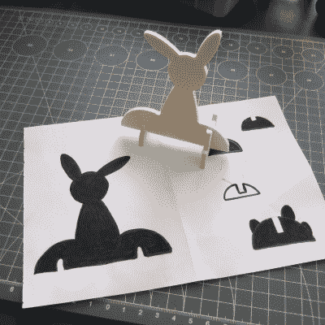

# 当正确的工具出错时

> 原文：<https://hackaday.com/2021/04/03/when-the-right-tool-is-wrong/>

我坚信在工作中使用正确的工具。开源软件工具最奇妙的一点是，没有什么能阻止你尝试它们。例如，在过去的几周里，我一直在几个，也许是三个 CAD/CAM 工具之间来回切换。它们各有优缺点，所以如果我在做一个简单的工作，我就用简单的软件，因为它更快，更简单。但我必须戒掉它，至少一段时间，我会告诉你为什么。

第一个软件包是 [FreeCAD](https://www.freecadweb.org/) ，它是一个非常强大的 CAD/CAM 软件。它可以做任何事情，或者看起来如此。但是它有一个很长很浅的学习曲线，而我只达到了一半。我正处于应该为练习而敲打简单的“hello world”部分的阶段。我说，我*应该是*。

 幸运/不幸的是，一些 Hackaday 的读者通过评论把我介绍给了 [KrabzCAM](https://mkrabset.github.io/krabzcam/krabzcam/index.html) 。它的功能远不如 FreeCAD 丰富，但它能在瞬间将你妻子画的兔子草图变成复活节装饰品。对于像这样简单的东西，这是一个很好的简单工具，非常适合 2D 凸轮工作。它还有其他一些不错的功能，而且它也能很好地处理激光雕刻。这就是问题所在。

用 KrabzCAM 做简单的事情意味着当我最终回到 FreeCAD 时，我正在做一个更具挑战性的项目——使用我不一定熟悉的技术。所以我会投入时间，但是发现自己仍然在导航和项目设置等介绍性的“hello world”的东西上磕磕绊绊。

我知道——第一世界的黑客问题。“可怜的埃利奥特接触了太多有用的工具，它们的优势使它们适合不同的工作！”老实说，我很高兴能有这么多好的选择——五年前可不是这样。但在这种情况下，使用正确的工具对我来说是错误的学习其他工具。

仔细想想，这与“永远不要尝试任何新东西，因为你目前的工具工作得很好”的问题有关。这个问题的解决方案就是硬着头皮坚持使用 FreeCAD，直到我精通为止。但是 KrabzCAM 对于那些 2D 的小工作来说非常有效…

黑客的生活很艰难。

This article is part of the Hackaday.com newsletter, delivered every seven days for each of the last 200+ weeks. It also includes our favorite articles from the last seven days that you can see on [the web version of the newsletter](https://mailchi.mp/hackaday.com/hackaday-newsletter-649368). Want this type of article to hit your inbox every Friday morning? [You should sign up](http://eepurl.com/gTMxQf)!