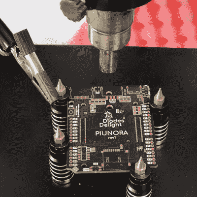

# 你在哪里会影响你的发明

> 原文：<https://hackaday.com/2021/10/16/where-you-are-influences-what-you-invent/>

[丁满]刚刚[为他的桌子买了一个新的 PCB 支架装置](https://mobile.twitter.com/timonsku/status/1448258867545190401)。它是一种弹簧加载的工件，使用强大的磁铁将其从工作表面上抬起来，由金属制成，这样你就可以用它来回流焊料。它可能是 [PCBite](https://sensepeek.com/) 的克隆，但坦白地说，我在任何地方都看到过类似的项目——现在很难说谁在抄袭谁。不管怎样，这不是重点。

 这些支架给我留下深刻印象的是它们的顶部:它们是重新利用的 3D 打印机喷嘴。这是一个奇妙的想法，因为它们没有磁性，耐热，相对均匀，而且在深圳可能非常便宜，因为这块板的设计者几乎肯定住在深圳。也许他或她甚至在 3D 打印机工厂工作？谁知道呢？但设计师几乎肯定会四处寻找符合要求的东西，并找到了喷嘴。

事实上，在过去十年里，中国在董事会持股方面有很多创新。我还记得当时的技术水平就像老虎钳一样。(我仍然喜欢我的家酿[stick vise](https://hackaday.com/2015/06/13/review-stickvise-needs-a-place-on-your-bench/)克隆用于低矮、方正的工作。)

但是随着手机维修需要能够保持和回流更奇怪的电路板形状，可重新定位的固定器已经蓬勃发展。棋子柱设计很酷，但是它们的实用性取决于磁铁的强度。(举例来说，我不会在没有亲自尝试的情况下购买链接的产品。)我真的很喜欢[这些 jobbies](https://aliexpress.com/item/1005001523978290.html) 的样子，它们有弹簧来保持张力。(3D 打印的塑料爪能承受多次回流吗？)无论如何，这些设备的发明者在宇宙的手机维修之都并非巧合。

俗话说，需要是发明之母。但如果像房地产一样，是位置、位置、位置呢？你利用手头的零件，想出解决身边问题的办法。如果这听起来有点宿命论，考虑一下你也可以改变你的环境，无论是物理的还是虚拟的。你正处于正确的挑战和机遇之中吗？

This article is part of the Hackaday.com newsletter, delivered every seven days for each of the last 200+ weeks. It also includes our favorite articles from the last seven days that you can see on [the web version of the newsletter](https://mailchi.mp/hackaday.com/hackaday-newsletter-649368). Want this type of article to hit your inbox every Friday morning? [You should sign up](http://eepurl.com/gTMxQf)!