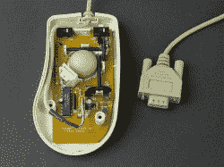
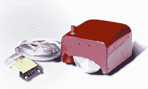

# 谁发明了鼠标？你确定吗？

> 原文：<https://hackaday.com/2020/01/17/who-invented-the-mouse-are-you-sure/>

如果你问大多数发明鼠标的人，他们不会知道。那些知道的人会说道格·恩格尔巴特知道。1964 年，作为他在斯坦福研究所工作的一部分，他有一个带两个轮子的盒子，像现代老鼠一样工作。1968 年有一个著名的演示视频，他展示了一台看起来很像旧麦金托什电脑的东西。原来，另外两个人可能更早拥有鼠标——或者至少是轨迹球。那你为什么从来没听说过这些？

## 英国老鼠

拉尔夫·本杰明为英国皇家海军工作，为军舰开发雷达跟踪系统。就在第二次世界大战后，拉尔夫致力于综合显示系统——一种船只在网格上监控攻击飞机的方法。他们使用了“球跟踪器”与恩格尔巴特的鼠标不同，它使用了一个金属球，在橡胶涂层的轮子上滚动。这更像一个现代的非光学鼠标，尽管球跟踪器让你的手滑过球，而不是相反。一种轨迹球装置。

 事实证明，海军更喜欢操纵杆，这项工作完全是秘密的。拉尔夫后来在 GCHQ 和 NATO 担任重要职务，虽然他没有得到任何荣誉，但据报道，他很高兴人们正在使用他想到的一种设备，即使他们并没有从他的发明中了解到这一点。

你可能会认为这个设备与现代鼠标没有太多的共同点，但看看旧系列鼠标内部的照片。有一个球。小轮子随着球的移动而移动，光电传感器检测小轮子的运动和方向。翻转过来，这是一个简单的轨迹球。

## 加拿大向何处去？

尽管它对公众来说是秘密的，但为 Ferranti Canada 工作的加拿大工程师有机会看到该系统，并于 1949 年开始研究 DATAR——一种试图根据海军特遣部队的传感器数据构建通用作战图的系统。

他们制作了一个类似拉尔夫的轨迹球，尽管他们选择的球是一个加拿大五瓶保龄球。如果你不熟悉这种变化的保龄球，球足够小，适合一只手，因此，通常没有手指孔。

DATAR 很成功，每个看过的人都印象深刻。然而，没有人想加入加拿大皇家海军，他们无法独自承担费用。尽管用了四年时间成功建造了一个原型，这个项目还是结束了。

DATAR 轨迹球使用了两个 X 盘和两个 Y 盘。圆盘与电线机械接触，计数脉冲让系统了解球的位置。再一次，这个项目是秘密的，所以没有多少人看到其中的一个在运行。

## 商品化

尽管有这些早期的活动，但直到 1965 年或 1966 年，商业轨迹球才出现。德国 Telefunken 公司在 1965 年提供了一个轨迹球，到 1968 年，他们意识到你可以把它翻过来，创造出我们称之为鼠标的东西。他们称这两款设备为 RKS 100-86，你可以在相邻的照片中看到。

## 从理论到实践

 我们所知的鼠标与 RKS 100-86 或恩格尔巴特的原始鼠标相去甚远(见相邻照片)。

今天的鼠标可能有一个激光传感器和一系列按钮。但想法仍然是一样的:提供一种高分辨率的方式来指向屏幕上的某个东西，并对其采取行动。

还有其他选择。轨迹球仍然存在，并受到铁杆触摸打字员的青睐。有触控板，一些笔记本电脑有橡皮擦旋钮。有触摸屏和越来越少的光笔。但是鼠标经受住了时间的考验，成为我们与屏幕互动的主要方式。对于一个上下颠倒的轨迹球来说还不错。

如果你从未见过 Engelbart 年的“所有演示之母”,展示了文字处理、即时消息、超链接、一个令人敬畏的功能键盘，当然还有正在使用的鼠标，你可以在下面的视频中找到它。

 [https://www.youtube.com/embed/B6rKUf9DWRI?version=3&rel=1&showsearch=0&showinfo=1&iv_load_policy=1&fs=1&hl=en-US&autohide=2&wmode=transparent](https://www.youtube.com/embed/B6rKUf9DWRI?version=3&rel=1&showsearch=0&showinfo=1&iv_load_policy=1&fs=1&hl=en-US&autohide=2&wmode=transparent)

照片致谢:

串行鼠标 Raimond speaking[CC BY-SA 4.0](https://creativecommons.org/licenses/by-sa/4.0/deed)

rks 100-86[马尔西的旋风]t0 西西-萨-2.0

恩格尔巴特鼠[SRI 国际公司] [CC-BY-SA-3.0](https://creativecommons.org/licenses/by-sa/3.0)