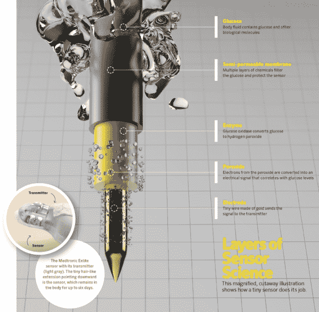
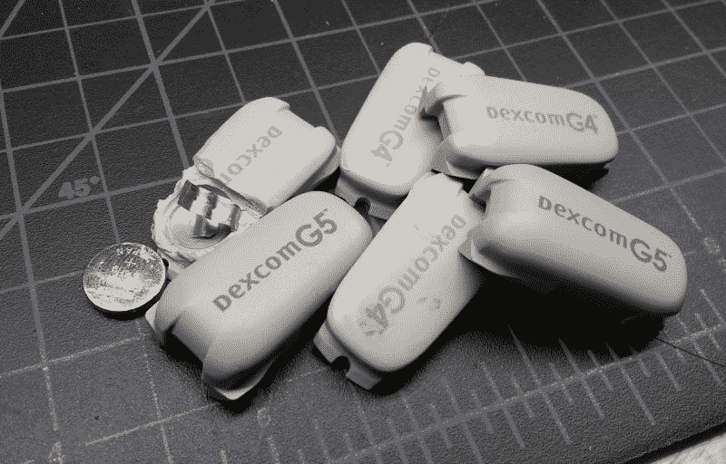
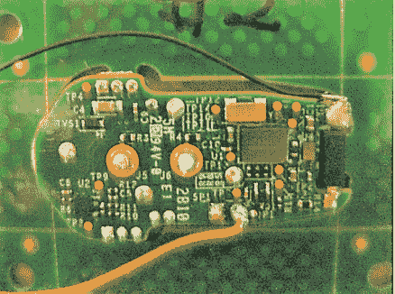
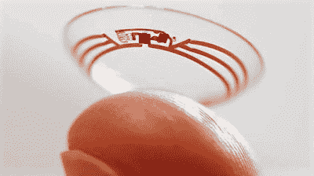

# 为什么连续血糖监测这么难？

> 原文：<https://hackaday.com/2018/12/03/why-is-continuous-glucose-monitoring-so-hard/>

每个人的一天都是从例行公事开始的，就像现在大多数人一样，我的一天也是从查看手机开始的。但在大多数人关注天气预报、当地交通、甚至是查看推特或脸书的地方，我用手机窥视女儿腹部的一英寸。在那里，一个微小的电化学传感器不断地对她的细胞之间的液体进行采样，测量葡萄糖的浓度，这样我们就可以控制她通过胰岛素泵接受的胰岛素量。

1 型糖尿病是一种令人讨厌的疾病，通常在患者生命早期突然出现，每天都要进行一系列医疗程序——计算每一口食物的正确胰岛素用量，处理不可避免的高血糖和低血糖读数，以及一次又一次的针刺验血。连续血糖监测(CGM)对我们和数百万糖尿病家庭来说是天赐之物，因为它给了我们自由，让我们的孩子做回孩子，去过夜，多吃一片披萨，而不用把它变成一个大项目。此外，良好的血糖控制意味着在以后的生活中减少糖尿病的可怕后果，如失明、心脏病和截肢。我不得不说，我觉得在我的孩子身上安装遥测装置是一件很棒的事情；我们喜欢称她为我们的“电子小子”

但是尽管有 CGM 的所有好处，它也不是没有缺点。就消耗品和电子设备而言，它非常昂贵，需要侵入性的程序来放置传感器，即使在这个微小电子设备的时代，它仍然相对笨重。看起来我们应该在技术上走得更远，但事实证明，CGM 实际上很难做到，并且有一些非常坚实的理由说明为什么技术似乎停滞不前。

## 该传感器

CGM sensor cutaway. Click for larger view. Source: [Diabetes Forecast](http://www.diabetesforecast.org/2014/05-may/anatomy-of-a-cgm-sensor.html)

CGM 系统由三个主要部分组成:传感器本身，它将体内的葡萄糖浓度转换为电信号；发射机，用于调节信号并对其进行编码以进行无线传输；以及接收器，其可以是独立单元或直接内置于胰岛素泵中，并显示当前读数和过去 24 小时的葡萄糖趋势图。

传感器是整个事情的关键。其背后的化学原理很简单:一根超细的金线覆盖着葡萄糖氧化酶，这是一种来自细菌*青霉菌的酶。*这种酶将葡萄糖氧化成 D-葡糖酸-1，5-内酯和过氧化氢。然后过氧化物在金线上氧化，产生与组织液中葡萄糖浓度成比例的电流。该电流由系统读取，并用于基于校准曲线计算血糖浓度的估计值。

虽然化学过程很简单，但人类生物学和制造方面的挑战使得实际的 CGM 传感器很难实现。首先也是最重要的，CGM 传感器必须被插入到间质液中，并在那里存活长达一周的时间(尽管我们中的许多人为了节省传感器而将时间延长了很多)。作为体内的异物，涂有来自细菌的蛋白质的电线对免疫系统来说是红肉，免疫系统正是为了清除这种外来入侵者而设计的。如果没有某种保护，使传感器工作的葡萄糖氧化酶将在几个小时内被免疫系统破坏。这需要在传感器上覆盖特殊的专有涂层，它可以允许葡萄糖进入，但阻止免疫系统攻击酶，至少在一段时间内。

另一个困难涉及处理微小的组件，并将它们组装到发射器的接口中，发射器将数字化来自传感器的信号，并将它们无线发送到接收器。该接口必须为发射器提供一个匹配的位置，并提供一种方法来一次可靠地附着在皮肤上数周，而不会导致任何类型的接触性皮炎或其他副作用。传感器还需要与某种导入器配合，这种导入器是一种较粗的皮下注射针，细而松软的传感器线可以穿过它，因此它可以在不弯曲的情况下插入。当然，成品组件也必须经过消毒，因此它必须能够经受住辐照的严酷考验，这是医疗器械消毒最常用的方法。

## 发射机

My collection of dead transmitters, including one I opened. Along with my daughter’s current transmitter, this represents about $5,000 worth of gear that insurance doesn’t pay for.

从各方面考虑，我们为每个 CGM 传感器支付的 75 美元可能不是太不合理。对我来说，价值主张开始瓦解的地方是发射机。不同制造商的设计各不相同，甚至在一个制造商的产品中也是如此，因为新技术取代了旧技术。当然，原理图很难得到，但是[FCC ID 数据库](https://fccid.io/PH29433)和[沮丧的用户进行的大量拆卸](https://www.youtube.com/watch?v=AOVjZhS-FFI)表明，我们使用的发射器的基本内容与任何无线技术都差不多——传感器的信号调理、微控制器、一些电源管理材料和无线子系统。我们现在使用的发射机使用 2.4 GHz ISM 频段；我们还使用了蓝牙发射器，但这些发射器的持续时间只有老式发射器的四分之一。

$600? Really? Inside view from the [FCC ID database](https://fccid.io/PH29433).

看着这些拆下来的东西，我很难相信我花 600 美元买这些东西是值得的。我们都知道这些东西的实际制造成本有多低——可能远低于每件 5 美元，这真是太慷慨了。是的，我知道我不是在为这些组件和组装它们的人工买单，我是在为将这些设备推向市场而在 R&D 和临床试验上花费的数十亿美元买单。但我忍不住想，一定有更好的办法。

基本问题是，这些发射器是密封的单元。我指的是真正密封——树脂胶囊完全在印刷电路板周围注射成型，没有办法非破坏性地打开它。由于没有办法打开外壳，当里面的电池最终耗尽时，你所能做的就是更换它。当然，这并没有阻止无畏的黑客更换电池。我还没试过，但它在我的待办事项清单上。一旦传感器被打开，放入新电池非常简单，但再次密封传感器以保持防水是一个挑战。

## 眨眼的工夫

Verily’s prototype CGM contact. Source: [Google](https://googleblog.blogspot.com/2014/01/introducing-our-smart-contact-lens.html)

但是一定要这样吗？真的有必要有一个相对较大、笨重的发射机吗？在我看来，如果使用某种 RFID 技术，发射器可能会小得多，便宜得多。外部发射器可以询问传感器，并接收回编码当前传感器电压所需的微小数据。这似乎是谷歌旗下的医疗设备公司 Verily 为 CGM 开发装有传感器的隐形眼镜的方式。这个想法似乎是可靠的，因为葡萄糖是以眼泪的形式排泄的，并导致 1 型糖尿病发作的早期症状之一——由于角膜上的糖晶体而导致视力模糊。触点上肯定没有电池，所以它必须远程供电。

然而，可悲的是， [Verily 刚刚宣布](https://blog.verily.com/2018/11/update-on-our-smart-lens-program-with.html)他们在 CGM 接触上认输，声明获得稳定的、对诊断有用的读数的生物学障碍太大，难以逾越。正如我们所看到的，CGM 并不容易，但我很难相信 Verily 因为纯粹的技术原因放弃了这个项目。带着愤世嫉俗的帽子，我要说的是，跳过无尽的监管圈的前景对该公司来说太难以承受了，这对这样一项看似突破性的技术来说是一种奇耻大辱(对不起)。但很难与已经获得监管机构批准、资金雄厚的老牌企业竞争。

尽管如此，我仍然希望有人会接受建立一个更好的 CGM 的挑战。现在还不错，在一天结束的时候，我可能会尽我所能让我的孩子保持清醒。令人遗憾的是，CGM 公司知道这一点，并不觉得特别有必要在垄断市场的定价上更慷慨一点。