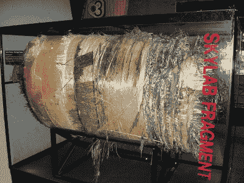
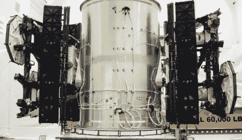
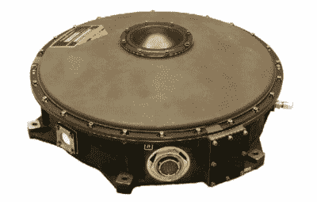

# 为什么未来的卫星会燃烧

> 原文：<https://hackaday.com/2019/04/22/why-satellites-of-the-future-will-be-built-to-burn/>

近地轨道上的卫星在执行任务的过程中会出现很多故障。即使在最好的情况下，飞船也需要经受住宇宙射线的轰击和巨大的温度变化。为了有机会在最坏的情况下幸存下来，例如硬件故障或与一个流氓太空垃圾的碰撞，它需要设计有强大的冗余，可以在面临系统损坏时保持一切运行。当然，在这一切发生之前，它需要在太空旅行中生存下来；所以，把高 G 负荷和强烈振动加到能杀死你昂贵的鸟的东西的清单上。

在将卫星送入轨道所涉及的所有细致的工程和费用之后，你可能会认为它会在任务结束时受到英雄般的欢迎。但其实完全相反。最具讽刺意味的是，在花费了所有的时间和精力来开发能够在严酷的太空飞行中生存的航天器之后，最终，它的操作者很可能会命令航天器通过将其轨道下降到地球大气层来摧毁自己。一颗设计合理的卫星的最后一步很可能是让自己陷入它花了几年甚至几十年才避免的同样的火海命运。

你可能想知道工程师们如何设计一艘既足够坚固，可以在太空环境中生存数年，同时又足够脆弱，以至于在重返大气层时完全烧毁的航天器。直到最近，简单的答案是，它并没有真正被考虑在内。但随着发射价格的下降，未来几年太空将会更加繁忙，人们开始竞相开发新技术，以确保卫星只在需要时完好无损。

## 天要塌了

A piece of Skylab that crashed in Australia

碎片重返大气层并撞击地面的可能性并不新鲜，有记录的案例可以追溯到我们向太空发射东西的时代。可以说最著名的例子是 1979 年，当时天空实验室的残骸散落在澳大利亚内陆各处。最大的部件，如美国最挑剔的空间站上的氧气罐，重达数百公斤。幸运的是，这些巨大的物体降落在地球上人口最稀少的土地之一，但如果它们降落在一个主要城市，对人类生命的损害和风险可能是相当大的。

改变的是在不久的将来，我们预计会有多少物体重返大气层。当只有世界超级大国有能力将东西送入太空时，跟踪东西何时返回相对容易。但是日益激烈的竞争大大降低了将卫星送入轨道的成本，现在公司开始关注太空投资，这在十年前是完全不可能的。像 SpaceX、OneWeb 和三星这样的公司正在关注由数千个单独的航天器组成的卫星巨型星座，其中每一个最终都将在名义寿命结束时倾斜返回大气层。

在 2 月 26 日的一封信中，联邦通信委员会特别要求 SpaceX 详细说明他们计划让 Starlink 网络中的数千颗卫星脱离轨道。他们想知道 SpaceX 是否能确保飞船重返海洋，如果不能，估计坠落的碎片可能造成物质损失或人员伤亡的可能性。这封信的结尾指出，如果这些信息不能让 FCC 满意，SpaceX 申请 Starlink 批准的申请可能会被驳回。

## 不可接受的风险

指导航天器在海洋上空降落一直是确保任何幸存的碎片不会给地面带来任何问题的标准方式。既然这个星球的大部分表面区域都是海洋，假设你的宇宙飞船运行正常并且能够自我操纵，这最终会是一件相对简单的事情。虽然错误确实会发生；天空实验室实际上应该重新进入非洲南部，计算中的一个小错误导致它向东飞得太多。

Two prototype Starlink satellites before launch

但是 SpaceX 公司提出的 Starlink 卫星(以及其他类似的卫星)是一个特例。它们利用高效率的霍尔效应推进，这是偶尔调整轨道和保持位置的理想选择，但缺乏将飞行器置于目标再入轨道所需的推力。

换句话说，这些卫星有能力降低它们的轨道，足以确保它们会烧毁，但不能以足够的精度确定它会在哪里发生，以做出任何保证。当只处理一颗卫星时，这可能是一个可以接受的风险，但 Starlink 的长期计划需要多达 12000 颗卫星。有这么多飞行器在运行，其中一个在人口稠密地区解体的可能性实在是太大了。

在他们对联邦通信委员会的官方回应中，SpaceX 解释说，虽然他们无法保证 Starlink 卫星只会在海洋上空重返大气层，但他们已经找到了一个解决方案，可以让它变得没有必要。在“广泛的研究和投资”之后， [SpaceX 表示，他们已经改进了 Starlink 卫星的设计](https://licensing.fcc.gov/myibfs/download.do?attachment_key=1636825)，以确保它们会在大气层中完全烧毁。

## 为消亡而设计

将卫星设计成在正常再入过程中完全烧毁的想法已经流传了几十年，但到目前为止还很难流行起来。在业内被称为“为消亡而设计”或 D4D，其最大的支持者可以说是欧洲航天局，该机构已将其作为他们整体“清洁空间”倡议的中心主题。正如你可能想象的那样，这是一个复杂的问题，但冒着把事情过于简化的风险，基本上有两种主要的方法:在进入大气层时分裂成更小碎片的设计，以及使用无法承受重返大气层的高温的材料。这两个想法并不相互排斥，实际上可能会一起使用以获得最佳效果。

例如，卫星不是用螺母和螺栓固定在一起，而是用环氧树脂粘合在一起，这种环氧树脂在高温下会分解。一旦航天器撞击大气层并开始升温，环氧树脂就会消失，结构就会分崩离析。这种技术不仅减少了可能完好无损地穿过大气层的大型物体的数量，而且还使航天器内部向热的大气气流开放，这将促进更完全的燃烧。

A typical reaction wheel module.

尽管如此，普通卫星的一些部件足够坚固，可以想象它们能够存活下来。可能的候选物是钛推进剂罐、碳化硅反射镜(用于光学望远镜或激光通信系统)、霍尔效应推进器的铁芯，以及用于为航天器提供姿态控制的重型不锈钢反作用轮。这些组件提出了一个相当棘手的问题，因为用于建造它们的材料显然是有原因的。例如，由于密度差异，用相同直径的铝制反作用轮替换不锈钢反作用轮是行不通的。考虑到材料的变化，整个系统需要重新设计。

根据他们对联邦通信委员会的官方回应，SpaceX 公司表示，他们已经用他们可以保证不会重返大气层的版本替换了这些有问题的组件。如果是真的，这将是 D4D 设计的一个巨大的里程碑，并且很可能是未来大规模卫星星座将被测量的标准。但并不是每个人都相信 SpaceX 像他们所说的那样巧妙地解决了这个复杂的问题。布法罗大学的机械和航空航天工程教授约翰·克拉西迪斯在给 IEEE Spectrum 的一份声明中说，他认为这些说法有点过于大胆:“如果你以正确的角度撞击，任何东西都可以穿过大气层。如果他们保证这不会引起问题，那么我就要打电话给 BS。”