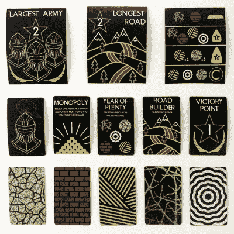

# 为什么要满足于标准卡坦板？

> 原文：<https://hackaday.com/2020/02/09/why-settle-for-the-standard-catan-board/>

让我们面对现实吧，游戏之夜会变得非常吵闹。无论你的游戏之夜是葡萄酒和猫，啤酒和狗，还是伏特加和小熊，事情都会发生。也许强盗在沙发下被痛打了一顿，或者有人疯狂地打着手势，把酒洒了你的羊一身。[eeeeeeeden]的聚会越来越失控，是时候设计一个定制的卡坦板了。

 但她并没有止步于棋盘瓷砖——[这是卡坦从零开始重新设计的](https://imgur.com/a/aPzInn7)，包括棋子、资源卡和一个定制的收纳盒。[EEEEEEEEEDEN]甚至通过设计一片叶子放在中间来为玩家扩展做计划。框架内置了几百块磁铁，所以应该不会再有丢失的碎片了。至于所有纸板的防酒性，[EEEEEEEEEDEN]设计了新的纸板瓷砖和卡片，用激光从丙烯酸树脂上切割下来，并煞费苦心地用塑料浸渍喷涂。

我们认为它很华丽，但要明白这种极简风格可能并不适合每个人。如果你想去定制，很难反对 [3D 卡坦](https://hackaday.com/2019/08/20/get-ready-for-games-night-with-3d-catan/)的美丽。

感谢[Johannes]的提示！通过 [/r/DIY](https://www.reddit.com/r/DIY/comments/ezjtef/i_redesigned_and_built_catan_from_scratch/)