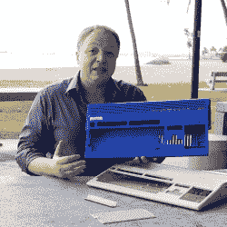
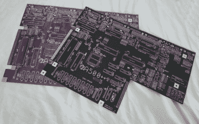
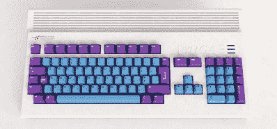

# 为什么你(可能)不会很快建造一个 Amiga 的复制品

> 原文：<https://hackaday.com/2020/06/16/why-you-probably-wont-be-building-a-replica-amiga-anytime-soon/>

2019 年初，很明显，复古工业综合体的创新和生产率达到了新高。由于一系列不同项目的共同努力，现在可以从零开始创造全新的 com mdore 64*，* [。有史以来最畅销的电脑似乎真的会永生。](https://hackaday.com/2019/03/12/its-raining-brand-new-commodore-64s/)

很自然地，这引发了关于 C64 的骄傲继承者 Amiga 的问题。由于各种各样的原因，我们不太可能很快看到从头开始建造的 Amiga 500s 突然出现。让我们看看需要什么，也许，仅仅是也许，几年后你会在运行 Workbench 1.3 的全新平台上运行 *Lotus II* (或者，理想情况下， *Jaguar XJ220: The Game* )。

## 一个案子的案子

The Amiga 500+ case project from Indiegogo promises backers a fresh new enclosure for their classic Amiga, Raspberry Pi, or Vampire board.

制作复制品的第一步是准备一个箱子，把所有东西都放进去。这是最容易或最难找到的部分，取决于你对真实性的品味。与 C64 不同，人们不能简单地在网上订购现成的近似工厂的复制品。Indiegogo 早在 2018 年就推出了一个生产轻度升级的复制品的项目，然而，迄今为止，[的零件尚未运往支持者。](https://www.indiegogo.com/projects/new-compatible-case-for-amiga-500-plus#/updates/all)

这使得萌芽中的建筑商不得不寻找自己的解决方案。对于个人来说，制造注塑模具和进行生产运行可能是不可能的，但如果你有 100 万闲钱，那就去做吧。当然，3D 打印也是一种选择。这将需要构建一个精确的 3D 模型，并且可能需要在许多部分之间的某个地方进行打印，这取决于 3D 打印机的大小。为了获得好看的最终效果，在完成时也需要做大量的工作。不过，这是我们下注的地方。

另一个选择可能是做一个非常大的硅胶模型来制作一个原始案例的复制品。要获得好的结果，需要先进的技能、丰富的经验和高端的工具。我们个人还没有见过这种技术用在这种尺寸的零件上，特别是很难复制的大平面。但是如果你想在你的家庭工作室做一些案例，并且有一两年的空闲时间，这可能是一个有趣的项目。

## 主板

接下来，你需要一个主板。在这种情况下，事情正在好转——由于[Bob's Bits] 的努力工作，有可能从 Tindie 采购新的 A500+ PCB。它被称为 A500++，包含一些小的更新，改进了现代建筑的设计。这包括很好的接触，如提供一个常规的圆形 DIN 电源连接器，而不是原来的方形部分，以及现代扩展经常使用的引脚的额外突破。其他人过去也做过类似的工作，[尽管是有限的私人经营](https://forum.amiga.org/index.php?topic=72246.0)。[PCB way](https://www.pcbway.com/project/shareproject/amiga_500_motherboard__try_at_your_own_risk.html)上还有一块未经测试的 A500 原板，如果你想试一试的话，它似乎遗漏了一些重要的布线。

【Bob’s Bits】的 A500++主板有黑色和紫色两种颜色，丝网印刷图形是对原版的忠实更新。

当然，主板只是起点。你还需要它上面的所有零件。[幸好有了 BOM](https://docs.google.com/spreadsheets/d/13xq2P7Ha_PA6r3vfPw77Q9PaSZYWncYfNpqhrwdvhaY/edit#gid=0)，这使得采购商品部件变得容易了。采购 CPU 也不是太难，因为摩托罗拉 68000 在许多应用中都非常受欢迎。rom 也很容易找到，因为交换不同的 Kickstart 版本是一种流行的旧机器兼容模式。

不幸的是，从那以后事情变得越来越难——这都要归功于让阿米加变得伟大的魔力。Commodore 64 和 Amiga 都严重依赖定制硅，这使它们在市场上比竞争对手具有性能优势。前者有其著名的 SID 音频芯片，以及一堆外围设备的胶合逻辑，当然还有处理视频输出的 VIC-II 芯片。Amiga 由一家被 Commodore 收购的初创公司完全独立开发，有阿古纳斯、宝拉和丹尼斯，以及其他一些人。这些芯片大体上分别负责 DMA、音频和视频，尽管实际上其他功能也由芯片处理。

作为具有单一应用的专门设计的硅集成电路，这些部件与计算机本身一起停产。一些芯片，如 VIDIOT IC，已经被社区复制，有传言说, [Gary 也可能在 CPLD 上被复制。对于机器的大明星们——阿古纳斯、宝拉和丹尼斯——唯一可行的来源是从旧机器中收获芯片或不断减少的“新老库存”供应。对于那些尝试新版本的人来说，这仍然是一个主要的绊脚石。](https://amigalove.com/viewtopic.php?p=7769&sid=2c512234a1e96b70e88490a1f0d02ed3#p7769)

这张 2011 年的模糊图片展示了[Jeri Ellsworth]的芯片原型 Amiga。它充当了 OCS(以及理想情况下的新芯片组)可以在 FPGA 中实现的概念证明。FPGA 为解决这一问题带来了希望。然而，到目前为止，项目一直专注于在单个 FPGA 中重新实现整个 Amiga 500，而不是将分立芯片插入原始主板。Minimig 已经是这个领域的长期玩家，即将推出的吸血鬼 V4 单机版也将是一款类似的机器。

这些项目为 Amiga 平台带来了新的动力和功能，但由于设计上的主要差异，它们往往会偏离原始机器的感觉。然而，【Jeri Ellsworth】早在 2004 年的工作表明，以 FPGA 形式实现 OCS 芯片组是可以实现的。她的原型将单个 FPGA 挂在一个股票 A500 主板上，取代了除 Paula 的磁盘接口和原来的 68000 CPU 之外的所有定制芯片。这项工作旨在导致[C64 DTV 的后续，](https://en.wikipedia.org/wiki/C64_Direct-to-TV)但被放弃，改为创建一个威廉姆斯街机模拟器。从失败的虎口中夺回失败——多么适合阿米加的故事！

## 外围设备

如果你有一个新的 Amiga，你也需要一些外围设备。鼠标很简单，虽然有些过时，但有了新的设备。USB 适配器也存在，如果你只是不能没有你的 5000DPI Razer 充满闪烁的 led 灯。

I’ll have one of these with an i7 and 32GB of RAM, thanks. Oh, and make mine a 500, natch.

键盘是一个不同的故事，事情变得有点模糊。[Amiga On The Lake]已经为[一款基于 Cherry MX 的新键盘开放了预购，这款键盘看起来很棒](http://amigaonthelake.com/new-a500-replacement-keyboard-with-full-set-of-amiga-keycaps/#description)，尽管我们不确定该项目离发货还有多远。据报道，它配有键帽和 USB 接口，可以与其他硬件配合使用。【A1200.net】[也展示了一个原型设备](https://www.a1200.net/amiga-compatible-mechanical-keyboard/)，尽管它似乎还没有公开发售。[他们为 A1200 设计的键帽颜色配置工具](https://www.a1200.net/keycaps-matching-simulator/)非常棒，但实际产品似乎很难实现。

就存储而言，原装软驱很少见，而且越来越少。你最好的选择是使用类似于 [GoTek 模拟器](http://www.gotekemulator.com/)的东西。或者，如果你有一个 SCSI 接口，[SCSI 2 SD 是一个很好的选择](https://store.inertialcomputing.com/category-s/100.htm)，但这依赖于更老的硬件。我们认为，在人们开始再造[A590](http://amiga.resource.cx/exp/a590)之前，事情还有很长的路要走。

## 概括起来

总的来说，建立一个全新的 Amiga 500 的想法是一个即使是最专注的爱好者。在像 C-64 那样对普通的信用卡爱好者来说变得容易之前，还有很多工作要做。需要可靠的案例来源，重要零件供应中的重大漏洞需要填补。

出现这种情况有许多原因。Amiga 500 的销量从未与 Commodore 64 的销量相同。Amiga 生态系统更加分散，500、600、1200 甚至 2000/3000/4000 都有自己独特的粉丝群。因此，有许多更小的团队在从事不同的项目，与 Commodore 64 相反，Commodore 64 的整个社区都致力于再造一台机器。

实现这一壮举绝不是不可能的。然而，这可能需要少数熟练工人的不懈努力，以及大量的资金来完成。这可能是因为 Amiga 的粉丝群不够强大，不足以支持与 C64 相同水平的售后市场，但我们仍然充满希望。愿那些华丽的 16 位左右的机器再次统治世界！