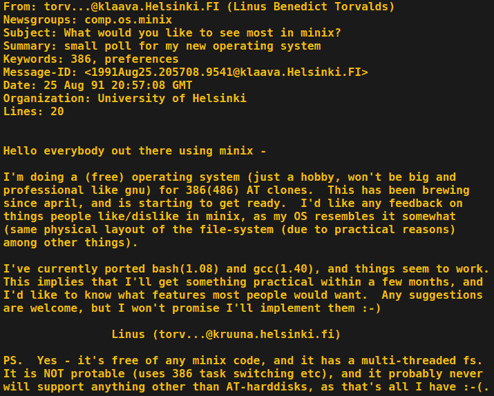

# 真正的 UNIX 请站起来好吗？

> 原文：<https://hackaday.com/2019/11/05/will-the-real-unix-please-stand-up/>

[![Ken Thompson and Dennis Ritchie at a PDP-11\. Peter Hamer [CC BY-SA 2.0]](img/0f7af7406fde80be087e0c3818a8bcfe.png)](https://hackaday.com/wp-content/uploads/2019/10/1279px-Ken_Thompson_sitting_and_Dennis_Ritchie_at_PDP-11_2876612463.jpg) 

肯·汤普森和丹尼斯·里奇在 PDP-11。上周，计算世界庆祝了一个重要的周年纪念日:UNIX 操作系统诞生 50 周年。最初于 1969 年为贝尔实验室的 DEC 小型计算机开发的轻量级分时系统对我们遇到计算的每个地方都产生了巨大的影响，从我们的个人和嵌入式设备到云中看不见的服务器。但是在这个经历了五十年无数波折的故事中，现在的 UNIX 到底是什么呢？

这个问题的官方答案很简单。UNIX 是由 Thompson，Ritchie *等人*于 1969 年开发的贝尔实验室原始软件发展而来的任何操作系统，并拥有贝尔实验室或其继承组织的 UNIX 名称所有权许可证。因此，举例来说，惠普公司的企业机器上安装的 HP-UX 是几种商业上可用的 UNIXes 之一，而本文所写的 Ubuntu Linux 发行版却不是。

## 当您可以在磁带上的 UNIX 邮件中注销时

真正的答案相当不清楚，这取决于您在多大程度上将 UNIX 视为一个生态系统，以及在多大程度上取决于传统或规范遵从性，甚至用户体验。像 GNU、Linux、BSD 和 MINIX 这样的名字加入了争论，如果你问:真正的 UNIX 会站起来吗？

[![You too could have sent off for a copy of 1970s UNIX, if you'd had a DEC to run it on. Hannes Grobe 23:27 [CC BY-SA 2.5]](img/ac4de9f887722474fd704586df0a0e37.png)](https://hackaday.com/wp-content/uploads/2019/10/Magnetic-tape_hg.jpg) 

如果你有一台可以运行的 DEC，你也可以订购一台 20 世纪 70 年代的 UNIX。汉尼斯格罗贝 23:27[[CC BY-SA 2.5](https://commons.wikimedia.org/wiki/File:Magnetic-tape_hg.jpg)]

一开始，这是一个相对连续的故事。贝尔实验室团队开发了 UNIX，并在他们内部使用，最终作为源代码发布给感兴趣的组织，如大学，他们自己运行它。20 世纪 50 年代的一项法律规定禁止 AT & T 及其子公司如贝尔实验室销售软件，所以这是免费的。这些大学将把他们的 UNIX 版本 4 或 5 磁带安装在他们的 DEC 小型计算机上，并以各地程序员的方式编写他们自己的扩展和改进来满足他们的需要。加州大学在这方面做得如此之多，以至于到了 20 世纪 70 年代末，他们发布了自己的发行版，即所谓的*伯克利软件发行版*，或 BSD。它仍然包含一些原始的 UNIX 代码，所以从技术上来说它仍然是一个 UNIX，但是与那个代码库有很大的不同。

那时，UNIX 已经成为贝尔实验室的所有者美国电话电报公司的一个重要的商业提案，而且，一旦贝尔实验室从法院强制的义务中解脱出来，UNIX 也成为一个吸引巨额许可费的商业软件。这反过来导致开发者寻求打破他们的垄断，其中包括理查德·斯托尔曼，他的 GNU 项目始于 1983 年，目标是生产一个完全开源的 UNIX 兼容操作系统。它的名字是一个递归的首字母缩略词，“Gnu's Not UNIX ”，这明确地表明了它相对于贝尔实验室原创的位置，但提供了许多软件组件，尽管它们可能不是 UNIX，但肯定很像它。到 20 世纪 80 年代末，BSD Net/1 及其从遗留 UNIX 代码中解放出来的后代已经加入了开源阵营。

## “不会像 GNU 一样大而专业”

在 20 世纪 80 年代的最后几年，荷兰一所大学的学者 Andrew S. Tanenbaum 写了一本书:“*操作系统:设计和实现*”。它包含了一个类似 UNIX 的操作系统 MINIX 作为它的教学例子，MINIX 被大学和爱好者广泛采用，作为 UNIX 的一个可使用的替代系统，可以在廉价的台式微机上运行，如 i386 PCs 或基于 68000 的 Commodore Amigas 和 Atari STs。1991 年，赫尔辛基大学的学生 Linus Torvalds 就是这些狂热分子中的一员，他对 MINIX 的内核感到不满，开始编写自己的内核。最终发布的结果是 Linux 很快就超越了它的 MINIX 根，并与 GNU 项目的组件而不是 GNU 自己的 HURD 内核相结合，产生了我们今天许多人使用的 GNU/Linux 操作系统。

Linus Torvalds’ [first announcement](https://groups.google.com/forum/#!msg/comp.os.minix/dlNtH7RRrGA/SwRavCzVE7gJ) of what would become the Linux kernel.

所以，我们现在是在 2019 年，尽管有一些不太为人所知的操作系统和一些障碍，如 Caldera Systems 在 2003 年试图对 Linux 进行法律攻击，但我们在主流的 UNIX 类领域有三个主要群体。有“真正的”闭源 UNIX，如 IBM AIX、Solaris 或 HP-UX，有“扎根于 UNIX”的，如包括 MacOS 在内的 BSD 系列，还有“肯定不是 UNIX，但确实与之相似”的，如 GNU/Linux 系列发行版。就它们的能力而言，它们之间的区别并没有供应商让你相信的那么大，除非你喜欢对操作系统吹毛求疵。事实上，即使是闭源变体的用户也会经常发现自己在运行来自 GNU 和其他来源的开源代码。

在 50 岁的时候，更广泛的类 UNIX 生态系统，包括 GNU/Linux 和 BSD 之类的，已经非常成形了。在我们的水平上，不值得太担心哪个是“真正的”UNIX，因为所有这些项目都从五十年的集体开发中受益匪浅。但这确实提出了一个有趣的问题:未来五十年会怎样？在 20 世纪 60 年代的小型机上分时的解决方案能继续适应 21 世纪中期计算的硬件和需求吗？我们的猜测是会的，不是因为 20 年后你的 UNIX 克隆将与你现在的一模一样，而是在可预见的未来，使它保持相关性 50 年的东西将继续这样做。我们在 50 岁时使用 UNIX 及其克隆系统，因为它们已经被证明足够灵活，可以不断发展以适应每一代人的需求，并且期望这种情况继续下去也不是不合理的。我们期待看到它的发展方向。

一如既往，评论是开放的。