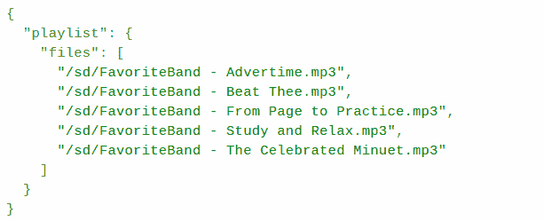

# Winamp 与 Adafruit PyPortal 一起重生

> 原文：<https://hackaday.com/2022/02/20/winamp-reborn-with-the-adafruit-pyportal/>

只要看一眼默认的 Winamp 皮肤，就一定会唤起社区中某一部分人的美好回忆。对于那些亲身经历了 MP3 革命的人来说，很少有音频播放器像 Winamp 和它的 llama whipping 声誉一样引人注目。不，专有的 Windows 专用媒体播放器不是我们现在推荐的那种东西；但那是 20 世纪 90 年代，情况大不相同。

对于那些想要重温那些令人兴奋的点对点日子的人，[Tim C]发布了一个教程，介绍如何将 Adafruit 的 PyPortal 变成一个触摸屏 MP3 播放器，忠实地再现经典的 Winamp 外观。正如你在下面的视频中看到的，它确实固定了视觉效果，直到绿色轨道信息的轻微抖动，我们现在才意识到这可能是开发人员试图模仿某种物理显示，如 VFD。

With minimal UI functionality, playlists must be created manually.

[Tim]甚至包括了对原始 Winamp 主题的支持，尽管正如你所料，还需要一些跳跃。在这种情况下，您必须对照从 [*Winamp Skin Museum*](https://skins.webamp.org/) 中提取的原始皮肤图像运行 Python 脚本。从那里开始，你只需要编辑几行代码来将播放器指向正确的皮肤文件。换句话说，在皮肤之间切换是一件麻烦的事情，但是你至少应该能够得到你最喜欢的风格。

但是在你变得太兴奋之前，有一个小陷阱。首先，Winamp UI 实际上并不实用。你可以点击屏幕的顶部来暂停播放，点击下方播放列表区域可以更换歌曲，但所有单独的按钮和图标视觉均衡器只是为了展示。管理你的播放列表还需要你手动编辑一个 JSON 文件，[用当时的说法，即使在 20 世纪 90 年代](https://hackaday.com/2020/07/27/mp3-is-25-years-old/)我们也会认为它很古怪。

当然，随着对代码的进一步修改，事情可以很容易地简化一点，因为[Tim]已经在未授权的情况下将其发布到公共领域，任何人都可以帮忙。就其现状而言，它仍然是一个非常漂亮的媒体展示，我们当然不会介意放在我们的桌子上。

 [https://www.youtube.com/embed/8sV1sRYdRRY?version=3&rel=1&showsearch=0&showinfo=1&iv_load_policy=1&fs=1&hl=en-US&autohide=2&wmode=transparent](https://www.youtube.com/embed/8sV1sRYdRRY?version=3&rel=1&showsearch=0&showinfo=1&iv_load_policy=1&fs=1&hl=en-US&autohide=2&wmode=transparent)

