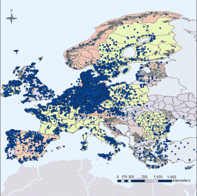

# 夜晚的风力发电场:按需警示灯来了

> 原文：<https://hackaday.com/2020/03/24/wind-farms-in-the-night-on-demand-warning-lights-are-coming/>

似乎不缺乏憎恨风力发电场的理由。如果你住得离他们很近，情况就更是如此。正如研究显示的那样，他们的普遍接受度确实随着他们的距离而增长。无论你最喜欢的可再生能源是什么，至少它与核电厂或化石能源有一些共同之处:*不要在我的后院*。不同之处当然在于，它需要更多的风力涡轮机来实现同样的输出，因此总体上影响了更多的后院——在全球范围内不断增加的。

就我个人而言，作为一个偶尔从远处遇到风力涡轮机的人，我发现风力涡轮机大多是一个眼中钉，尤其是在风景优美的山区。它们可以给一些枯燥的平地增添一种未来感。换句话说，我无法判断真实的居民对他们对人类或环境的影响的主张。所以，让我们抛开观点和情绪，特别关注一个问题的事实和技术:光污染。

这可能不是想到风力发电场时想到的第一个问题。但风力涡轮机足够高，需要空中交通安全警示灯，在夜空中闪烁的风力涡轮机可以在几英里外看到。从纯粹的效率角度来看，考虑到一架飞机实际上平均多久经过一次，这似乎是不合理的。大多数时候，那些灯只是毫无意义地闪烁，照亮了乡村。我们能改变这个吗？

## 按需照明

Wind farms locations across Europe as reported in the Wind Power database (Source: [SETIS](https://setis.ec.europa.eu/))

改进警示灯，使其只在附近有真正的飞机警告时才亮起，这并不是一个新想法，过去已经成功进行了实现这一点的单独测试。看看欧洲风力发电场的地图，德国对这个问题特别感兴趣并不奇怪，德国现在正在实施新的法规，强制要求风力发电场使用按需警示灯系统，预计将于今年夏天生效。

一般来说，有两种选择来了解风力涡轮机周围天空中的物体:

1.  涡轮机正在天空中寻找一架飞机
2.  飞机向涡轮报告它的存在

对于这两种选择，现有的技术分别以雷达和转发器信号的形式存在。

### 雷达

为了简化雷达的基本概念:无线电波被发射到野外，如果有任何东西阻挡它们，它们会反弹回来再次被接收，从而可以确定物体的存在和距离。以恒定的方式重复，物体的角度和速度也可以确定。

就像其他技术一样，随着时间的推移，雷达系统也发生了巨大的改进和变化，如今使用[有源电子扫描阵列(AESA)](https://en.wikipedia.org/wiki/Active_electronically_scanned_array) 天线，它们不仅可以一次跟踪多个物体，而且看起来比过去更加微妙。不是巨大的天线四处旋转，对公众造成潜在的新问题，无线电波角度是电子定向的，允许整个系统完全静止，并放置在一个不显眼的盒子里。把它画成一头牛，可能根本没人会注意到。

### 转发器信号

如果我们将责任转移到飞机本身，即使用 [ADS-B](https://en.wikipedia.org/wiki/Automatic_dependent_surveillance_%E2%80%93_broadcast) 信号，那就更不显眼了。ADS-B 通常被认为是空中交通管制中雷达本身的替代品，本质上由位于飞机内的应答器组成，当[的](https://hackaday.com/2018/07/27/building-an-sdr-lab-with-wheels/)到[的每个人接收到](https://hackaday.com/2018/06/05/cat-compels-raspberry-pi-flight-tracker/)的[无线电信号](https://hackaday.com/2019/08/14/remote-ads-b-install-listens-in-on-all-the-aircraft-transmissions-with-rtl-sdr-trio-phones-home-on-cellular/)时，该应答器定期发送飞机的身份、位置和高度。

当然，如果家里的树莓 Pi 或 ESP32 可以接收信号并理解数据，那么风力发电场也可以。

## 问题是

到目前为止，理论上还不错，但和往常一样，实际上并不那么简单。像有源相控阵雷达这样的复杂系统是有价格标签的，这里的全部目的是鼓励更多的风力发电的采用。抛开成本不谈，如果雷达信号受到任何干扰，导致它变得不可靠，整个系统都将被绕过，无论如何都要把灯完全打开。

ADS-B 的成本会低得多，但是除了[可能的卫星导航可靠性问题](https://hackaday.com/2019/06/09/gps-and-ads-b-problems-cause-cancelled-flights/)之外，这种方法还有其他问题。虽然大型商用飞机大多被规定需要 ADS-B 转发器，但小型飞机不一定需要。当然，并不是所有能飞的东西一开始都必须是飞机，也不一定是民用的。由于 ADS-B 允许跟踪一架飞机，他们中的一些人可能不想有这个选项，其他人可能*不应该*有这个选项。在最坏的情况下，该系统将无法检测到真正需要警示灯的物体。

忽略将使用哪种技术的细节，另一个要考虑的方面是与风力涡轮机本身的互操作性，以及这种系统日益增长的复杂性以及随之而来的安全隐患。一旦灯被外部事件触发，并且该事件需要被分配到多个涡轮机，事情可能在许多地方出错，并且这样的系统的总体可靠性将是可疑的。此外，它不会需要一个铁杆阴谋论者去思考这样一个系统有一天恶意故障的后果。

## 更大的问题

但是让我们后退一步，看看最初的问题本身:警示灯照亮了夜空，以通知飞行员有一个高大的建筑存在。对我来说，这引发了一个问题“为什么？”。为什么我们完全依靠人类来处理这里的空中交通安全？

这甚至不是一个关于你对可再生能源或光污染的立场的问题，而是为什么有必要发出警告的光——不管它是持续的还是按需的，或者我们是否在谈论风力涡轮机、无线电塔或任何足够高的建筑。从效率的角度来看，安装按需报警灯系统肯定是有意义的，我想你必须从某个地方开始，那么为什么不安装风力涡轮机，但我们难道不应该专注于一个全新的报警系统吗？

以船舶导航为例:几个世纪以来，灯塔是帮助船只安全入港、避免撞上岩石和悬崖的重要系统。是的，它们今天仍然存在，令人惊讶的是它们中的一部分甚至闪耀在海里，但在大多数情况下，更新的导航系统已经取代了它们的大部分。然而，挑衅性地说，航空安全条例距离雇佣飞机观察员手动打开警告灯只有一步之遥。船只有详细的海底地图。为什么飞机对地面没有同样的？

我们将会看到未来会发生什么，也许我们的孙子会摇头表示不相信我们过去是如何将所有这些责任毫无顾虑地交到几个人手里的。在那之前，我们可以期待乡村的夜空再次变得稍微暗一点，至少在世界的一些地方。所有这些是否真的以推广可再生能源的名义发生，还有待观察。

(横幅图片由[杰斯温·托马斯](https://www.pexels.com/@jeswin)拍摄)