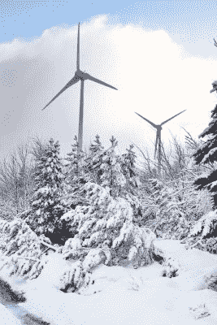
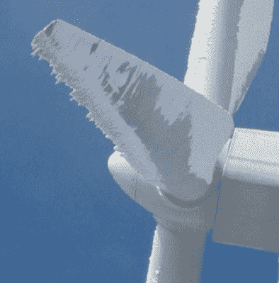

# 风力涡轮机和冰:它们如何适应特定的气候

> 原文：<https://hackaday.com/2021/03/01/wind-turbines-and-ice-how-theyre-tailored-for-specific-climates/>

风力涡轮机是令人难以置信的技术，能够收获风能并将其输送到电网，而没有碳排放。自 1939 年第一台风力发电机上线以来，风力发电机的不断发展意味着，随着每兆瓦时风能价格的持续下降，每台风力发电机的发电量将持续上升。此外，它们可以在几乎任何气候下运行，在世界上几乎任何地方可靠地发电，从加拿大到北大西洋甚至更远的地方。虽然最近席卷美国南部的寒流似乎与这一事实相矛盾，但实际上，在这一天气事件中风力发电的损失在一定程度上是这些特定风力发电场设计过程中权衡的结果(当然，还有德克萨斯州如何运营其电网的细节，但这超出了本文的范围)，而不是技术本身的失败。

首先，建设兆瓦级的风力涡轮机不是一个万能的解决方案。从通用电气、西门子或维斯塔斯这样的公司购买大型涡轮机就像买车一样。首先选择品牌和型号，然后为这些基础型号选择选项。例如，低但稳定的风速要求较大的叶片以较低的速度旋转，而平均风速较高的地区可能能够通过较小和较便宜的叶片获得相同的发电量。涡轮机的另一个常见选项是寒冷天气包，其中包括控制系统、液压和电力电子设备的加热器，某些区域的额外绝缘，以及特别针对涡轮机叶片的除冰解决方案。

在像德克萨斯州这样很少长时间出现低温的地方，可以理解的是，在建设期间可以省略寒冷天气包以节省资金(尽管一些较小的加热器通常包括在关键区域以减少冷凝或湿度)，但也可以节省维护费用:风力涡轮机的每个部件都必须维护。继续以汽车为例，这相当于有人在寒冷的气候下购买了一辆没有配备空调的汽车，以节省前期费用，但也避免了空调最终损坏时的维修费用。然而，在安装旨在改善涡轮机在寒冷天气下运行的设备时，除了成本之外，还有其他副作用需要考虑。

让我们深入了解如何为给定的风电场选择风力涡轮机设备的细节。

## 好的设计需要权衡

提高涡轮机在寒冷天气下的运行能力实际上可能会降低其在炎热天气下的运行能力，至少在德克萨斯州一年的大部分时间里肯定会看到这种情况。涡轮机中的一切都在运行时产生热量，从叶片变桨设备到齿轮箱和发电机，再到将它们与电网电连接的电力电子设备。在这些地方，排出夏天的废热比让它们为几天的寒冷天气做好准备要重要得多，这些天气在任何一年都可能不会发生。通常，这些废热是通过散热器和冷却风扇排出的，无论它们是安装在齿轮箱、发电机、功率转换器还是其他热敏设备上，冷却系统启动时的设置(如果有的话)可能不容易或不可能改变。

这就带来了另一个关于德州风能的问题。德克萨斯州风力充足，因此它是美国最早采用早期电网规模风力涡轮机的地方之一，其中一些仍在运行。这些涡轮机比现代版本的可配置性差得多，并且改变涡轮机中的各种温度设置可能不容易或不可能。这意味着在某些情况下，冷却风扇一直处于活动状态，或者涡轮机以某种方式永久配置，使其非常适合在炎热的气候下使用，但在寒冷的天气下很快就会离线。如果内部温度达到远低于冰点的设定点(通常为-30°C/-22°F)以防止损坏，即使是现代涡轮机也会离线(请注意，如果电网运营商了解天气，他们将能够预测发电损失并为其做好计划)，但如果冷却系统没有针对寒冷进行配置，通风口仍然打开，或缺乏隔热，这些涡轮机也不会免受寒冷的影响。

## 抗冰:电热和特种涂料；但不是直升机

影响风力涡轮机在极端寒冷条件下运行能力的其他方面是它们如何处理冰，特别是涡轮机叶片上的冰。叶片上的碳基电加热器是控制积冰的常用方法。2014 年在瑞典进行的[直升机除冰测试的图像显示在下面的](https://www.youtube.com/watch?v=-90g8SrOtgQ)视频中，在德克萨斯州停电期间迅速传播，但这项技术在德克萨斯州没有使用，而且由于涉及的费用，似乎没有在任何地方得到广泛采用。(还考虑到在结冰条件下现场需要一名飞行员和至少两名其他工人。安装叶片式加热器有其自身的成本，并且至少目前，可能只有在一年中的大部分时间里要应对寒冷的地区才有经济意义。

 [https://www.youtube.com/embed/-90g8SrOtgQ?version=3&rel=1&showsearch=0&showinfo=1&iv_load_policy=1&fs=1&hl=en-US&autohide=2&wmode=transparent](https://www.youtube.com/embed/-90g8SrOtgQ?version=3&rel=1&showsearch=0&showinfo=1&iv_load_policy=1&fs=1&hl=en-US&autohide=2&wmode=transparent)

其他选项包括使用热感相机来感应冰的堆积，如果冰变得严重，就关闭涡轮机。虽然迄今为止所有这些方法都需要能量输入才能为叶片除冰，但一家名为 Gamesa 的风力涡轮机公司的创新产品[正在生产一种天然防止结冰的涂料](https://w3.windfair.net/wind-energy/news/15308-gamesa-launches-innovative-anti-icing-paint-for-wind-turbines)，从而消除了对昂贵的高能耗除冰解决方案的需求。

另一个公司使用油漆试图防止叶片上结冰的例子是在加拿大的一个风力发电场，那里的站点[将一些叶片涂成黑色](https://www.windpowerengineering.com/the-cold-hard-truth-about-ice-on-turbine-blades/)以便增加从太阳吸收的紫外线量，希望在没有任何新技术或高能耗解决方案的情况下自然提高叶片的温度。虽然这种方法不像其他方法那样普遍，但它展示了一个在炎热和寒冷气候之间权衡的例子:在得克萨斯州将叶片涂成黑色，虽然[有一些证据表明这可能会减少鸟类死亡](https://www.audubon.org/news/can-painting-wind-turbine-blades-black-really-save-birds)，但当漫长的夏季来临，叶片受热超过设计公差时，这可能会有重大的不利影响。

## 寒冷天气下的人力资源

尽管所有这些针对极端气候的技术解决方案都是任何关注风能负面影响的新闻周期的主题，但当考虑在预期气候之外运行时，关于风力涡轮机运行的最重要的事情之一往往被忽略:维护风力涡轮机的人也必须做好在该气候下生活和工作的准备。如果在雪或冰事件期间涡轮机由于常规原因而离线，那么在德克萨斯州等地的大多数风力技术人员没有扫雪机、吹雪机或雪车来接近涡轮机，就像他们在魁北克北部工作时那样。他们可能不住在经常翻耕或撒盐的地方，因此很难或根本不安全到达现场或涡轮机。即使技术人员正在做一些简单的事情来改善涡轮机在寒冷天气下的性能，如关闭舱口通风口或增加隔热层，他们仍然需要接近涡轮机。

Ice buildup on turbine blades can be thrown or fall on people and equipment if left unchecked. Via [windpowerengineering.com](https://www.windpowerengineering.com/detecting-ice-on-wind-turbine-blades/)

此外，涡轮机上的积冰也有一些安全问题，也就是说，当它从涡轮机上脱落时，它必须去某个地方。出于这个原因，大多数技术人员在结冰事件期间对接近涡轮机有严格的规定，以防止任何冰从涡轮机上脱落并落到他们或他们的车辆上。然而，在有除冰系统的寒冷气候中，这个问题更容易控制和预测，但在像德克萨斯州这样的地方，这意味着一个本来可以修复的涡轮机可能会离线更长时间，而技术人员则等待更安全的条件。

总之，我们想指出的是，得克萨斯州最近的灾难与风能本身的任何基本面无关，而是与他们的[孤立电网](https://hackaday.com/2017/01/17/the-electrical-grid-demystified/)和美国基础设施普遍失修的[趋势](https://www.asce.org/infrastructure/)有关的其他问题。风力涡轮机完全能够在地球上一些最寒冷的环境中产生能量，只要它们(以及它们的操作者)的设计和装备能够应对这种气候。事实上，由于空气密度与温度成反比，对于给定的风速，寒冷气候下的涡轮机比炎热气候下的涡轮机能产生更多的能量。我们还应该对德克萨斯州在风能上的巨额投资表示赞赏。截至 2019 年，该州的风电装机容量略低于 25 吉瓦，是迄今为止所有其他州中最多的，装机容量继续快速增长。他们有[数量惊人的可用风能](https://windexchange.energy.gov/maps-data/319)，而且他们没有浪费掉。但是，在炎热的气候条件下对涡轮机进行冬季防冻处理，尤其是不可配置的老式涡轮机，从经济角度来看通常是不可行的，因为设计任何产品的过程，无论是小型玩具还是大型风电场，都需要权衡。