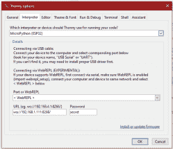
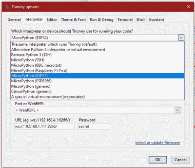

# 用 Thonny 进行无线 MicroPython 编程

> 原文：<https://hackaday.com/2021/04/29/wireless-micropython-programming-with-thonny/>

我最近在几个不同的嵌入式平台上玩了几个 MicroPython 项目，包括几个 ESP32 WiFi 模块。有多种方法对这些模块进行编程:

*   使用一个串口和 [ampy](https://github.com/scientifichackers/ampy) (自 2018 年被 Adafruit 掉后由【devxpy】维护)。
*   如果你使用 Pycom 板或 WiFy 固件，有用于 [Atom](https://github.com/pycom/pymakr-atom) 和 [Visual Studio](https://github.com/pycom/pymakr-vsc) 的`pymakr`插件。
*   如果你像我一样喜欢命令行，MicroPython 的顶级贡献者之一 Dave Hylands 提供了 [rshell](https://github.com/dhylands/rshell) 。

一年多来，我一直对`rshell`很满意，直到我开始研究这些无线节点。由于懒惰，我想在沙发上摆弄我的 ESP32 模块，而不是把我的笔记本电脑拖到厨房或阳台去插 USB 线。我不能用无线方式和他们一起工作吗？

嗯，你可以用 [WebREPL](https://docs.micropython.org/en/latest/esp8266/tutorial/repl.html) 。虽然它很实用，但出于某种原因，它并没有引起我的兴趣。[Elliot]在[最近的一个播客](https://hackaday.com/2021/02/05/hackaday-podcast-ep-104-delicous-ai-dvd-scanning-microscope-and-battery-friendly-microcontroller-designs)中提到，他正在使用 telnet 访问他的无线节点，但他正在使用 ESP8266 上的 [esp-link](https://github.com/jeelabs/esp-link) ，这意味着将另一个芯片扔进组合中。

## Thonny IDE

当我偶然在 Dronebot Workshop 频道上看到这个关于在新的 Raspberry Pi Pico 板上运行 MicroPython 的视频时，我几乎放弃了。比尔使用的是 [Thonny](https://en.wikipedia.org/wiki/Thonny) ，这是一个在教育界很流行的 Python IDE。2015 年，爱沙尼亚塔尔图大学的 Aivar Annamaa 引入了 Thonny。Thonny 旨在解决六年来向初学者教授 Python 编程课程期间观察到的常见问题。如果你读了这个项目和它的发展，你会看到他为制作 Thonny 付出了很多努力，这是显而易见的。

了解 Thonny 引起了我的好奇，经过一番挖掘，我发现它对 MicroPython 的 WebREPL 支持是开箱即用的。虽然这是一个新特性，并被归类为实验性的，但我发现它使用起来相当稳定，对于家庭实验室来说绰绰有余。

## 安装和连接

项目的[网站](https://thonny.org)上有明确的说明。Windows 页面顶部有一个下载链接。对于 Linux 和 Mac，我只需要简单地做`sudo apt install thonny`或`brew install thonny`就够了。如果你有一个树莓 Pi，你会发现 Thonny 是预装的——版本 3.3.3 是在我实验室最近的 Pi 4 上发现的。然而，在较旧的 Pi 3 上，Thonny 太旧了，简单地重新安装对我来说并不适用。做了一个`sudo apt update`、`sudo apt upgrade`，然后重新安装 Thonny，就产生了最新的版本 3.3.6。

出于某种原因，在 Ubuntu 20.04 和 Debian Buster 软件包库中找到的 Thonny 也不够新。我没有从源代码开始构建，而是使用提供的 Linux 安装脚本来下载和安装最新版本。

为了连接到一个模块，您将使用`Run -> Select interpreter...`菜单。在这里，您可以选择使用哪种类型的模块，以及哪种接口(USB 或 WebREPL)。请注意，您必须首先通过 USB 连接到您的模块，并确保在`boot.py`中启用了 WebREPL。一般来说，这是启用 WebREPL 的正常方法——如果您的模块已经有了 WebREPL 设置，您不需要做任何更改。填写 WebREPL URL 和密码—您应该可以连接并准备好了。

## 扭

Thonny Connection Screen

默认情况下，Thonny 的窗口是垂直堆叠的。如果您使用的是现代的宽屏显示器，您可能会希望在 Thonny 中重新排列窗口，以便编辑器和 shell 并排显示(参见功能图)。这是通过将`ShellView.location = e`添加到`configuration.ini`文件的`[view]`部分来实现的(参见此处的)。`e`表示`East`，也可以指定`se`等其他罗盘点。对于我测试的系统，可以在以下位置找到配置文件:

*   Raspi，Ubuntu，Debian
    `~/.config/Thonny/configuration.ini`
*   Mac
    `~/Library/Thonny/configuration.ini`
*   视窗
    `C:\Users\\AppData\Roaming\Thonny\configuration.ini`

我手动使用 REPL 没有问题，但是当你开始测试具有永久循环的自启动应用程序时，我发现了一个问题。如果不小心，应用程序的主循环可能会阻止您重新获得 REPL 控制权。解决方案是确保您的应用程序在主循环中休眠几毫秒。我测试了 100 毫秒(见这里的)并且总是能够重新获得控制。在大多数家用传感器应用中，这应该不是问题，模块可能会在两次读取之间休眠数十分钟。

默认情况下，Thonny 安装不会使自己对命令行执行可见。在我测试的计算机上，您会在以下位置找到 Thonny 可执行文件:

*   拉斯皮`/usr/bin/thonny`
*   Ubuntu，Debian(通过安装脚本安装)
    `~/apps/thonny/bin/thonny`
*   Mac
    `/Applications/Thonny.app/Contents/MacOS/thonny`
*   视窗
    `C:\Users\\AppData\Local\Programs\Thonny\thonny.exe`

## 多个模块和实例

Thonny Modules Selection List

Thonny 可以支持各种不同的模块。但是如果想同时连接多个模块，就需要同时运行 Thonny 的几个实例。默认情况下，只允许一个实例。在`Tools -> Options -> General`菜单中，取消勾选`Allow only single Thonny instance`复选框。

然而，我注意到了 MacOS 的一个怪癖。出于某种原因，当从 GUI 启动应用程序时，取消选中选项[不起作用](https://github.com/thonny/thonny/issues/1554)。有一个解决方法—如果从命令行启动，可以运行多个实例。

还有一个麻烦——默认情况下，Thonny 会在启动时使用以前的解释器/连接。这是合理的行为，但在同时与多块电路板通话时会引起打嗝。当 Thonny instance #2 试图连接到已经连接的模块时，请忽略过多的错误消息，并使用菜单连接到第二个设备。显然没有任何关于特定连接的命令行参数，但是我在 [GitHub 项目页面](https://github.com/thonny/thonny)上有一个[查询等待](https://github.com/thonny/thonny/issues/1695)。

## 冰山一角

我在这里只关注 Thonny 的 WebREPL 连接性方面，这一功能在其他 MicroPython 编程工作流中似乎并不常见。但这只是触及了 Thonny 的表面。在引擎盖下，当你第一次打开它时，它有很多隐藏的功能。

虽然我一直在使用它的 MicroPython 操作模式，但 Thonny 是为学习编写和调试运行在桌面计算机上的“普通”Python 程序的学生而设计的。如果您经常使用 Python，我建议您看看程序的这些方面——对象检查器、调试器、单步执行和一系列其他有用的工具。

Thonny 也是一个多平台工具。在准备这篇文章的时候，我在 MacOS、Windows 10、Debian、Ubuntu 和 Raspberry Pi 电脑上进行了测试，没有出现任何问题。该项目是在麻省理工学院许可下开源的。

至少，对于 WiFi 嵌入式模块的远程 MicroPython 编程，Thonny 是一个很棒的解决方案。检查一下，试一试，尤其是如果你像我一样懒的话。