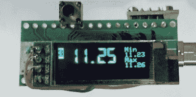

# 无线四路电压表将所有这一切结合在一起

> 原文：<https://hackaday.com/2020/12/10/wireless-quad-voltmeter-brings-it-all-together/>

如果你正在阅读黑客日报，你几乎肯定有一个电压表。事实上，听说你有两个孩子，我们一点也不奇怪。但是，如果您需要同时监控四个电压电平，该怎么办呢？即使你有四个仪表，把它们全部连接起来，并且放在一个足够方便的地方，让你能一次看到它们，也不是一件容易的事。在这种情况下，听起来像是【阿伦·莫里斯】组装的[多通道无线电压表就是为你准备的。](https://github.com/alunmorris/Multi-channel-wireless-voltmeter)

作为极简主义的一个练习，这个项目使用了一系列我们大多数人已经在零件箱里用过的组件。每个发射机都需要一个 ATtiny 微控制器、一个 nRF24L01+无线电、一个小型充电电池和一些无源元件。在接收器方面，有一个有机发光二极管屏幕，另一个 nRF 无线电模块和一个 Arduino Nano。你可以像[阿伦]一样把所有东西都放在 perfboard 的碎片上，但如果你需要一些更耐用的东西供长期使用，这将是创建一些定制 PCB 的一个很好的借口。

 虽然硬件本身相当简单，【阿伦】显然在软件方面下了很多功夫。接收器的 128 x 32 显示屏能够同时显示来自四个发射器的电压，并配有单独的电池和信号电平指示器。当您深入到单个变送器时，屏幕还会显示最小值和最大值。随着全屏显示分辨率的增加，你甚至可以看到一个非常光滑的人造液晶字体。

当然，这样一个简单的系统有一些非常严格的限制。每个变送器只能处理 0 到 20 之间的正 DC 电压，根据所用元件的质量和温度等环境因素，精度可能会随时间漂移，需要重新校准。不过，如果你需要一种方法来监控多个电压，[甚至可能将这些数据带到物联网上](https://hackaday.com/2017/01/25/voltmeter-speaks-mqtt-without-libraries/)，这绝对是一个值得考虑的项目。

 [https://www.youtube.com/embed/bwuttJC_tyY?version=3&rel=1&showsearch=0&showinfo=1&iv_load_policy=1&fs=1&hl=en-US&autohide=2&wmode=transparent](https://www.youtube.com/embed/bwuttJC_tyY?version=3&rel=1&showsearch=0&showinfo=1&iv_load_policy=1&fs=1&hl=en-US&autohide=2&wmode=transparent)

