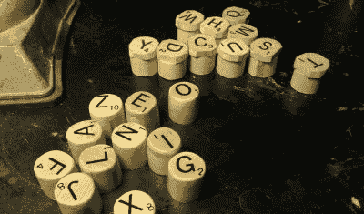

# 木质键盘搭配拼字游戏拼块更胜一筹

> 原文：<https://hackaday.com/2021/08/03/wooden-keyboard-with-scrabble-tiles-goes-the-extra-mile/>

[Steve M. Potter]像我们一样热爱并尊重一个好的、坚固的键盘，并想建造一艘传家宝级的战舰来装点他们的家庭办公室。你找不到比他更好的捐赠者了。[Steve]用的是 Unicomp，现代的 M 型。它们上面的外壳远没有真正的 M 型好，但是，嘿，你还能在哪里找到带有新的弯曲弹簧开关的键盘呢？你不是。(如果任何人有自己的新扣式弹簧开关，请告诉我们。)

 虽然它有那些奇妙的屈曲弹簧开关，但这个身体是由实心樱桃制成的。在拨入外壳的大致形状后，[Steve]使用插入式刳刨机小心地刨出所有关键的簇孔。这似乎是容易的部分，因为制作键帽看起来非常乏味。

阿尔法 a 号排都是由 3/4 英寸枫木榫杆切割成圆柱形金块，上面覆盖着拼字瓷砖。F 键和修饰键是从带有鸟瞰枫木单板的方形杨木杆上切割下来的，具有独特的外观。我们特别喜欢彩色的 F 键——它们看起来像糖果或威士忌石头，只是碰巧按照电阻颜色代码顺序排列。但我们最喜欢的部分必须是大写锁定灯。我们永远也不会明白为什么原位锁灯会过时。

喜欢这款键盘的外观但是没有这么多时间投入？[大叶子在木头上也很好看](https://hackaday.com/2021/05/21/custom-macro-keyboard-looks-good-in-wood/)。