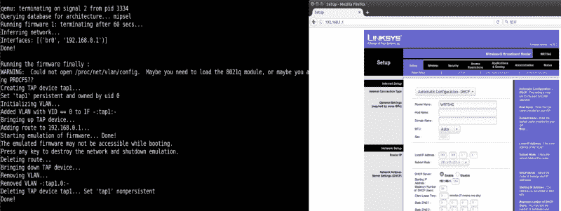
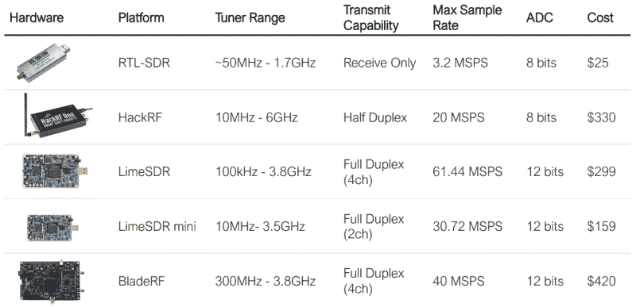

# WOPR:安全不再那么模糊

> 原文：<https://hackaday.com/2019/03/28/wopr-security-loses-some-of-its-obscurity/>

正如我们一次又一次看到的，“黑客”这个词根据你的谈话对象有不同的含义。如果你问阅读这种优秀的数字出版物的人，他们可能会告诉你，黑客是喜欢学习事物如何工作的人，并且喜欢寻找创造性的问题解决方案。但如果你让街上的普通路人描述一名黑客，他们可能会想象有人戴着巴拉克拉法帽，在昏暗的废弃仓库里敲打他们的笔记本电脑。谢谢好莱坞。

The “Hollywood Hacker” Playset

自然，我们不会认为黑客是一心想窃取你身份的数字恶棍，但我们会承认，我们所说的黑客行为与信息安全领域发生的事情之间存在一些裂痕。如果你在 Hackaday 上看到提到红队和蓝队，这更可能是指有人在 ESP32 上模仿*口袋妖怪*，而不是与渗透测试有关的任何事情。我们不完全确定黑客社区的这种分裂来自哪里，但它肯定是普遍存在的。

为了弥合这一差距，最近的 WOPR 峰会汇集了来自更大的黑客世界的所有部门的会谈和陈述。该活动的目标是表明社区的不同方面比他们可能意识到的有更多的共同点，并以一些真正模糊界限的谈话为特色。携带示波器的工作人员了解了一些他们的小工具的秘密应用，高水平的安全意识的个人很好地了解了硅香肠是如何制作的。

其中两个演讲应该特别能引起黑客群体的共鸣，分别是 Charles Sgrillo 的*物联网渗透测试简介*和 Kelly Albrink 的 *Ham Hacks:闯入软件定义的无线电*。这两个演讲讨论了我们在 Hackaday 上每天都会看到的许多技术的安全含义:蓝牙低能耗(BLE)、软件定义无线电(SDR)、家庭自动化、嵌入式 Linux 固件等。不幸的是，这些谈话并没有在首届 WOPR 峰会[上记录下来，但是两位演讲者都提供了他们的幻灯片作为参考](https://www.woprsummit.org/talks)。

## 破碎物联网

正如你可能从名字中猜到的，*物联网渗透测试简介，*对各种互联网“东西”的实际利用有相当严重的倾向。在这个演示中，Charles 描述了一些非常有趣的软件包的操作，这些软件包以前从未在 Hackaday 上出现过。坦率地说，这些令人难以置信的工具能够在我们的雷达下飞行这么长时间，这足以证明我们应该做出更大的努力，与我们更有安全意识的同行合作。

对于蓝牙低能耗工作，查尔斯建议使用 btlejack，这是一个使用多达三个 [BBC Micro:Bits 和一个定制固件](https://github.com/virtualabs/btlejack)来嗅探、捕获、劫持甚至干扰通信的项目。使用三个连接到 USB 集线器的设备运行该工具，可以覆盖更多的频道，并增加它捕获您正在寻找的内容的可能性。如果你不在真正分发 Micro:Bits 的国家[，你也可以将 btlejack 与 Adafruit 的 Bluefruit LE 嗅探器或 nRF51822 评估套件一起使用。](https://hackaday.com/2016/06/03/hands-on-with-the-bbc-microbit/)

在研究嵌入式 ARM 或 MIPS 设备时，Charles 说他在 Firmadyne 上运气很好，这是一个允许你运行固件映像的模拟器包。他用一个为古老的 Linksys WRT54G 路由器设计的固件进行了演示，展示了如何通过本地机器上的虚拟界面访问“路由器”的 web 界面。更重要的是，除了能够简单地运行固件，Firmadyne 还允许你插入一个调试器，并探索设备的虚拟文件系统，以提取关于它如何操作的重要线索。

虽然谈论假设的情况可能会很有趣，但 Charles 还从他在 IT 领域十多年的经验中提取了真实世界的例子。其中一个特别有趣的是他所谓的“物联网车载”攻击。在这个场景中，他展示了他如何能够利用 WiFi 智能灯泡的未加密配置接口来收集用户最终加入灯泡的网络的加密密钥。我们最近看到[这些灯泡倾向于在内部以纯文本方式存储网络凭证](http://hackaday.com/2019/01/29/dont-toss-that-bulb-it-knows-your-password/)，因此它们的初始配置界面也不使用加密这一事实也就不足为奇了。

## 廉价的特别提款权是一笔大交易

很大一部分 *Ham Hacks:闯入软件定义无线电*是基于一个大多数 Hackaday 读者可能熟悉的断言:RTL-SDR 项目是绝对的游戏规则改变者。这并不是说凯利认为被黑客攻击的电视加密狗必然是你在 2019 年的最佳选择，而是它打开了低成本 SDR 的闸门。在 RTL-SDR 项目之前，SDR 的价格远远超出了普通黑客的预算，有效地阻止了社区中的很大一部分人探索 RF 频谱。现在任何口袋里有 20 美元的人都可以从低兆赫一直嗅探到用于卫星通信的千兆赫频率，以前仅仅因为很少有人能监听而“安全”的系统现在已经成熟。

Kelly 给与会者上了一堂 RF 通信速成课，然后介绍了市场上一些不同的 SDR。她解释了调谐器范围和采样率等实际考虑因素，以及展望无线电黑客应该如何将这些变量纳入他们的购买。但她也谈到了社区和文档的重要性；LimeSDR Mini 的价格令人难以置信，但它没有更昂贵的 HackRF T3 那样大的社区(T2)。

随着 SDR 硬件的广泛应用，Kelly 继续给出了一些捕获信号并最终将其转换成可以检查的数据位的实际演示。过程的前半部分:识别目标设备使用的频率，使用 GQRX 等工具进行微调，然后使用`rtl_sdr`命令进行捕获，这是[我们已经在许多项目中使用过的东西](https://hackaday.com/2019/01/19/automate-your-home-from-the-clearance-rack/)。

但是这个难题的最后一部分，从捕获的数据中获取有用的数据，是我们还没有看到的。Kelly 介绍了 Inspectrum、DspectrumGUI 和[当然还有通用无线电黑客](https://hackaday.com/2017/02/23/universal-radio-hacker/)等工具，并演示了如何使用它们来捕获 SDR 文件。我们遇到的许多 SDR 黑客本质上只是重新传输原始捕获，很少考虑信号实际包含的信息，更深入地了解这些开源工具如何帮助从简单的模仿走向理解是很有趣的。一旦你能够解码空中发送的数据，你就可以*修改*数据了；这才是真正有趣的地方。

 [https://www.youtube.com/embed/M6vUJbav1VE?version=3&rel=1&showsearch=0&showinfo=1&iv_load_policy=1&fs=1&hl=en-US&autohide=2&wmode=transparent](https://www.youtube.com/embed/M6vUJbav1VE?version=3&rel=1&showsearch=0&showinfo=1&iv_load_policy=1&fs=1&hl=en-US&autohide=2&wmode=transparent)

## 透过镜子

这些演示涉及的主题是黑客读者熟悉的，但在这两种情况下，都带来了新的东西。看到技术的“另一面”是 WOPR 峰会的中心主题，这些会谈表明，视角的转变往往可以带来新的细节。一些疯狂的小伙子聚集在一起英国广播公司微:比特捕捉 BLE 交通是我们在破门而入之前所能达到的最大限度，事实上，我们直到现在才看到它是一个完美的例子，表明信息没有在不同的阵营之间顺利移动。

希望将来其他黑客事件将采用这种更折中的方式来展示主题，并帮助在众多黑客之间建立更好的对话。否则，我们不仅会错过有用的技术和工具，更糟糕的是，在解决方案已经开发出来的情况下，还要重新发明轮子。