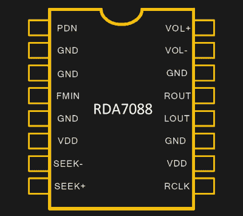

# 使用与 I2S 兼容的调频调谐器

> 原文：<https://hackaday.com/2022/12/23/working-with-i2s-compatible-fm-tuners/>

虽然互联网是一个获取你所梦想的任何音乐或音频的好地方，但广播电台仍有一席之地。[mit41301]最近一直在探索在各种项目中实现简单的 FM 调谐器芯片。

问题中的芯片是 RDA7088，它的外部元件要求最低，采用紧凑的 SOP16 封装。根据[数据表，](https://xn--p8jqu4215bemxd.com/wp-content/uploads/2019/08/rda7088.pdf)它旨在用于便携式收音机、PDA、手机和 MP3 播放器等应用。

【MIT 41301】的第一次尝试是将芯片用作简单的调谐器，连接到 PIC10F200 进行控制。调查显示，它能够通过 I2S 输出数字音频，同时通过 I2C 接受指挥。默认情况下，它以 8 kHz 的低采样率输出音频，但重新配置会将采样率提高到 44.1 或 48 kHz。将数字 I2S 流通过管道输出到 DAC，然后提供模拟输出，该输出可以馈入放大器。该建筑还可以远程控制，PIC 负责解码红外信号并向无线电芯片输出命令。

继这一成功之后，[mit41301]更进一步，将一个 ESP-01 连接到芯片[上，试图让 RDS 运行](https://hackaday.io/project/188624-i2s-output-fm-tuner-with-rds)。如果你对无线电数据系统不熟悉，这是一种通过调频广播发送短文本信息的方式。除了 PIC 模块执行的任务之外，ESP-01 还负责从 RDA7088 接收 RDS 数据，并将其输出到显示器。

虽然使用这种芯片在工业中是家常便饭，但看到与特定硬件接口的 DIY 指南总是很棒。如果您想将 FM 无线电集成到自己的项目中，RDA7088 是一种简单易行的方法。我们以前见过类似的工作，在树莓派中加入调频收音机。

 [https://www.youtube.com/embed/ZwBNjuqUm9Q?version=3&rel=1&showsearch=0&showinfo=1&iv_load_policy=1&fs=1&hl=en-US&autohide=2&wmode=transparent](https://www.youtube.com/embed/ZwBNjuqUm9Q?version=3&rel=1&showsearch=0&showinfo=1&iv_load_policy=1&fs=1&hl=en-US&autohide=2&wmode=transparent)

