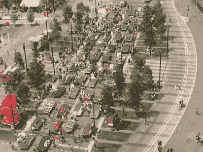
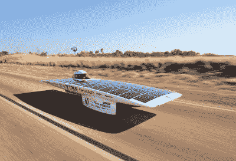
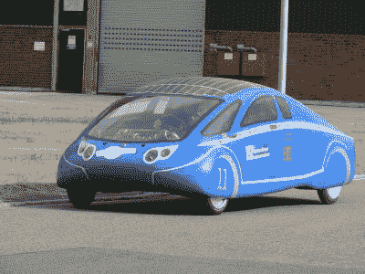

# 世界太阳能挑战:太阳能汽车能走多远？

> 原文：<https://hackaday.com/2020/12/21/world-solar-challenge-over-30-years-of-engineering-competition/>

太阳能是一种很好的可再生能源，但总是有其局限性。在阳光明媚的日子里，地球表面最多只有 1000 瓦/米 2²可用，太阳能电池板的有限效率进一步降低了这一数字。它的含量如此之低，以至于乘用车上的太阳能电池板被限制在卑微的任务上，比如电池维护和运行低功率的换气扇。

然而，有些人可能认为不可能，其他人则认为有机会。世界太阳能挑战赛是一项旨在展示太阳能交通工具真正潜力的比赛。现在，它已经诞生 30 年了，过去不可能的事情，实际上已经由多个团队在不到原来十分之一的时间内完成了。为了让竞争对手保持警觉，规则随着时间的推移而不断演变，总是在挑战仅仅依靠阳光的可能性。这不是主流交通工具。这是一项工程挑战。太阳能汽车能走多远？

## 历史

The Quiet Achiever, pictured here on its 1982 cross-continental journey, was the progenitor of the World Solar Challenge.

这项活动的创始人是丹麦出生的冒险家汉斯·索尔斯特鲁普，他对可持续发展和化石燃料的替代品充满热情。与澳大利亚旅行车传奇拉里·帕金斯和他的兄弟加里一起，三人组造了一辆名为*宁静致远的太阳能汽车。*1982 年，这种轻型交通工具仅用 20 天时间从珀斯到悉尼行驶了 2518 英里，完全依靠太阳能。这一壮举引起了公众的广泛关注，直接导致了 5 年后世界太阳能挑战赛的首次举办。

首届比赛于 1987 年与南澳大利亚旅游委员会合作举办。有 13 名选手在起跑线上列队，其中 6 名到达了终点线。通用汽车公司凭借 *Sunraycer，*在 44 小时 90 分钟内完成了从达尔文到阿德莱德的全程，比排名第二的福特澳大利亚公司快了近 23 小时。

最初每三年举行一次，从 1999 年开始改为每两年举行一次。几年来，已经有超过 50 支队伍在起跑线上加入了比赛，尽管许多队伍因为撞车或机械故障而退出比赛。参赛者来自世界各地的不同背景，参加比赛。在过去 30 年的竞争中，来自汽车制造商、科技公司、大学甚至高中的参赛者纷至沓来。通常，团队发起人来自与此类应用相关的高科技行业。拥有一家能够提供高效太阳能电池板或重量轻、功率大的发动机的公司会大有帮助。

The race is run from Darwin in the Northern Territory, down to Adelaide in South Australia. The race finishes with all competitors forming up in Victoria Square for final celebrations.

多年来，随着新技术的出现，这场竞赛也在不断发展。随着太阳能电池板的效率越来越高，对最大太阳能电池板面积的规定也越来越严格。这有助于降低成本，因为最新最好的太阳能电池板并不便宜。其他法规侧重于限制车载储能，并确保竞争者之间的公平竞争环境。竞赛车辆在公共道路上行驶，因此需要遵守速度限制和道路规则。

随着多年来平均速度的提高，规则也发生了变化，将重点放在了实用性上，旨在引导竞争对手设计更接近街道上可用的车辆。现在，比赛的特点是多乘客车辆的巡洋舰级别，根据进入的难易程度和旅程中累积的乘客公里总数等因素进行评分。

## 一切都是为了效率

The Tokai Challenger, built by students from Japan Tokai University, won the 2009 event. Note the extreme, streamlined design aiming to minimise drag.

就像传统的赛车运动一样，世界太阳能挑战赛的规则塑造了竞赛车辆的设计。在能源有限的情况下，效率是设计各个方面的关键。能够获取最大能量并将其转化为前进动力的竞争者最有可能赢得胜利。

在电力方面，首先要考虑的是从可用的太阳光中有效地获取尽可能多的能量。安装最高效的太阳能电池板只是等式的一部分。下午 5:00 驾驶结束后，车队通常会倾斜他们的太阳能电池板，使其垂直于太阳光线，以在日落前充分利用光线。为了榨干电池的每一滴水，[最大功率点跟踪](https://hackaday.com/2017/03/17/are-you-down-with-mppt-yeah-you-know-me/)硬件用于保持太阳能电池处于最佳工作范围。电机和控制器的设计类似，重点是在道路上推进车辆时尽可能少地浪费能量。

2013 saw the introduction of the Cruiser class, for solar vehicles intended to carry multiple passengers.

也许对这些车辆的外部设计影响最大的是空气动力学。以高达 130 公里/小时的速度行驶数小时，阻力在能源效率方面发挥着巨大的作用。将阻力降低到绝对最小是关键，单人挑战级别的车辆通常采用俯冲、刀片式泪珠设计。轮子通常装有翼型整流罩，以允许它们在空气中滑行。历史上，大多数设计都让驾驶员以近乎俯卧或横卧的姿势躺着，以最大限度地减少他们对汽车外形的影响，然而近年来，[座椅位置已经改为更自然的直立姿势，以更好地模拟公路车辆](https://www.abc.net.au/news/2013-10-08/solar-challenge-day-three-slow-pace-alice-springs/5008692?nw=0)。巡洋舰级别的参赛作品往往在这一领域有更多妥协的设计，因为它们必须更笨重和更高，以承载多个座位的乘客。然而，他们仍然致力于尽可能地减少阻力，即使刀口流线型设计在这一级别中不实用。

机械效率也是制造有竞争力汽车的关键。滚动阻力必须保持在最低水平，为了达到这一目标，使用了专门设计的轮胎。确保正确选择和维护轴承、链条和皮带以避免这些区域的过度损耗也很重要。当旅行数千英里时，对这些小细节的关注可能会产生严重的影响，尤其是在能量如此之低的情况下。

## 展望未来

随着车队继续制造赛车以最好地应对现有的挑战，规则集继续改变以进一步推动极限。2021 年，法规将再次改变，专注于驾驶员舒适性、比赛车辆的动态稳定性，并包括新的安全功能，如日间行车灯。所有这些变化都会对性能产生影响，从改变空气动力学到为车辆增加新的动力。然而，正是这种挑战迫使团队创新和调整他们的设计，创造出比以往更好、更有能力的太阳能汽车。尽管我们预计太阳能电池板不会很快成为乘用车的标准配置，除非我们的太阳发生重大变化，但该活动仍然是太阳能和电力推进技术最优秀的一个有用的展示和试验场。