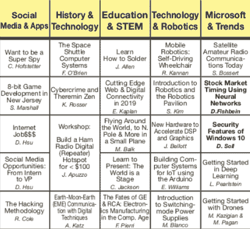

# 世界上最古老的计算机节将于本周末举行

> 原文：<https://hackaday.com/2019/03/20/worlds-oldest-computer-festival-is-this-weekend/>

曾几何时，拥有一台家用电脑是件大事。在互联网普及之前，所谓的“电脑展”是与他人交流建议、信息和硬件的最佳方式。当然，今天的情况大不相同。组装电脑的人只是在网上购买零件，其他人可能都在使用沃尔玛 200 美元的笔记本电脑，不值得花时间或金钱升级。

Small sampling of the talks at TCF 2019

因此，虽然特伦顿计算机节(TCF)可能始于 1976 年，作为人们购买早期计算机如 Altair 8800 的一种方式，但多年来，它已经演变成一种更接近现代概念的“骗局”。那些参观 3 月 23 日在新泽西大学举行的第 44 届 TCF 的人可能会在节日的大部分时间里参加 40 多个讲座和研讨会，这些讲座和研讨会将在短短六个小时内举行。但是任何有钱的人仍然可以去跳蚤市场，在那里他们可以买到现代的和老式的硬件。

谈话涵盖了从 Arduino 到量子计算的所有领域，如果你在今年的计划中没有看到任何引起你兴趣的东西，人们可能会想知道你最初是如何发现自己在阅读 Hackaday 的。如果你能在所有讲座之间找到一些空闲时间，开锁人开放组织(TOOOL)的新泽西分会将在那里提供一个动手开锁课程，如果你不介意参加速成班，你甚至可以获得你的业余无线电执照。只需门口 20 美元的天价。

事实上，TCF 发生的事情太多了，让人有些不知所措。正如我在去年的访问中发现的那样，同时举行的活动数量意味着你几乎肯定会做出一些艰难的决定。为了 TCF，我今年将再次前往新泽西大学校园，并将有大量的黑客贴纸和徽章发给那些在我演讲间隙试图阻止我的人。