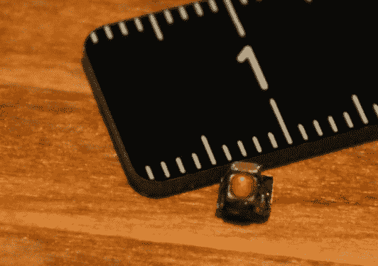
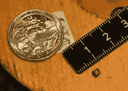
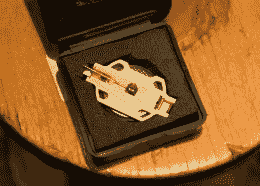

# 世界上最小的 LED 闪光灯

> 原文：<https://hackaday.com/2018/09/23/worlds-smallest-led-blinky/>

[迈克·哈里森]以极其微小的焊接而闻名。现在，他声称自己拥有“世界上最小的”独立 LED 闪光灯，我们认为他已经创下了纪录。

他带着它参加了周五的猎兔犬聚会，我们近距离观察了这个小型的集会。这个项目是在[Mike]看到 Seiko 关于一种小型封装的新型超级电容器的公告时构思出来的(很可能是 cph 3225 a，使 blinky 的尺寸为 3.2 x 2.5 毫米)。在此基础上，他添加了一个 SOT23 封装的 PIC 10f322 微控制器、一个 0603 平滑电容器和一个 SMD LED。

  Blinky net to a metric ruler  US Quarter for scale (ruler is metric)  Charging jig doubles as a carrying case

如此小的包装，最棘手的部分是如何给超级电容充电。[Mike]用钻头和手锉在 CR2032 电池座上钻了一个方孔，作为夹具。当弹簧针第二次连接到组件侧面的端子时，超级电容的底部靠在电池上。它充电很快，充电后会愉快地闪烁大约六分钟。

迈克开始制作其中的两个，但在他的工作台上掉了第二个超级电容，永远消失在每个电子车间常见的碎屑中。当他第一次在聚会上拿出来的时候，我们在一个屋顶露台上，我们有点担心它会被风吹走。你如何开始制造这样一个微小的组件？他先用紫外线固化环氧树脂将它们粘在一起，然后用手工完成焊接！

 [https://www.youtube.com/embed/47bqgQxyNs0?version=3&rel=1&showsearch=0&showinfo=1&iv_load_policy=1&fs=1&hl=en-US&autohide=2&wmode=transparent](https://www.youtube.com/embed/47bqgQxyNs0?version=3&rel=1&showsearch=0&showinfo=1&iv_load_policy=1&fs=1&hl=en-US&autohide=2&wmode=transparent)

