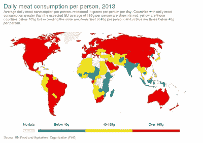
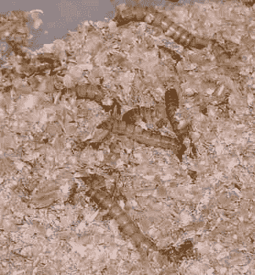

# 你想要薯条配你的昆虫汉堡吗，夫人？

> 原文：<https://hackaday.com/2021/02/10/would-you-like-fries-with-your-insect-burger-maam/>

在疫情的封锁期，逛超市是一种罕见的奢侈，但如果我今天提着篮子在过道里闲逛，我可能会带走一堆健康的水果和蔬菜，一点肉和鱼，也许还有一些奶酪。不过，2031 年我的购物篮可能会有一些额外的东西，也许令人惊讶的是，其中一些可能来自昆虫。欧盟科学家宣布，人类和动物食用人工养殖的昆虫产品是安全的，这离未来又近了一步。

Is meat consumption at this level sustainable? Our World In Data, [CC BY 3.0](https://commons.wikimedia.org/wiki/File:Daily_meat_consumption_per_person,_OWID.svg).

我们人类，像我们的一些类人猿同胞一样，是杂食动物。我们可以吃任何东西，即使我们可能不总是想吃两次。因此，个体人口的饮食在过去会有很大的不同，这取决于他们生活的地方的条件，这使我们有能力传播到地球上的几乎任何地方——我们做到了。

在过去的几百年里，这种只依靠当地食物生存的需要已经被农业的进步边缘化了。对于我们这些生活在发达国家的人来说，任何我们喜欢的食物都可以是我们的，只需要一点小小的努力。这意味着[肉类消费的爆炸式增长](https://en.wikipedia.org/wiki/List_of_countries_by_meat_consumption),因为曾经的奢侈食品已经变得大众负担得起，反过来，相应的农业扩张以满足需求，这给生态系统带来了无法承受的压力，并在很大程度上导致了全球变暖。很明显，向纯素食主义的大规模转变不太可能发生，所以养殖昆虫可能是我们对肉类蛋白质渴望的答案吗？对消费者来说，这可能很难接受，但这是一个需要更多检验的问题。

## 你美味、营养、多皱纹的朋友！

Mealworms thrive on a diet of bran. Richard Chambers, ([CC BY-SA 3.0](https://commons.wikimedia.org/wiki/File:Mealworms_in_plastic_container_of_bran.jpg)).

在任何读者想象吃一只令人毛骨悚然的爬虫之前，值得指出的是，有问题的昆虫不太可能是有翼有腿的成年昆虫，它们正盯着潜在的食客。相反，这是一个替代蛋白质来源的故事。这些几乎肯定是幼虫，昆虫生命周期的早期阶段，干燥后加工成其他食物。例如，我们最终可能会吃到由昆虫蛋白制成的汉堡。

最常被提名为候选的物种是黄粉虫，这是一种甲虫幼虫，特别容易繁殖，可以以谷类工业的副产品如麦麸为食。[它们的养殖非常简单，甚至可以在家里进行](https://www.instructables.com/Mealworm-Farm/)，但即使扩大到商业规模的设施，它们也只占养殖同等体积牲畜蛋白质所需土地和水资源的一小部分。

## 不要让欧盟科学家开始

[来自欧盟科学家的研究论文](https://efsa.onlinelibrary.wiley.com/doi/10.2903/j.efsa.2021.6343)详细分析了干燥的黄粉虫幼虫，包括完整的和磨成粉末的。对于一个非食品科学家来说，他们在做这项工作时所涉及的细节是令人大开眼界的，但作为消费者，我们知道细菌、有毒重金属或其他有毒化合物的水平受到控制是很重要的。在对养殖过程进行详细检查后，他们得出结论，用不含任何此类有害物质的适当食物喂养的经过适当处理的黄粉虫产品在食用时不会有风险。在他们测试的批次中，一些批次的蛋白质含量高达 58.9%，脂肪含量高达 27.6%，其余大部分是甲壳素形式的膳食纤维。来自这篇文章在线研究的轶事证据表明，它们有一种令人愉快的味道，被一些人描述为轻微的坚果味。

我在一片厚重的粘土上长大，周围都是农田，传统上是牧场，但随着更有效的土壤管理耕作技术的引入，在 20 世纪 70 年代和 80 年代转变为耕地。今天，它种植了大片大片的谷类作物，但它们基本上不会出现在你的盘子里。相反，大片的乡村为室内牲畜饲养提供了饲料，大量的土地生产出数量少得惊人的食物。我生长在一个英国农业社区，喜欢吃高质量的肉类，但多年来我逐渐形成了一种观点，即这种养殖方式绝不是利用土地生产食物的最有效方式，也不是最环保的方式。我更喜欢吃少量的高标准牛肉，而不是期望每天吃以这种方式集中养殖的牛肉。因此，以种植在那片土地上的粮食作物的副产品为饲料的养殖昆虫蛋白的前景只能是积极的一步，我欢迎欧盟的举措，这是我们做出这种改变的早期步骤。问题是，谁会第一个把虫子汉堡放进购物篮？