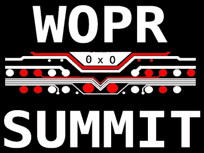

# 你想玩游戏吗？WOPR 峰会将于本周末举行

> 原文：<https://hackaday.com/2019/02/25/would-you-like-to-play-a-game-wopr-summit-is-this-weekend/>

在夏季的几个月里，它可能被称为“美国的游乐场”，但在每年的这个时候，大西洋城通常是那些想烧掉一些固定收入的老年人的首选目的地。当然，那是在 WOPR 峰会召开之前。从 3 月 1 日到 3 日，[它承诺将著名的大西洋城木板路上的 Bally 酒店和赌场改造成一个高科技绿洲](https://www.woprsummit.org/)在氧气罐和步行者的海洋中。在一年中的这个时候，可能不会有什么有趣的事情发生，但是一个完整的会谈和研讨会的时间表，涵盖了从渗透测试到业余无线电爱好者的所有事情，无论如何都更符合我们的速度。

 还有几天就可以在网上打折注册 WOPR 了，但是如果你错过了截止日期，他们自然会很乐意在门口收你的钱。截至本文撰写之时，Bally's 甚至还有 WOPR 特价的房间，你可能会想利用[的时间，因为时间表上的活动一直持续到我们正常的就寝时间](https://www.woprsummit.org/schedule)之后。

WOPR 看起来将会是硬件和软件的完美结合，并有大量的信息安全技术。像*“你的项目策略:概念到原型”*和*“成为 q——设计黑客小工具”*这样的演讲听起来就像是经典的黑客大餐。但是，即使你通常不关注安全领域，像*“Ham Hacks:闯入软件定义的无线电”*和*“物联网渗透测试简介”*这样的演讲看起来将是跨越鸿沟的一个极好的方式。在会谈间隙，他们承诺会有一个黑客空间开始运行，供你查看，并提供焊接课程和竞赛。

你并不经常能够见证一个新的黑客会议的诞生，尤其是在东海岸，所以当我从老年中心赶下一辆开往木板路的公交车时，Hackaday 将摆脱我们漫长的冬季午睡。找到我，你甚至可以把我们的快乐扳手贴纸和你的吃角子老虎机奖金一起带回家。但是，即使你这个周末不能去美国相当寒冷和狂风大作的游乐场，我也一定会报道所有的亮点，这样你就可以通过你最喜欢的屏幕的舒适闪烁来身临其境地生活。