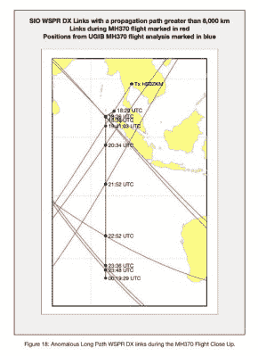

# WSPR 可能是 MH370 最终位置的关键

> 原文：<https://hackaday.com/2021/04/24/wspr-may-hold-the-key-to-mh370-final-position/>

2014 年 3 月，马来西亚航空公司(Malaysia Airlines)MH 370 航班在不明原因的航向改变后在印度洋上空向南飞行，随后失踪，残骸的最终位置仍然是个谜。多年来，人们一直在努力缩小可能的搜索范围，现在我们从一个意想不到的来源获得了进一步的消息。使用业余无线电 WSPR 协议，飞机的路径可能[在无线电散射中显示为异常长距离接触。](https://www.mh370search.com/2021/04/03/wsprnet-and-inmarsat-satellite-data/)

 [WSPR](https://wsprnet.org/drupal/) 是一种低功耗的业余无线电模式，旨在探测和记录大气的无线电传播能力。发射信标和接收站连续运行，所有的接触，无论多么短暂，都被记录到一个在线数据库中。对大气感兴趣的研究人员可以挖掘这一点，但在这种情况下，它也可能为失踪客机的飞行路线提供线索。通过搜索路径与 MH370 预期位置交叉的异常长距离 WSPR 接触，有可能发现飞机形成无线电波反射器的时刻。然后，这些联系人可以确认已经使用其他方法估计的位置，或者甚至提供进一步的航向点。这是一个令人印象深刻的演示，展示了可能潜伏在 WSPR 日志等宝藏中的意外数据，同时也展示了当我们在广播中乱搞时，我们留下的标记可能比简单地吹嘘我们工作过的 DX 有更多的好处。

如果 WSPR 业务引起了你的兴趣，那么[请阅读我们 *$50 火腿*系列中关于它的文章](https://hackaday.com/2021/03/25/the-50-ham-wspr-ing-around-the-world/)。

表头:来自法国 L'Union 的 Laurent ERRERA， [CC BY-SA 2.0](https://commons.wikimedia.org/wiki/File:Boeing_777-200ER_Malaysia_AL_(MAS)_9M-MRO_-_MSN_28420_404_(9272090094).jpg) 。

[via [南门弧](http://www.southgatearc.org/news/2021/april/using-wspr-data-to-detect-mh370.htm)