# 第二次世界大战飞机无线电咆哮到生活:需要什么来恢复一段历史

> 原文：<https://hackaday.com/2019/12/12/wwii-aircraft-radio-roars-to-life-what-it-takes-to-restore-a-piece-of-history/>

我一生都被告知，在旧时代的陆军/海军剩余物资商店里，你可以买到成桶的 FT-243 晶体、无线电设备、防毒面具，甚至是装在大木箱里的吉普车。遗憾的是，情况不再如此。今天，剩余的商店只有当代中国制造的靴子、露营装备和手电筒。除了我在阿迪朗达克度假时发现的一家剩余商店之外，它们都令人失望透顶:乔治湖的爱国者。

在那里，我发现了一只具有历史意义的独角兽；一个未修改的自二战以来剩余的 CBY-46104 接收机与发电机。生产日期是战前，1942 年 2 月。这东西保存得和从 F4F 地狱猫里取出来的时候一样好。从来没有锤子把烙铁或钻头放在上面。这支部队在南太平洋有过行动吗？想象一下它能讲述的故事！

我对这台收音机的非传统修复遵循了严格的规则，以最大限度地减少内外修复的痕迹，同时使这台收音机再次运行，就像它刚从装配线上下来一样。让我们看看我做得怎么样。

## 满足各种需求的收音机

安装在二战飞机上的[无线电系统的清单还在继续，对于像夜间战斗机这样完全依靠无线电导航和雷达系统来执行任务的特殊飞机来说更是如此，干扰飞机的目的是隐藏轰炸飞机的舰队或沿海领土的入侵。每项专门任务都有不同的系统:](https://aafradio.org/flightdeck/b29.htm)

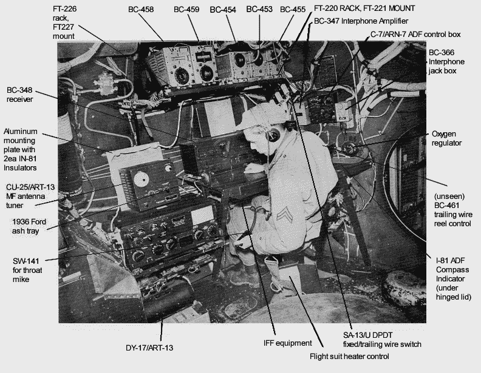

An early B-29 radio installation showing a menagerie of radio gear. More gear would be installed as the war dragged on. Bottom line is, they used lots of radio equipment for a multitude of purposes.  A very busy radio room indeed!

*   远程无线电系统，用于与基地通信，通常由 ART-13 发射机和 BC-348 接收机组成。
*   为飞机对飞机通信而设计的短程无线电系统，被称为细分为多个频段的命令集。
*   空对地无线电通信设备。
*   识别飞机为友军的雷达信标(识别敌友，或 IFF)。
*   各种类型的无线电导航接收机
    *   无线电测向仪，
    *   着陆用下滑道接收器，以及
    *   类似于现代 GPS 的 TDOA 无线电导航系统(除了你必须用示波器手动测量到达的时间差，并在特殊的图表上排列出来)，例如 [GEE](https://en.wikipedia.org/wiki/Gee_(navigation)) 。
*   不同类型的雷达系统。
*   探测敌方雷达信号的电子战接收器。

# ARC-5 无线电设备的一部分

[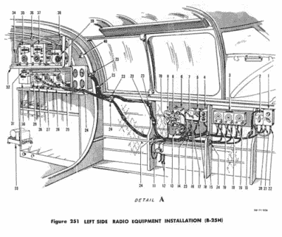](https://hackaday.com/wp-content/uploads/2019/11/fig251.jpg)

Command set installation in a B-25H, showing location of command set equipment (left) and the control heads (right) that are located so as to be available to the pilot for direct radio control.

在这个无线电系统动物园的某个地方，你会发现一个 CBY-46104 接收器。该接收机是一系列无线电设备的一部分，称为 ARC-5 命令集，它描述了一整类用于飞机对飞机通信的 WW2 发射和接收设备。这类设备包括独立的发射器和接收器，可以由飞行员通过安装在驾驶舱某处的遥控头进行遥控。

这些无线电是在 20 世纪 30 年代中期设计的。发射机采用了一种 [MOPA](http://www.rfcafe.com/references/electrical/NEETS-Modules/NEETS-Module-12-1-31-1-40.htm) (主振荡器功率放大器)架构，支持 AM 电话和 CW(又名莫尔斯码)传输。接收器使用单变频外差式架构，类似于那个时代的[大木控制台收音机。八管被用作有源器件，工作频率不超过 20 MHz，这在 1930 年代中期被认为是高频。](https://hackaday.com/2014/09/09/welcome-to-the-old-school-restoring-antique-radios/)

这款无线电设备符合二战标准，重量很轻，CBY-46104 仅重 6 磅，完全由铝制成。这是一种精心平衡的底盘/无线电设计，以实现重量最小化(毕竟这些是安装在飞机上的)，同时还保持坚固耐用，能够在军用规范温度范围和强烈振动下提供稳定的操作。

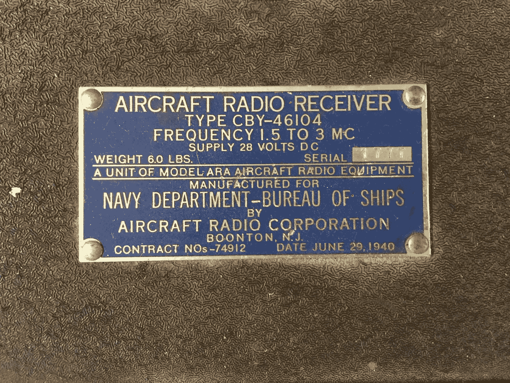

CBY-46104 覆盖 1.5-3mc AM 或 CW(它也可以在 CW 模式下调谐到单边带)，由新泽西州布恩顿的飞机无线电公司于 1942 年 2 月制造，序列号为 1777。这份合同的日期为 1940 年 6 月 29 日，编号为#74812，证明了珍珠港事件前战争物资采购/生产的增加。换句话说，他们为这场冲突提前做了计划(这是一本关于这个主题的有趣的[书](https://www.amazon.com/Freedoms-Forge-American-Business-Produced/dp/0812982045)，讲述了美国的战争生产是如何由通用汽车的一位高管提前建立的，这位高管在 20 世纪 20 年代和 30 年代建立了通用汽车的全球供应链)。

## 修复的交战规则

为了保存这一历史宝藏，我的修复原则是:

*   不需要更换任何部件。
*   如果电容器出现故障，则必须重新填充。
*   装置必须完全按照原始规格运行。
*   单位必须运行其发电机，因为它是打算。
*   无论是在机箱上还是在插件上，都不能钻孔。
*   后部电源连接器必须保持原样。
*   没有任何底盘改造。

这些规则并不容易遵守，因为正如我们所知，修复古董收音机的第一步是更换所有的纸和电解电容器，这样可以节省很多麻烦和时间。

## 初步评估

我没有更换瓶盖，而是粗略地检查了一下瓶盖，并试着启动设备进行评估。我用 Fluke DVM 在电阻模式下测试了电解电容和纸电容，看是否有明显的短路或低阻抗。就我的 DVM 而言，所有的电容都是开路的(不幸的是，DVM 对适当的泄漏测试不够敏感，稍后会详细介绍)。

接下来，我必须找到文档。幸运的是，很容易找到 WW2 无线电设备的文档，因为它在 40 年代末到 70 年代初在世界各地的业余电台中无处不在([这里是所有或大多数 ARC-5 设备手册的 PDF 链接](http://bama.edebris.com/download/military/an-arc5/AN%2016-30ARC5-2%20open.pdf))。后二战时代的一个典型做法是埃尔默·哈姆夫妇将一架 ARC-5 接收机赠送给一个正在工作以获得执照的年轻哈姆。有了这样的接收器，年轻的汉姆就可以收听来自世界各地的无线电通信，并练习收听莫尔斯电码(CW)传输。

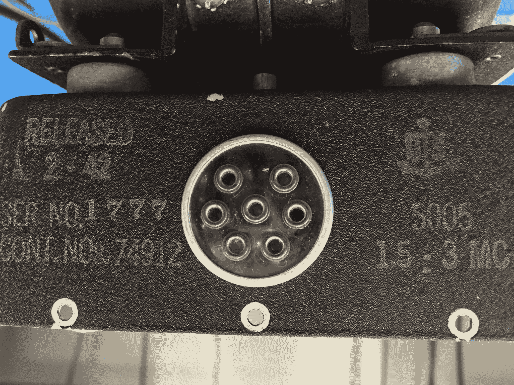

连接军用剩余无线电设备并不容易，因为它们通常使用多针多用途连接器进行电源和其他控制。根据文档，我想出了什么必须插入背面的多针连接器；+28 VDC，外部 CW/AM 拨动开关，RF 增益控制罐，600 欧姆扬声器(我使用了 8 欧姆扬声器和阻抗匹配变压器)。

但是有人可能会问，“在 28VDC 输入的情况下，我们如何为真空管板获得高电压？”这是他们在二战中是如何做到的:这个单位有一个被称为发电机的东西。发电机产生了高电压。从接收器到在低压 DC 总线上运行的发射器，一切都使用发电机来产生运行所需的 200-1000V 或更高的电压。

 [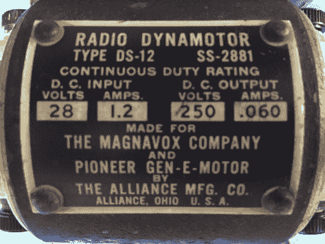](https://hackaday.com/2019/12/12/wwii-aircraft-radio-roars-to-life-what-it-takes-to-restore-a-piece-of-history/img_1143-2/)  [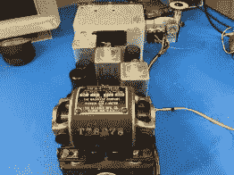](https://hackaday.com/2019/12/12/wwii-aircraft-radio-roars-to-life-what-it-takes-to-restore-a-piece-of-history/img_1147-2/)  [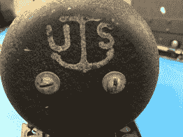](https://hackaday.com/2019/12/12/wwii-aircraft-radio-roars-to-life-what-it-takes-to-restore-a-piece-of-history/img_1152-2/)  [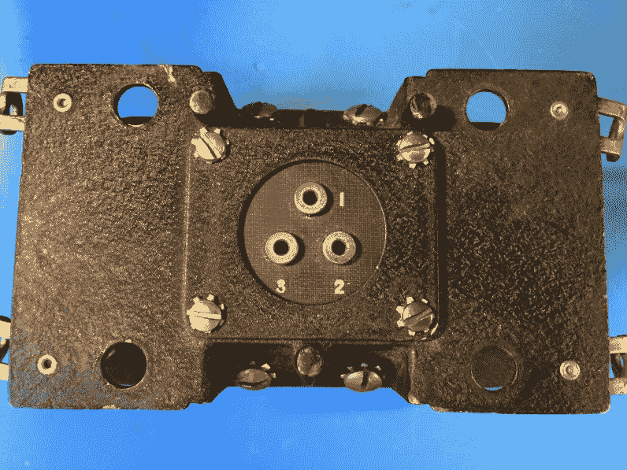](https://hackaday.com/2019/12/12/wwii-aircraft-radio-roars-to-life-what-it-takes-to-restore-a-piece-of-history/img_1153-2/) 

发电机是电动发电机；在我的例子中，一端是 28VDC 的旋转电机，另一端是 250VDC 的发电机。这种电机不是将两个电机的两个轴连接在一起(船上较大的装置实际上使用了这种配置)，而是与两个电枢和两组电刷组成一个紧凑的装置。28 伏直流电输入，250 伏直流电输出，同时像旋转的鸟一样旋转。

我从电机的两侧移除了钟形件(端盖)。我施加 28V 电压，小心地用手指推动发电机 28V 侧的电枢，让它运转起来。它像 1950 年代的喷气发动机一样旋转起来！whrrrrrrrrrrrrr…..

大约 30 秒后，Whrrr 听起来有点慢，实际上是负载过重，因为真空管正在预热，并从发电机的 250VDC 输出中吸取电流。然后扬声器里传出噪音。我连接上我的 20 米偶极天线，令我惊讶的是，我正在收听 1500 Kc 左右的 AM 广播电台。有很多噪音通过扬声器传来，可能是由于去耦电容失效，否则会消除发电机的嗡嗡声。接收器不太灵敏，调谐在刻度盘的较高频率范围被干扰了。就在这一点上，我关闭了它，这个收音机想工作，我现在要做的就是清理她，并解决一些事情。

## 维修电容器和电阻器

首先要做的是准确测试电容器，因为很明显有些电容器不符合规格。正确测试电容非常困难，需要多次测试才能排除坏电容的故障:

*   在欧姆设置下用数字电压表进行测试。
    *   用 DVM 在电阻模式下测试电容器将显示哪些是短路的，但它不会显示泄漏的电容器，这些电容器在高电压下泄漏非常轻微(例如，具有极高的 DC 阻抗)。DVM 测试只能显示短路的电容，这是必要的第一步。
*   **测试规定值。**
    *   电容器必须在其指定值下工作，因此最好测试一下电容是否能起到电容的作用。该测试将显示盖子是否按照规定发挥作用。不幸的是，一些泄漏电容将测量到其规定值，所以这个测试不是决定性的。
*   **静电电阻(ESR)。**
    *   在现代低压电子产品中，衡量电容品质的关键指标是 ESR。该测试将确认电容器对高频信号呈现低阻抗。换句话说，在相对较高的频率下测量时，电容器的串联 DC 电阻是多少。理想情况下，电容应该不呈现任何电阻，但实际电容确实呈现一些低电阻，而不良电容呈现的电阻远远大于某些电阻。
    *   也就是说，ESR 测试对于测试电子管设备中的电解电源电容非常有用。
*   **泄漏。**
    *   对于高压电容，衡量品质的关键指标是漏电。旧电容器漏过多少电流？如果少量电流(单位数 uA 量级)漏过，则该电容是坏的。漏帽将像高值电阻器一样工作，在几兆欧姆的范围内，从而反向偏置电子管的栅极或自身放电，使其完全不像电容器那样工作。泄漏测试绝对重要，每个瓶盖都必须进行泄漏测试。

鉴于所有这些，排除电子管设备故障的关键是测试每个电容的电容，以验证其功能，并测试泄漏，以确保电路之间没有泄漏电流。

为了用一个测试设备检查值和泄漏，你必须重新使用一个被称为电容器检查器的旧测试设备。很多年前我在代顿会议上花 10 美元找到了我的。它由几个刻度盘和一个非常灵敏的“魔眼”管组成，可以检测到泄漏。Carlson 先生的实验室有一个关于如何使用一个的视频。

为了检查每个电容，我不得不把它们从电路上一个一个地拆下来。这是不可避免的，否则你可能会漏读上限数值或泄漏测试。值得注意的是，绝大多数这些 1942 年 2 月电容器测试良好。这证明了如果没有必要，不要更换所有的瓶盖。我发现除了三个金属罐密封的蜡和纸帽(专用于 ARC-5 和其他二战无线电设备，因其金属罐的形状而被称为“花盆”电容器)和电解帽之外，其余都需要更换。我选择通过打开金属罐，取出内脏，放入一个现代的替代品，然后将罐子粘在一起，来重新填充有缺陷的瓶盖。

### **电阻器维护**

接下来，我用 Fluke DVM 检查了所有的电阻。管齿轮的好处是，当电源关闭时，管呈现开路，因此您可以在电路中可靠地测试电阻，而无需移除它们。

旧电阻器的值会随着时间的推移而增加。尤其是在 100 千欧或 100 兆欧范围内的较高值。对于这台收音机，没有一个电阻超出公差范围！对于 1942 年 2 月前制造的电阻器来说是惊人的。

## 维修发电机

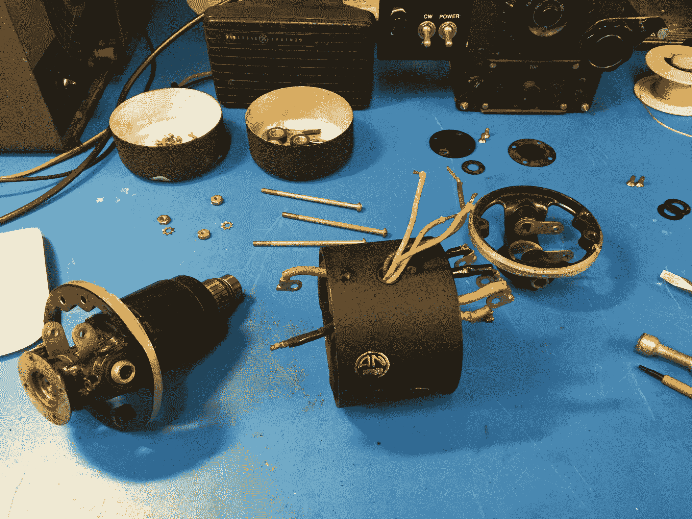

然后我开始清洗发电机。它在运行，但不是很好。幸运的是，这些很容易维修，它们的设计使得任何人都可以用平头螺丝刀来修理它们。我找到了[一个关于维修类似电机](https://www.youtube.com/watch?v=crUNcNsiZEA&feature=youtu.be)的视频，并着手拆卸我的电机，清除轴承中的旧油脂，将新油脂注入轴承，清洁电枢，并重新组装。发电机运转良好，又像新的一样！

## 调谐可变电容器的问题

有了好的电阻，好的电容，一个可以工作的发电机，我就可以开始调谐了。有些不对劲，大的可变调谐帽上的板实际上相互摩擦。我做了必要的修理；似乎该装置在某一点掉落，通常与地面电绝缘的固定板从其塑料绝缘体上脱落。我把它们放回原位，调音装置完好如新。

旧收音机就像老爷车一样，它们可以不时地校准。考虑到调谐单元的变化，我意识到我必须做一次完全校准。我按照原始维修手册中的说明，首先对准中频(使用现代合成信号发生器进行精确定位)，然后对准我刚刚修复的前端可变电容组件。后者比较棘手，需要一些高、中和低波段特定的比对。

接收器对准后，我测试了它的灵敏度。我在 2 MHz 的 AM 上测得小于 1 uV，对我来说已经足够好了，很容易超过原始工厂规格。

## 制作线束

 [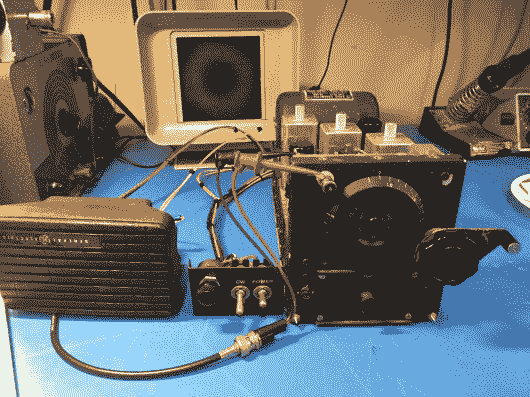](https://hackaday.com/2019/12/12/wwii-aircraft-radio-roars-to-life-what-it-takes-to-restore-a-piece-of-history/img_1115-2/)  [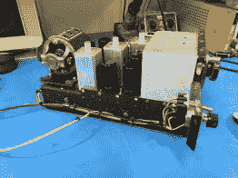](https://hackaday.com/2019/12/12/wwii-aircraft-radio-roars-to-life-what-it-takes-to-restore-a-piece-of-history/img_1141-2/)  [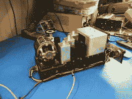](https://hackaday.com/2019/12/12/wwii-aircraft-radio-roars-to-life-what-it-takes-to-restore-a-piece-of-history/img_1142/)  [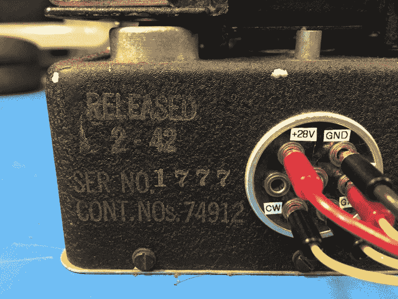](https://hackaday.com/2019/12/12/wwii-aircraft-radio-roars-to-life-what-it-takes-to-restore-a-piece-of-history/img_1145/) 

在这一点上，我有两个拨动开关和一个锅与一堆电线推到后面板连接器引脚。为了整理这些乱七八糟的东西，并使收音机的功能展示更加持久，我制作了一个小的外部开关面板，并在上面钻了一个孔，这样它就可以使用外壳上现有的两个机器螺钉简单地固定在收音机的侧面。我把原来的后部电源插头留在原处，发现“微型香蕉”插头完全适合 WW2 插口。我用这些香蕉插头连接控制面板和一个 600 欧姆的扬声器。有了这些，我做了一个整齐的线束把它们绑在一起。

## 最终测试，它还活着！

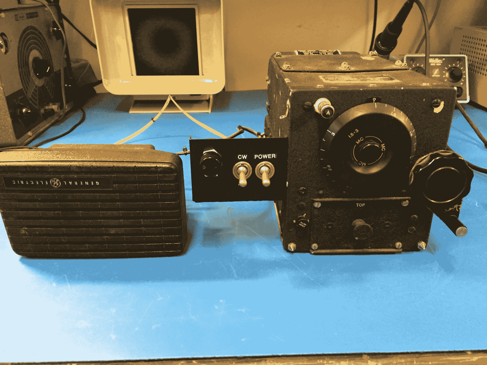

现在一切都准备就绪，是时候试试收音机的最终配置了。我连接了我的 20 米外部偶极天线并启动了无线电。whrrrr 比以往任何时候都平稳。几秒钟之内，电台开始强势出现，声音比以前大得多。我调整了天线耦合控制，他们更大声了。我从芝加哥的 AM 广播站收听了一场篮球比赛，我调到了 2.5 兆赫的 WWV，并收听了 80 米的 AM 网。多么不可思议的接收器，它完全清醒，并再次以其原始规格运行！

## 运营 3 年后…

这个装置每次开机都不会出错，为朋友和家人带来无数的演示。每个人都兴奋和惊讶地看到一个发电机供电的接收器，几乎完全依靠其原始部件运行，就像它最初建造时一样。

不小心，我甚至把 DC 输入反了，极性反了。发电机轰鸣着启动了，但是收音机没有声音。经过大约五分钟的反极性操作，我发现了问题。对我来说幸运的是，不像固态设备，没有造成损害。我以正确的方式重新连接了它，它就像以前一样工作。

 [https://www.youtube.com/embed/iNJVMzGYUW4?version=3&rel=1&showsearch=0&showinfo=1&iv_load_policy=1&fs=1&hl=en-US&autohide=2&wmode=transparent](https://www.youtube.com/embed/iNJVMzGYUW4?version=3&rel=1&showsearch=0&showinfo=1&iv_load_policy=1&fs=1&hl=en-US&autohide=2&wmode=transparent)

## 如果是二战的，不要黑，保存！

我们现在正处于一个过剩的二战电子产品不再应该被砍成碎片的时刻。加入这个运动，有许多其他人尽可能恢复二战和其他老式装备的原貌。大多数社区都围绕着[电子广播杂志](https://www.ermag.com/)运转。在把这些电容器扔进垃圾箱之前，先测试一下，并让它们一直亮着！