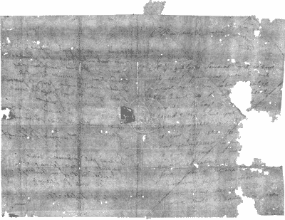

# x 射线击败了信件锁定——打开并阅读自 1697 年以来密封的信件

> 原文：<https://hackaday.com/2021/03/06/x-ray-defeats-letterlocking-unfolds-and-reads-letter-sealed-since-1697/>

近年来，我们在 x 射线成像领域取得了一系列令人着迷的进展，因为研究人员已经将他们的 x 射线显微断层扫描技术和设备发展到了这样一个地步，他们可以探测并通过计算重建博物馆藏品中的信件或卷轴等物品中的书面材料，这些物品的价值或脆弱性意味着它们不能以传统方式打开和阅读。这项挑战不仅仅是简单地提取笔迹，除了检测墨水，研究人员还必须解开书写内容的结构。一个特别的挑战来自于信件包，一种将信件折叠到自己信封里的艺术，一篇新出版的*自然通讯*论文详细介绍了美国、英国和荷兰的一个学术团队在解决这个问题上的工作。

信件包不仅仅是一种包装邮件的实用方法，它们还有一种通常被称为信件加锁的安全功能。一个小包会以这样一种方式折叠，以确保在不撕开或损坏纸张的情况下不可能打开，它们的结构是历史学家特别感兴趣的。研究人员有一个独特的工作资源；布里恩收藏是一个装满无法投递的邮件的箱子，由荷兰海牙的一对 17 世纪的邮政局长夫妇收集，现在归该市的比尔德·恩·格鲁德博物馆所有。里面有一堆信件，包括 577 封从未打开过的信件，x 射线技术有望在不破坏它们的情况下分析这些信件。

A letter imaged using the technique.

研究人员为虚拟展开过程开发了一种完整的计算技术。首先对未开封的包装进行三维立体 x 射线扫描，然后他们识别纸张的不同层和代表墨水的亮点。他们的算法必须处理两层或更多层紧密接触的区域，例如当多层折叠时，然后将得到的三维网格拆成二维薄片。他们绘制折痕图的过程包括应用代表给定点的平均曲线半径的彩色图。本文的最后一部分着眼于多种不同的字母锁定方法，并试图对它们进行分类，包括每种方法的安全等级。很明显，这可能是一个高度个性化的过程，事实上他们举了一封来自苏格兰玛丽女王的信为例，这封信使用了一种复杂的螺旋折叠技术来识别发信人。

很明显，这种技术将揭示更多迷人的历史文献，因为它既精炼又扩展到更多等待它的文物收藏中。正如他们所说，个人信件不一定包含惊天动地的历史发现，但放在一起，它们对过去几个世纪的社会史有着重要的启示。

纸上的一个名字是【大卫·米尔斯】，[他的作品在](https://hackaday.com/2018/09/20/the-use-and-abuse-of-ct-scanners/)之前就在这里出现过。