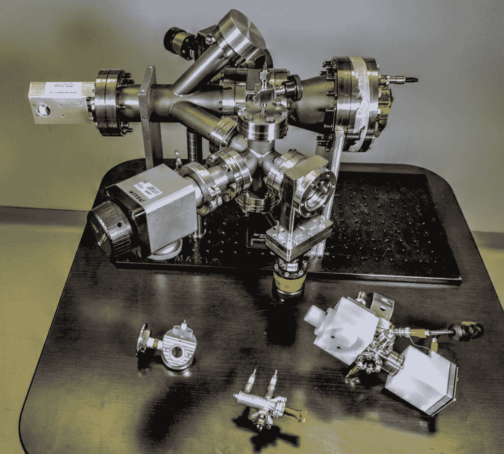
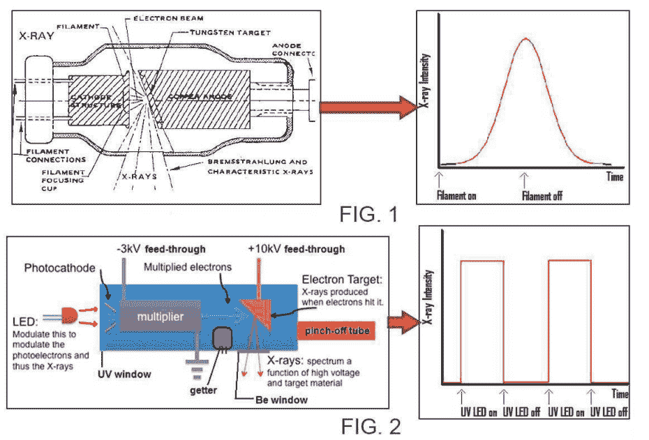

# x 射线是太空通讯的下一个前沿

> 原文：<https://hackaday.com/2019/05/06/x-rays-are-the-next-frontier-in-space-communications/>

数百年后，人类不可避免地在太阳系传播的故事将是一系列工程问题的解决，有些可能是以英雄的方式。在我们偷偷摸摸进入更广阔的银河系的第一步中，我们已经解决了很多这样的问题。我们的工程解决方案已经将人类送上月球并返回，但这是我们能够送走脆弱而珍贵的自己的最远距离。

当我们想出如何解决让我们被困在地月系统中的问题时，我们已经派出了机器人使者舰队来代理我们的探索，进行我们需要的观察，以构建下一组需要解决的工程问题。但是，随着我们向太阳系和更远的地方探索，我们的探索能力越来越受到通信瓶颈的困扰，这些瓶颈限制了我们可以向地球发回多少数据。

我们需要找到一种方法，在通信链路的两端使用尽可能少的资源，尽可能快地发回大量数据。这样做可能意味着放弃传统的无线电通信，转而使用更先进的方式，开发实用的 X 射线通信手段。

## 物理学的暴政

深空通信的基本问题来自两个来源——平方反比定律和信息论。[平方反比定律](https://en.wikipedia.org/wiki/Inverse-square_law)表明，无线电通信链路接收端的能量与到发射机距离的平方成反比。基本上，无线电波从声源传播出去，在很远的距离上，会逐渐消失在背景噪音中。这就是为什么深空通信网络往往在链路两端都有大型天线，以收集和聚焦尽可能多的微弱信号，并能够传输强大而窄聚焦的波束。

信息论告诉我们，高频信号比低频信号能容纳更多的数据。早期的卫星不需要太多的带宽来完成工作，所以 VHF 和 UHF 无线电一般就足够了。但随着航天器变得更加复杂，需要发回的数据量增加，它们的通信链路开始逐渐从电磁频谱转移到微波区域。旅行者号探测器目前在星际空间，其上行链路使用 2.1 GHz，用于相对低带宽的飞行器控制任务，下行链路使用 8.1 GHz，反映了将科学数据发送回地球所需的带宽增加。

尽管旅行者号已经取得了惊人的工程成就，尽管它在发射后 40 多年仍在工作，但它的无线电设备只能勉强支持它的星际任务。公平地说，旅行者号从来没有打算持续这么长时间，它返回地球的每一点数据都只是锦上添花。但是对于专门为星际空间设计的未来任务，发送回足够的数据以使这种任务可行将需要更多的带宽。

## 小巧、明亮、快速

The Modulated X-Ray Source experiment. The miniature source is center bottom. Source: [NASA/W. Hrybyk](https://www.nasa.gov/feature/goddard/2019/nasa-set-to-demonstrate-x-ray-communications-in-space)

4 月下旬，美国宇航局将向国际空间站发送一托盘设备，藏在货物中的一项实验旨在探索深空 X 射线通信(XCOM)的潜力。调制 X 射线源(MXS)是一个小型 X 射线发射器，将安装在空间站外面。这个实验的接收器已经安装好了；[中子星内部成分探测器(NICER)](https://www.nasa.gov/nicer) 自 2017 年以来一直在收集中子星的 X 射线光谱，同时还在收集关于在一种“银河定位系统”中使用 X 射线脉冲星作为导航信标的可能性的数据。

MXS 是一种有趣的乐器。当人们想到制造 X 射线时，自然倾向于假设将使用传统的热阴极真空管，其中电子从灯丝蒸发，并被 100 千伏范围内的电场加速，撞击钨阳极。但是像医院 x 光室里的真空管并不是最好的太空旅行者，即使经过加固，它们也太大太重了，无法送到楼上。

因此，美国宇航局的研究人员开发了一种更适合航天飞行的 X 射线发生器。MXS 的 X 射线源不是加热灯丝来产生电子，而是用 led 发出的紫外光轰击镁光电阴极来产生光电子。产生的少量光电子随后进入电子放大器，这是质谱仪中的现成组件，使用涂有一薄层半导体材料的特殊形状的室。每一个入射电子都会释放出一些二次光电子，这些二次光电子从倍增器的另一面反射回来，产生更多的电子，从而大大放大了信号。然后，巨大的电子流被 10 千伏的电场加速，与目标阳极碰撞，产生 X 射线。

Comparison of hot-cathode X-ray tube to MXS. Source: [NASA](https://ntts-prod.s3.amazonaws.com/t2p/prod/t2media/tops/pdf/GSC-TOPS-51.pdf)

虽然 MXS 源听起来类似于热阴极管，但还是有重要的区别。首先，光源可以由现成的组件和 3D 打印的金属外壳廉价制造。整个组件仅重约 160 克，可放在手掌中，并且没有异常的功率或温度控制要求。然而，最大的区别在于 X 射线开启和关闭的速度。发光的灯丝只能快速升温和降温，这意味着很难对来自热阴极源的 X 射线进行有效调制。在 MXS，只有当紫外发光二极管打开时才会产生 X 射线，并且这些发光二极管可以在亚纳秒范围内快速切换。调制 X 射线束的能力导致每秒千兆比特的数据速率，大大增强了我们在空间移动数据的能力。

更重要的是，X 射线可以比无线电波甚至光更紧密地准直，这也正在为空间通信进行实验。更紧密的 X 射线束扩散得更少，由于来自相对明亮的发射器的强信号，使得传输更有效，接收更容易。

虽然在这些 XCOM 实验中，MXS 和 NICER 之间的距离只有大约 50 米，但它们为我们提供了更好的深空通信带宽。除了 XCOM 之外，MXS 光源本身也有很多潜在的应用，从廉价、轻便、低功耗的地球和太空医学成像，到宇宙飞船的导航信标，甚至是 X 射线光谱学的高级化学分析