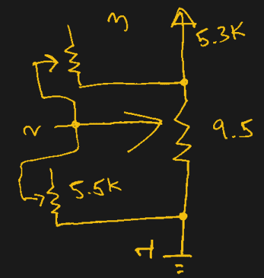

# Xbox 控制器模块变得严重坚持漂移

> 原文：<https://hackaday.com/2021/01/05/xbox-controller-mod-gets-serious-about-stick-drift/>

许多游戏玩家发现，经过几年在赛道上比赛或把恶魔从他们来的地方送回去后，他们可信赖的控制器上的模拟杆会开始漂移。很多时候，这是一个相当小的问题，如果你真的留意的话，你可能会注意到，但它肯定会很烦人。一旦到了那一步，那些擅长使用烙铁的人可能会把烙铁换成新的，但是[【泰勒·伯利】想知道重新校准有问题的烙铁会有多困难。](https://hackaday.io/project/176543-getting-rid-of-stick-drift-with-an-overkill-mod)

 需要明确的是，[泰勒]承认这种做法是矫枉过正。换一个新的漂流棒会更便宜更容易。即使你考虑到新的棍子可能没有原来的质量高，可以更快地放弃幽灵，这可能不值得努力。但这并不意味着它不是一个有趣的黑客。

在休息后的视频中，[Taylor]首先解释了驾驶杆漂移是如何发生的。操纵杆的每根轴都与电位计的游标相连，因此对于 10K 电位计，操纵杆的中心点应该对应 5K 的电阻。然后，他继续测量坏操纵杆的电阻，果然，中间的电阻下降了几百欧姆。

为了解决这个问题，他想出了一个简单的电路，在雨刷之间放置额外的电位计。每个轴上有两个操纵杆和两个调节盆，这样就有八个小调节轮需要调整，以正确校准中心点。在这种情况下，[泰勒]使用 Xbox 的控制器诊断工具来量化他的调整所产生的影响，以便他可以完美地调整它，但无论盒子上是谁的标志，想法都是一样的。

我们会说这是我们见过的解决游戏控制器上的操纵杆漂移问题的最大努力，但这个头衔必须归于【Matteo Pisani】，[他用定制的圆形触摸板](https://hackaday.com/2020/05/22/joy-con-mod-gives-nintendo-switch-touchpad-control/)取代了 Switch Joy-Con 上的模拟操纵杆。

 [https://www.youtube.com/embed/1yluzJre9D8?version=3&rel=1&showsearch=0&showinfo=1&iv_load_policy=1&fs=1&hl=en-US&autohide=2&wmode=transparent](https://www.youtube.com/embed/1yluzJre9D8?version=3&rel=1&showsearch=0&showinfo=1&iv_load_policy=1&fs=1&hl=en-US&autohide=2&wmode=transparent)

