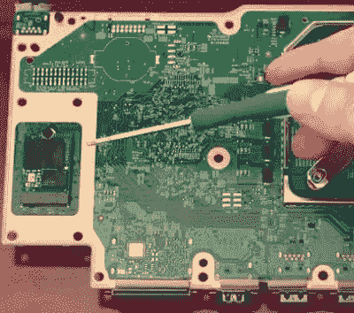

# Xbox 系列的拆卸展示了未来的一瞥

> 原文：<https://hackaday.com/2020/11/10/xbox-series-s-teardown-shows-a-glimpse-at-the-future/>

游戏机上市季节即将来临。亿万美元的公司通过承诺娱乐的未来最终向所有人开放来迎合“约翰尼消费者”的时代到来了。新一代游戏机的焦点是 Xbox Series X 和 PlayStation 5 之间的 4K 霸权之战。有趣的是，微软还为那些满足于 1080p 游戏的人创造了他们 Xbox 系列的另一个迭代，感谢[Dimitris] [我们已经能够看到 Xbox 系列 S (XSS)](https://www.youtube.com/watch?v=CKj6vXPq72U) 的内部。

The Xbox Series S features standard m.2 slot that could be used for future storage expansion.

微软选择生产全数字游戏机极大地影响了 XSS 的内部设计。由于没有磁盘驱动器，只有一根电缆，即风扇电缆，将组件连接在一起。覆盖 197 毫米 AMD APU 的散热器占据了主板表面积的近 60%。虽然按照现代控制台标准，XSS 可能很小，但它的冷却风扇很大，大约在 140 毫米范围内。散热器和风扇组件留下的一点点空间都被内部电源占用了。作为一个有趣的点头，PSU 体育主首席徽章，以表明位置的双叉连接器下方。

主板的下侧躺着“小哥哥”主机最大的惊喜。系统存储 SSD 是插入式的，而不是直接焊接到主板上。XSS 的主要设计目标是为玩家提供一个更便宜的选择，但这个标准的 m.2 插槽揭示了微软对未来扩张的计划。这种固态硬盘虽然在传统意义上用户无法访问，但可能会提供一种替代方法来扩展微软专有外部产品之外的存储。为了了解拆卸过程，下面是来自他的现代古董玩家 YouTube 频道的[Dimitris']视频。

 [https://www.youtube.com/embed/CKj6vXPq72U?version=3&rel=1&showsearch=0&showinfo=1&iv_load_policy=1&fs=1&hl=en-US&autohide=2&wmode=transparent](https://www.youtube.com/embed/CKj6vXPq72U?version=3&rel=1&showsearch=0&showinfo=1&iv_load_policy=1&fs=1&hl=en-US&autohide=2&wmode=transparent)

