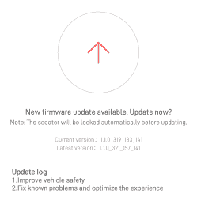

# 小米加密签署滑板车固件——下一步是什么？

> 原文：<https://hackaday.com/2022/04/24/xiaomi-cryptographically-signs-scooter-firmware-whats-next/>

[RoboCoffee]的[Daljeet Nandha]写信给我们，[分享了他对最近添加到小米 mi 滑板车固件中的基于加密签名的固件真实性检查的研究](https://robocoffee.de/?p=193)。这些滑板车通过 BLE 使用 OTA 固件更新机制，所以你可以只使用智能手机应用程序来更新你的滑板车——很好，因为你可以轻松获得所有好的新功能，但次优，因为你可以轻松获得所有坏的新功能。作为一名小米 1S 滑板车的所有者，但首先是一名黑客，【达尔吉特】[设立了一个 HTTPS 代理](https://robocoffee.de/?p=180)，捕获了该应用从小米服务器下载的固件文件，深入研究了这些文件，并总结了他的发现。

Confirming this update will indefinitely lock you out of any third-party OTA updates

与我们看到的许多设计欠缺的安全措施不同，这一措施通过我们认为是行业标准的 SHA256 哈希和椭圆加密支持的签名来保护 OTA 固件更新。一旦实现签名检查的第一个固件版本被闪存到你的踏板车中，它将不会接受任何东西，除了小米数字签名附带的其他固件二进制文件。除非在签名检查实现中发现一个缺陷，否则“用智能手机应用程序刷新定制固件”的路线似乎不再是以小米不赞成的方式改装你的滑板车的可行途径。

分解了当前可用的代码后，[Daljeet]告诉了我们所有这些，甚至更多。在他的大量文章中，他分享了他在探索之旅中使用的脚本，这样任何有足够动机的黑客都可以跟随他的脚步，我们强烈建议你看看他分享的所有内容。他还提供了进一步的见解，解释了 OTA 更新过程的一些约束，并指出了小米做出的一些安全相关的假设，值得检查一下是否绕过了所实施的安全。然后，他指出固件文件名暗示，在未来，ESC(电子速度控制，负责驱动电机)板固件可能会使用相同类型的椭圆曲线加密技术加密，并在反编译代码中找到一些更新挂钩，可以在未来的固件版本中实现这一点。

有人可能会说，这些滑板车通常是为了消除速度限制而改装的，安装在那里是因为各个国家的法律限制。然而，法定速度限制比硬性上限更微妙，如果硬件能够达到 35 公里/小时，你就不应该受小米的摆布，以便能够在考虑周到的情况下最大限度地使用你的滑板车。然而，公平地说，小米这样做是因为他们不想让自己的名声接近“人们可以改装以违反法律的滑板车制造商”，因此我们不能指望他们会很快出现。

此外，当然，这严重限制了我们所拥有的硬件的重用和有意义的修改。如果你想[让一辆退役的付费代步车重新变得有用](https://hackaday.com/2019/03/19/retired-rideshare-scooter-skips-the-reverse-engineering-to-ride-again/)、[添加蓝牙](https://hackaday.com/2021/03/09/put-more-scoot-in-yer-scooter/)，甚至[从头开始重建代步车](https://hackaday.com/2019/06/24/failed-scooter-proves-the-worth-of-modular-design/)，你应该能够做到。那么，我们如何绕过这些限制呢？揭开盖子，想出一个[方法，用类似 Pi Pico 的东西通过 SWD](https://hackaday.com/2020/02/11/xbox-controller-provides-intro-to-swd-hacking/) 刷新固件，也许？我们迫不及待地想看看黑客们想出了什么。