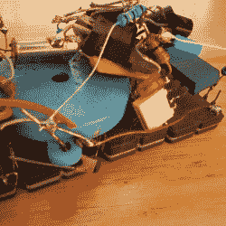
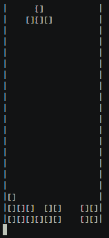

# 岁月不会减弱这些新奇小玩意的光芒

> 原文：<https://hackaday.com/2019/01/13/years-dont-dim-the-shine-of-these-curious-gadgets/>

[马顿·特罗普]最近花时间记录了几年来他收到的一些作为礼物的[不寻常且有创意的电子项目。这些小玩意是在 21 世纪初发明的，至今仍能完美运行。这里展示了我们最喜欢的两个:*硬件俄罗斯方块单元*(如上图所示)和*堆电子零件*。](https://www.geekabit.nl/projects/some-gifts-for-me/)

The “Heap of Electronic Parts” makes sounds when in sunlight.

一堆电子零件是一种硬件拼图，当然名副其实。它是以一种神秘的方式焊接到四个旧 EPROMs 背面的一堆部件——这些芯片有一个小窗口，通过它紫外线被用来擦除内容。确信这个装置真的有功能后，[Maarten]最终发现当放在阳光下时，这个装置会发出滴答声、嗡嗡声和尖叫声。[耶鲁安]已经发现 EPROMs 在阳光下可以像微型太阳能电池一样工作，四个一起产生足够的能量来驱动连接到压电扬声器的振荡器。即使在今天，它仍然快乐地鸣叫。

Hardware Tetris plays in a terminal window.

*硬件俄罗斯方块单元*是一个旨在插入串行端口的黑匣子。使用正确的串行端口设置打开终端，使用 ASCII 艺术图形的全功能**俄罗斯方块**游戏就可以玩了。它甚至可以通过串行端口引脚自供电。

在*硬件俄罗斯方块*内部是一个 AVR 微控制器，带有一些电平转换器，源代码和原理图可供下载。14 年后，计算机不再有硬件串行端口，但[Maarten]说，USB 到串行转换器工作得很好，设备仍然运行良好。

在[Maarten]的礼物页面上记录了更多的设备[，包括一个受 Zork 启发的迷你文本冒险和一个在旧诺基亚彩色液晶显示器上做一些迷幻演示的硬件板。[马腾]的朋友[耶鲁安·多姆伯格](又名 Sprite_tm)参与了大多数小工具的制作，他的杰出作品](https://www.geekabit.nl/projects/some-gifts-for-me/)[我们有幸在过去多次介绍过](https://hackaday.com/?s=sprite_tm)。