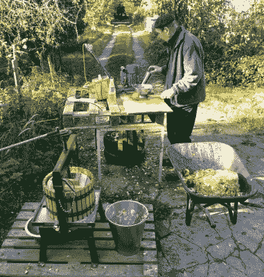
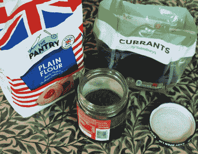
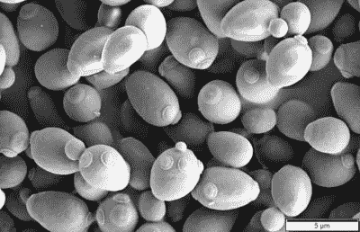

# 酵母是抢手货；封锁期间酿造和制作面包

> 原文：<https://hackaday.com/2020/04/13/yeast-is-a-hot-commodity-brewing-and-breadmaking-during-lockdown/>

在最近民众为新冠肺炎封锁做准备而疯狂囤积食品的过程中，出现了一些被广泛报道的产品成为稀缺商品的例子。想到的是卫生纸、意大利面、大米、蔬菜罐头、长寿命牛奶，但还有一个有点出乎意料。

当每个人都掸掉面包机上的灰尘，从那时起，面包就像砖头一样出来了，或者思考三个月没有啤酒，重新发现他们内心的家庭酿酒师，酵母似乎无论如何都不能拥有。没关系，因为这个世界充满了酵母，因此社交媒体充满了从干果中捕捉自己的，或者从自然环境中捕捉的指南。花几天时间打理一罐面粉和水，拿走细菌培养物，培养出你想要的那种，你就可以克服短缺，想要多少酵母就有多少酵母。

## 不仅仅是超市产品线

CIdermaking, chez List. Natural yeast ciders can be tricky to get right, so I usually cheat and add a champagne yeast culture.

每个人都喜欢古怪的硬皮面包或泡沫啤酒。使这成为可能的酵母是一个有趣的技术课题，它本身是进入黑客社区的一个重要入口。它不仅仅是超市配料通道里的几袋面包酵母，如果你知道你在做什么，你就可以凭空得到它。

酵母培养是我非常感兴趣的一个课题，因为从十几岁开始，我就自己酿造真正的苹果酒。多年来，发酵我的果汁的酵母的质量一直是我非常关心的问题，有时它会出问题，在其他的几年里，我已经做了相当大的努力来确保我有正确的菌株。

酵母是单细胞真菌，就像任何其他种类的生物一样，在野外也有许多种类。有些可以被广泛发现，而另一些则是特定的环境或情况。找到它们很容易，它们分布如此广泛，以至于它们以某种形式存在于几乎所有地方，你呼吸的空气可能含有大量的酵母孢子，这些孢子是这些人在社交媒体上分享的一些天然酵母培养物的来源。我不是物种分类学专家，但我们感兴趣的酵母类型都属于*酵母*家族，眼尖的人会认出它含有古希腊语中“糖”和“真菌”的意思。

## 哈卡代菌株

The Hackaday Strain, showing some early promise of cloudy yeast.

由于喜欢自制披萨，我们的橱柜里已经有了一包干酵母。但是如果我们没有呢？是时候检验所有的天然酵母发酵经验了。放进储藏室的橱柜里放一些干果和白面，放进回收箱里放一个有盖的果酱罐。这是用一些开水清洗，然后用一些水在里面摇一勺葡萄干。我立刻看到一些酵母从葡萄干上掉了下来，因为水是浑浊的。

将混浊的醋栗水转变成可用的酵母培养物的过程是缓慢而恼人的。想法是将它与一些面粉混合作为食物，并将其放在温暖的地方，然后一旦你可以看到指示它开始发酵的气泡和酵母气味，将少量的它与一些新鲜的面粉和水分开，在新的容器中制作新的培养物。这样做几次是为了创造一个有利于酵母的环境，减少细菌滋生的机会。它很慢，因为野生酵母需要时间来发酵，我喝过野生酵母苹果酒，在发酵开始前已经放置了几天。

不过，最终，如果你坚持不懈，你会有一大堆泡沫状的酵母，你可以用糖来喂养，就像你激活干酵母来烘焙或酿造一样。在我写这篇文章的时候，Hackaday 菌株正处于它的第二个新的培养阶段，并且开始看起来它可能有足够的能量在本周晚些时候用来做比萨饼。运行 Folding@Home 的 Core i7 台式电脑[提供了足够的温度来孵化它。重要的是要指出，无论你用这种方式培养什么酵母，它都是随机的，取决于你用什么来启动它。如果你幸运的话，它会生产出美味的面包和美酒，如果不是，你可能需要再试一次。](https://hackaday.com/2020/03/22/coronavirus-and-foldinghome-more-on-how-your-computer-helps-medical-research/)

## 让我们来看看品种和品系

An electron micrograph of *Saccharomyces cerevisiae*. Mogana Das Murtey and Patchamuthu Ramasamy / [CC BY-SA 3.0](https://commons.wikimedia.org/wiki/File:Saccharomyces_cerevisiae_SEM.jpg).

如果你创造自己的培养物，你将获得的酵母很可能包含不止一个品种，但你购买的商业酵母将被作为单一培养物精心培育。用于烘焙、酿造麦芽酒、葡萄酒和苹果酒的酵母都是同一品种的不同菌株，*酿酒酵母*，这是一种在较高温度下生长旺盛的酵母。因此，当你做面包时，你把它放在温暖的地方发酵，当你酿造啤酒时，你会稍微加热麦芽汁以获得最佳效果。在这两种情况下，发酵都是厌氧的，导致酒精和二氧化碳的产生，当它在液体中时，它会浮到顶部。因此，麦芽酒有时被称为顶部发酵。用面包酵母酿造麦酒是可能的，虽然我从来没有做过，但用相应的啤酒菌种做面包无疑是可能的。

Get your *Saccharomyces pastorianus* products, at [HackerBräu München](https://www.hacker-pschorr.com/)! Jebulon / [CC0](https://commons.wikimedia.org/wiki/File:Hackerbr%C3%A4u_1417_Lantern,_Oberammergau,_Bavaria,_Germany.jpg)

因此，在确定了面包和麦芽酒的制作过程中的主角之后，我们可能会认为自己已经完成了，对吗？也许你们中的一些人已经注意到，到目前为止我用了“麦芽酒”这个词，而不是“啤酒”，因为当然上发酵麦芽酒不是唯一的啤酒。“lager”这个词在一些说英语的国家被误用了，指的是一种淡啤酒风格的啤酒，但事实上“lager”来自于在洞穴中储存啤酒直到成熟的做法，泛指用完全不同的酵母品种发酵的一整类啤酒。*巴斯德酵母*是*酿酒酵母*和另一种野生物种的天然杂交品种，在低得多的温度下发酵，酵母沉淀在麦芽汁底部。这些底部发酵啤酒的风格和它们的麦芽酒一样多样化，让大众市场的“贮藏啤酒”如百威啤酒或卡林啤酒很难代表。

还有第三种酵母培养物，通常用于制作面包，即所谓的酸面团。这是一种酵母(通常是微小酵母)和乳酸杆菌的混合物，发酵产生的乳酸赋予酸面团面包特有的风味。这种酵母能够耐受酸性，而*酿酒酵母*在同样的情况下会死亡。

我希望这个简短的介绍已经让你对酵母世界有了一个基本的了解，如果你在禁闭期间有事可做，你至少可以尝试一下面包或啤酒，而不必在那些空架子上找酵母袋。我没有啤酒花，所以我有了一批新鲜的东西:云杉啤酒。祝你好运，享受你的劳动成果！

标题图片:Jon Sullivan / [公共领域](https://commons.wikimedia.org/wiki/File:Beer_and_bread.jpg)。