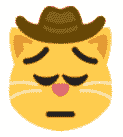

# Yee Haw:全套牛仔表情符号现已推出

> 原文：<https://hackaday.com/2021/05/22/yee-haw-full-set-of-cowboy-emojis-now-available/>

This cat looks like he plays bassoon in a jazz band.

如果你想在文字交流中添加一张有趣的小图片，尝试添加一些更好的背景或活力，表情符号都很好，但如果合适的小图片不能准确地代表你或你的感受呢？不要害怕，牛仔们，你们梦寐以求的表情符号现在已经创造出来了。

这组表情最初是由名副其实的[pensivecowboy]创建的，通过使用脚本将牛仔帽自动放置在来自 [twemoji 组](https://github.com/twitter/twemoji)的现有表情符号之上。随着时间的推移，人们决定将这些帽子应用于 300 个最常用的表情符号，在脚本生成的结果需要一些工作的情况下，进行一些手动修补。

The fire is coming out of the hat, which is just absolutely fantastic attention to detail.

结果是一套完整的 Unicode 兼容的牛仔和沉思 _ 牛仔表情符号，当你感觉像一个牛仔，或感觉像一个悲伤的牛仔。脚本是为那些希望更亲密地使用表情符号的人准备的，甚至还有 Discord 频道为那些订阅了 Nitro 的人提供即时访问新表情符号的机会。

这是重要的、开创性的工作吗？你对此的看法可能取决于你是一头牛还是一个男孩。但是在农场里，这可能会让一个忧郁的牛仔脸上露出笑容。然而，快速搜索后发现没有一个:snake_in_my_boot:表情符号，这可能是一个安全问题。

我们希望看到一些为编程破解表情符号而构建的开放工具；如果你已经开发了一些，[给我们写封短信](http://hackaday.com/submit-a-tip)。或者，[考虑这种表情枪，它向其他人发射小泡沫表情符号，以取悦或激怒他们](https://hackaday.com/tag/emoji/)。