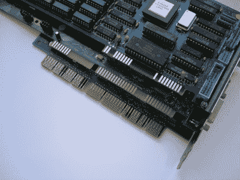
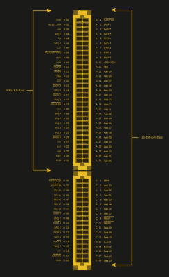
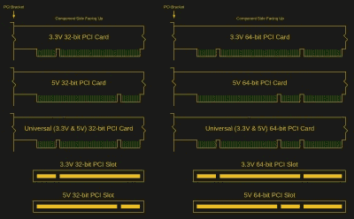
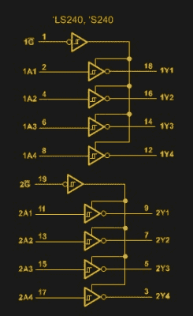

# 您的处理器总线上有些东西:入侵 ISA 和 PCI 的乐趣

> 原文：<https://hackaday.com/2021/01/06/you-got-something-on-your-processor-bus-the-joys-of-hacking-isa-and-pci/>

虽然从家用电脑出现之日起，就有能力扩展家用电脑的内存、存储和其他功能，但直到 IBM PC，完全开放和模块化的计算机系统的概念才成为主流。扩展卡的概念并不局限于制造商提供的系统配置和一些没有很好集成的附件，而是打开了整个行业和一个大的业余爱好者市场。

第一台 IBM PC 有五个 8 位扩展槽，直接连接到 8088 CPU。随着 IBM PC/AT 的出现，这些扩展槽变成了 16 位，这得益于它所围绕的 80286 CPU。这些插槽可以用于从显卡到网络、扩展内存或自定义 I/O 的任何东西。尽管这种卡边缘接口没有独特的原始名称，但在 PC/AT 时代，它被称为 *PC 总线*，以及 *AT 总线。*名称*工业标准架构* (ISA)总线是由 PC 克隆制造商创造的[的词源](https://en.wikipedia.org/wiki/Retronym)。

有了这种开放性，就有能力相对容易和便宜地为 ISA 总线以及随后同样开放的 PCI 总线制作自己的卡。时至今日，这种开放性造就了一个充满活力的生态系统，无论是希望构建定制的 ISA 或 PCI 声卡，还是为 1981 年的 IBM PC 系统添加 USB 支持。

但是现在开始使用 ISA 或 PCI 扩展卡需要什么呢？

## 简单的代价

[](https://hackaday.com/wp-content/uploads/2020/12/Bussysteme_Extended_ISA_32Bit_ISA_16Bit_XT_8Bit.jpg)

From top to bottom: 8-bit XT bus, 16-bit AT/ISA, 32-bit EISA.

关于 ISA 和最初的 PC/AT 总线，需要注意的一点是，与其说它是一种通用总线，不如说它描述了悬挂在 8088 或 80286 寻址和数据总线上的设备。这意味着，例如，最初总线与所讨论的 CPU 的时钟速度一样快:对于最初的 PC 总线是 4.77 MHz，而对于 PC/AT 是 6-8 MHz。尽管大多数时候 8 位卡可以在 16 位插槽中使用，但不能保证它们能正常工作。

随着 PC 克隆供应商开始在他们的模型中引入更快的 CPU，AT 总线的时钟频率最终从 10 到 16 MHz。可以理解的是，这导致许多现有的 AT ( [ISA](https://en.wikipedia.org/wiki/Industry_Standard_Architecture) )总线卡无法在这些系统中正常工作。最终，大多数制造商将总线时钟从处理器时钟中分离出来，但尽管缩写“ISA”暗示了这一点，ISA 始终没有真正标准化。

然而，人们试图以扩展 ISA ( [EISA](https://en.wikipedia.org/wiki/Extended_Industry_Standard_Architecture) )的形式标准化 ISA 的替代物。它创建于 1988 年，采用 32 位总线，运行频率为 8.33 MHz。虽然它没有在消费个人电脑上起飞，但 EISA 看到了服务器市场的一些增长，特别是作为 IBM 专有的微通道架构( [MCA](https://en.wikipedia.org/wiki/Micro_Channel_architecture) )总线的一种更便宜的替代方案。MCA 本身被 IBM 设想为 ISA 的替代品。

最终，ISA 在大多数工业设备和嵌入式应用(例如 [LPC](https://en.wikipedia.org/wiki/Low_Pin_Count) 总线)中存活至今，而工业的其余部分在很久以后转移到 PCI 和 PCIe。显卡在 VESA 局部总线( [VLB](https://en.wikipedia.org/wiki/VESA_Local_Bus) )和加速图形端口( [AGP](https://en.wikipedia.org/wiki/Accelerated_Graphics_Port) )的形式中看到了一些弯路，这些都是针对 GPU 需求的专门接口。

## 新旧技术入门

[](https://hackaday.com/wp-content/uploads/2021/01/ISA_slot_pinout_had.jpg)

特别是 ISA 混乱历史的必然结果是，在设计新的“ISA 扩展卡”时必须小心谨慎。为了实现真正的广泛兼容性，可以设计一种 8 位卡，其总线速度可以从 4.77 MHz 到 20 MHz。如果不需要支持基于 8088 的 PC，直接使用 16 位卡将是一种选择。当设计一个 [PC/104](https://en.wikipedia.org/wiki/PC/104) 卡时，应该没有兼容性问题，因为它几乎遵循 ISA 总线的最标准形式。

物理接口对于 ISA 或 PCI 都不是问题，因为两者都使用边缘连接器。之所以选择这些，主要是因为它们便宜又可靠，这一点至今未变。在 PCB 端，不存在物理连接器，只有接触边缘连接器触点的导电“指状物”。可以使用该部分的模板，以获得与触点的良好对准。还要记住 PCB 的厚度，因为卡必须接触良好。这里常见的 1.6 mm 似乎是个不错的搭配。

如果希望自己创建边缘连接器，可以很容易地在网上找到有关 ISA 和 PCI 设计规则的资源，例如 [Multi-CB](https://www.multi-circuit-boards.eu/en/pcb-design-aid/pc-pci-boards.html) (PCB 制造商，无关联)网站上的精彩概述。这显示了手指间距，边缘上的 45 度锥度，以及手指厚度和距离要求。

对电路设计部分有用的是知道 ISA 使用 5 V 电平信号，而 [PCI](https://en.wikipedia.org/wiki/Peripheral_Component_Interconnect) 可以使用 5 V、3.3 V 或两者。对于后者，这种差异通过 PCI 插槽中凹口的位置来表示，从 IO 板测量:3.3 V 卡为 56.21 mm，5 V 卡为 104.47mm。PCI 卡本身将具有其中一个凹口，或者如果支持两种电压，则两个都具有(通用卡)。

[](https://hackaday.com/wp-content/uploads/2021/01/PCI_slot_keying_had.jpg)

PCI 插槽有 32 位和 64 位版本，其中只有前者在消费者市场上引起了轰动。在 PCI 的另一面，我们发现了[PCI-X](https://en.wikipedia.org/wiki/PCI-X):PCI 的一种演变，在其 64 位版本中，它在服务器中得到了最广泛的应用。PCI-X 基本上将 PCI 的最大频率提高了一倍(66 至 133 MHz)，同时取消了 5V 信号支持。出于这个原因，PCI-X 卡通常在 3.3V PCI 插槽中工作，反之亦然。如果将 64 位卡插入更短的 32 位插槽，不管是 PCI 还是 PCI-X，它都可以退回到 32 位模式。

## 驾驶公共汽车

[](https://hackaday.com/wp-content/uploads/2021/01/74ls244_logic_diagram_had.jpg)

总线上的每个设备都增加了信号设备必须克服的负载。此外，在具有共享线路的总线上，重要的是单个设备可以在不使用这些共享线路时将其自身从这些共享线路上断开。处理这种情况的标准方法是使用三态[缓冲器](https://en.wikipedia.org/wiki/Digital_buffer)，比如常见的 [74LS244](https://www.ti.com/product/SN74LS244) 。它不仅能提供标准数字缓冲电路所提供的隔离，还能切换到 Hi-Z(高阻抗)状态，从而有效断开连接。

对于我们的 ISA 卡，我们需要类似 74LS244 或其双向兄弟 74LS245 的器件，以便与总线正确接口。每个总线信号连接都需要放置一个适当的缓冲器或锁存器，对于 ISA 总线，Abhishek Dutta 在本文[中有详细介绍。现代 ISA 卡的一个很好的例子是](https://linuxgazette.net/124/dutta.html)[‘Snark Barker’sound blaster 克隆](https://github.com/schlae/snark-barker)。

可以想象，PCI 也可以以这样一种分立的方式实现，但最常见的商用 PCI 卡使用 I/O 加速器 ASICs，它为卡的电路提供一个简单的、类似 ISA 的接口。然而，今天这些 IC 远不便宜(除非冒险使用类似 [WCH CH365](http://www.wch-ic.com/products/CH365.html) 的东西)，所以一个好的替代方案是在 FPGA 中实现 PCI 控制器[。前面提到的“Snark Barker”](https://www.fpga4fun.com/PCI.html)[的 MCA 版本(如我们之前介绍的](https://github.com/schlae/snark-barker-mca)[)使用一个](https://hackaday.com/2020/12/01/giving-micro-channel-bus-computers-a-sound-blaster-bark/) [CPLD](https://en.wikipedia.org/wiki/Complex_programmable_logic_device) 与 MCA 总线接口。像 OpenCores 这样的网站以现有的 [PCI target](https://opencores.org/projects/pci32tlite_oc) 项目为特色，可以作为一个起点。

## 与 ISA 和 PCI 聊天

在制作一个带有金色边缘接触指的闪亮 PCB 并在其上焊接一些总线缓冲 IC 或 FPGA 之后，人们仍然必须能够实际谈论实际的 ISA 或 PCI 协议。幸运的是，有很多关于 ISA 协议的资源，比如[这个关于 ISA](http://hamblen.ece.gatech.edu/489X/ISA.htm) 的。像 PCIe 协议一样，PCI 协议是“商业秘密”，只有通过 [PCI-SIG](https://en.wikipedia.org/wiki/PCI-SIG) 网站付费才能正式获得。然而，在过去的几十年里，这并没有保留从规范到[泄露](https://www.ics.uci.edu/~harris/ics216/pci/PCI_22.pdf)的副本。

绝对可以将现有的 ISA 和 PCI 项目作为自己项目的模板或参考。前面提到的 CPLD/FPGA 项目是一种避免自己实现协议和只得到好的部分的方法。无论哪种方式，都必须为各自的总线使用中断(IRQ)系统(专用信号线，在后来的 PCI 版本中也是基于消息的),并可以选择使用 DMA(ISA 上的 DRQn & DACKn)。然而，涵盖 ISA 和 PCI 总线的复杂性本身就需要一整篇文章。然而，对于我们这些拥有带拨动开关的 ISA 卡或者(更糟糕的)ISA PnP(即插即用)卡的人来说，这些应该已经很熟悉了。

与任何共享总线一样，读写时的基本协议包括从[总线主控器](https://en.wikipedia.org/wiki/Bus_mastering)请求总线访问，或触发 PCI 中多个总线主控器的总线仲裁协议。扩展卡也可以使用其总线地址直接寻址，正如 Abhishek Dutta [在他的 ISA 文章](https://linuxgazette.net/124/dutta.html)中所述，在 Linux 上，这涉及到[使用内核例程](https://linuxgazette.net/124/misc/dutta/isa.c.txt) ( `sys/io.h`)获得访问权限，然后才能将数据发送到可以寻址该卡的特定 IO 端口。本质上:

```

if (ioperm(OUTPUT_PORT, LENGTH+1, 1)) {
	...
}
if (ioperm(INPUT_PORT, LENGTH+1, 1)) {
	...
}

outb(data, port);
data = inb(port);

```

对于 ISA，IO 地址在卡中设置，地址信号线上的地址解码器用于确定匹配。通常使用拨动开关或跳线来允许特定的地址、IRQ 和 DMA 线路。ISA PnP 试图改进这一过程，但实际上造成了更多的麻烦。对于 PCI，PnP 是标准的一部分:启动时扫描 PCI 总线以查找设备，板载 ROM (BIOS)查询卡的需求，然后自动设置地址和其他参数。

## 包扎

显然，本文几乎没有涉及到开发自己的定制 ISA 或 PCI 扩展卡的要点，但希望它至少给出了这个主题的一个广泛的概述。一个人需要的很多东西取决于他希望开发的卡的类型，是基本的 8 位 ISA (PC/XT)卡，还是 64 位 PCI-X 卡。

然而，ISA 和 PCI 等总线的许多乐趣在于它们非常容易接近。在调试/分析的情况下，它们的总线速度完全在硬件爱好者和示波器的能力范围之内。使用较慢的并行数据总线意味着不使用[差分信号](https://en.wikipedia.org/wiki/Differential_signaling)，这简化了走线的路由。

尽管这些传统总线不能与 PCIe 相提并论，但它们的功能集和可访问性意味着它可以让旧系统重获新生，即使只是简单的为原始 IBM PC 添加基于闪存的存储。

[标题图片:Snark Barker ISA SoundBlaster 克隆板。信用:管时间]