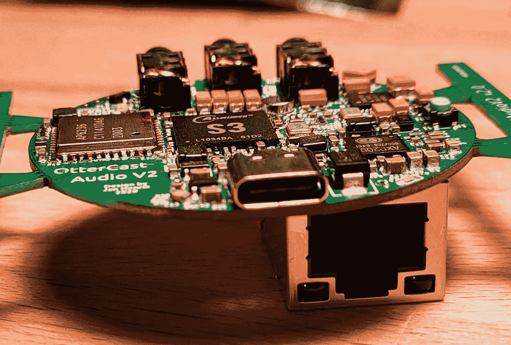

# 你不能播放音频:开放的硬件掩盖了 Chromecast 的音频

> 原文：<https://hackaday.com/2021/04/06/you-otter-be-able-to-stream-that-audio-open-hardware-eclipses-chromecast-audio/>

当谷歌在 2019 年初停止生产 Chromecast 音频时，人们发出了强烈抗议(现在沉默了)。该设备的粉丝们喜欢这种专用音频流加密狗，它以 35 美元的最低价提供了广泛的兼容性和极其简单的功能。如果你能找到一个活跃的列表，只要看看你最喜欢的拍卖网站就知道了，在那里，他们现在的售价比新的时候高得多。对于这种明显的企业恶意行为，一个多产的黑客能做些什么呢？为什么，当然是重新发明！因此[水獭演员音频 V2](https://github.com/Ottercast/OtterCastAudioV2) 诞生了，另一个高质量的水獭主题黑客来自我们最喜欢的硬件魔术师团队之一【露西·福斯、贾娜·玛丽·海辛、托布尔·迈纳和马纳维姆】。

USB-C and Ethernet, oh my!

Otter Cast Audio 是一个形状和大小与标准 Chromecast(直径约为 50 毫米)差不多的光盘，提供了几乎完整的原始 Chromecast Audio 功能超集，并添加了一个端口线，用于重定向现有设备的音频。协议支持比原来更灵活，有 AirPlay、web 界面、Spotify Connect、Snapcast，甚至还有 PulseAudio 接收器，可以让你的 Linux 风格的音频流流动起来。讽刺的是 水獭施放音频 *没有* 做的一件事就是充当施放地的目标。[Jan]注意到，在这里支持的所有协议中，实际的 Cast 支持被限制得太多，以至于很难提供支持。我们一直祈祷能够找到一个解决方案，让 Otter Cast 音频与最初的 Chromecast 音频完全对等。

但是这是黑客日，所以和*Otter Cast Audio 做什么*一样重要的是*如何做*。 [OtterCast 团队](https://cast.otter.jetzt/)跳过了将所有这些魔法硬塞进微控制器的环节，直接升级到了[全赢家 S3 SOC](https://www.cnx-software.com/2018/03/30/allwinner-s3-camera-soc-includes-128mb-ram-an-i2s-audio-interface/) ，这是一款基于 Cortex A7 的小机器，具有 128 MB 板载 DDR3 RAM。它的大小与全交互桌面的臃肿标准相当，但绝对是与 WiFi、蓝牙、以太网以及对上述所有协议的方便支持的完美匹配。如果你熟悉这些黑客的其他工作，你就不会感到惊讶，他们在这里生产的东西符合典型的极高质量标准，如这个[用于 JBC 烙铁手柄的 USB-C 适配器](https://hackaday.com/2020/04/21/have-jbc-soldering-handle-will-usb-c-power-deliver/)和这个 [TS-100 主板替代品](https://hackaday.com/2019/12/26/adding-usb-c-to-the-ts100-but-not-how-you-think/)。

这听起来像是未来可能会订购小批量生产，但在此之前，我们会提供为一家特别受欢迎的中国制造商优化的[生产文件，以及完整的 BOM 和布局文件。听起来那个制造商的交钥匙生产成本非常合理](https://github.com/Ottercast/OtterCastAudioV2/tree/main/production_v2.1) [$10(总)每单位，大部分组件，剩下的自己采购的组件手工安装仍然是合理的$22](https://twitter.com/_Jana_Marie/status/1374098303470682113) 。

对于成品的演示，请查看休息后嵌入的推文。

> 自豪地最终宣布 OtterCastAudioV2，一个运行 Linux 的开源音频流设备。基于 S3 SoC，具有 web 界面、shairport-sync、snapcast、Spotify Connect 和 pulseaudio sink。[pic.twitter.com/9GYVGyEKYI](https://t.co/9GYVGyEKYI)
> 
> —贾娜·玛丽·海辛(@ _ 贾娜 _ 玛丽)[2021 年 3 月 22 日](https://twitter.com/_Jana_Marie/status/1374088494985969667?ref_src=twsrc%5Etfw)