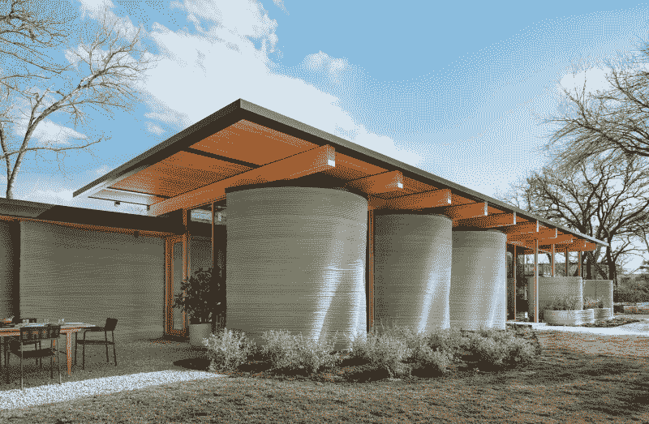

# 你不会 3D 打印房子吧？

> 原文：<https://hackaday.com/2022/07/13/you-wouldnt-3d-print-a-house-would-you/>

今天在美国建造的大多数房子都是平台式建筑:细长的 2 乘 4 的房子被堆叠和分层，以形成带有立柱的墙壁。每一层都被框在另一层的上面。它速度快，相对便宜，而且很容易学会怎么做。然而，它也不是没有缺点。有人估计每平方英尺(0.09 米 ² )产生的废物量约为 3.9 磅(1.8 千克)。

木材框架是一种古老的风格，巨型梁被用来创建房子的结构。每根木料都是手工雕刻成型，需要技巧和精度。一些小屋仍然以这种方式建造，因为很容易从当地获得木材，切割成大圆木比切割成许多小圆木工作量少。它相对来说是生态友好的，但是速度慢而且需要大量的技术工人。

我们生活在一个对更便宜、更快、更环保的住房有巨大需求的世界，但找到一个能满足所有需求的解决方案却极其困难。3D 打印房屋能实现这三个目标吗？我们还没有到那一步，但我们正在努力。

## 3D 房屋的艺术现状

用机器建造房屋的想法可以追溯到 1930 年。3D 打印房屋背后的想法是，通过消除一些所需的人工工作，它可以更好地扩展和降低成本。但是尽管有了新的机器，房屋建造的整体方法并没有改变多少。大致说来，今天市场上似乎有三种类型:预制、现场印刷和现场切割。

### 预制的

预制就是你想的那样。零件在某个设施中打印出来，最好是在靠近建筑工地的地方，然后运送到一个工人团队进行组装。这使得印刷受益于具有校准和可靠工具的受控环境。或者甚至打印非常大的东西，就像中国的这台巨型打印机一样。像[强大建筑](https://www.mightybuildings.com/)这样的公司正致力于用玻璃纤维增强热固性树脂建造预制模块和整体单元。热固性材料的好处是，它比你在打印机中看到的传统树脂固化得更强更硬。然而，层与层之间的粘合会因此受损。

Mighty Buildings 想出了一个聪明的解决办法，使用多种紫外线源。当沉积顶层时，这些层仅部分固化，然后当这些层在上面堆叠时完全固化。值得注意的是，这些建筑并不比用传统方法建造的预制房屋便宜或快很多，但是在设计上应该有更少的浪费和更多的灵活性。

### 就地打印

就地打印通常需要在网站上安装一个[巨型 3d 打印机，就像 2015 年的这个](https://hackaday.com/2015/09/27/enormous-delta-bot-3d-designed-to-print-an-entire-house/)。这些年来，已经取得了进步，使得打印机更快、更精确、更容易设置、更容易运输等等。然而，有一个区域似乎很难弄清楚，那就是到底要挤出什么。

这些系统的真正优势是它们可以全天候运行，根据需要慢慢打印出结构。但是，如果是在无人监督的情况下打印，喷嘴堵塞或各层不粘附，这就是一个大问题。那些拥有 3D 打印机的人，你能想象用你的打印机打印四天吗？一个你不能只是从床上爬起来，并投入回收时，它走了边？你需要第一次就做对。

大多数公司使用某种混凝土混合物，这种混合物经过优化，可以干净地从喷嘴中流过。然而，混凝土并不以其环保而闻名，因为它是全球温室气体排放的主要来源。

House Zero courtesy of ICON and Casey Dunn

ICON 采用就地印刷的方法，已经建造了几栋房子，并正在建造几百栋。他们的一所房子——上图中的零号房子——的独特之处在于，它融入了 3D 打印房屋所擅长的东西。墙壁可以是任何形状:不像大多数房子出于需要都是方方正正的，这座房子有一种波浪感。无论你在视觉上喜欢与否，在房子的结构元素中达到同样的效果将是难以置信的困难和浪费。更重要的是这个房子是待售的，是宜居的。

### 现场切割

现场切割是一种不同的方法。它有点像预制和现场印刷的混合体。它不是真的印刷出来的，但带来了一些相同的想法。一家公司将制造碎片的机器带到了网站上，但你不是创建一个整体的印刷品，而是创建更小的碎片，当它们从机器出来时，可以被构建和组装在一起。运到现场的大型计算机数控系统接收胶合板，并把它们变成有孔的盒子，用于绝缘、布线、管道和所有其他穿过我们墙壁的奇怪管子。Facit Homes 是一家使用这种技术生产房屋的公司。他们的 CNC 路由器根据房子的设计生产“盒式磁带”,然后组装起来。虽然它比纯粹的添加制造产生更多的废物，但每个盒子都是由标准的胶合板制成的，因此易于重复使用和回收。他们建造了十几栋房子，这些房子非常现代，但在其他方面看起来很普通。

## 判决

目前，3D 打印房屋没有实现其更便宜、更快或更环保的目标。我们在这里评估的房屋没有一个比传统方法便宜，有些价格明显更高。虽然有些速度更快，但仍存在收尾问题。房子的结构建成后，专业人员需要来安装窗户、门、装饰以及所有我们喜欢的关于家的东西。电气和管道也需要安装在结构中。

尽管有缺点，3D 房屋有两大优势。他们可以创造传统建筑所不能创造的形状和形式，就像在零号房屋中看到的那样。此外，它们比传统建筑浪费少得多。平台建设产生了大量的废物，而 3D 打印结构只打印出他们需要的东西。这只是比较加法和减法制造的本质。

显然，这不是对该行业的完整概述。还有一些公司和技术正在开发中，这里没有涉及。我们认为该行业的发展缓慢但令人振奋。二十年前的白日梦现在正处于萌芽阶段——房屋已经建成，人们已经买下并搬进去，这是一个重要的里程碑。我们会留意的。

我们错过了什么吗？请在评论中告诉我们。