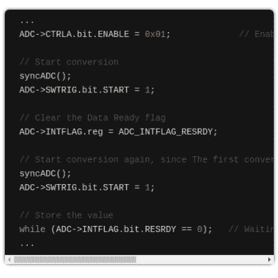

# 你的 Arduino SAMD21 ADC 在骗你

> 原文：<https://hackaday.com/2019/08/30/your-arduino-samd21-adc-is-lying-to-you/>

Arduino 环境的一大优点是它用一个公共接口覆盖了各种各样的硬件。重要的是，这不仅仅是关于语言，也是关于抽象出底层硅的血淋淋的细节。当然，问题是，首先必须有人解码通常难以理解的数据表来编写接口层。在最近一篇关于 omzlo.com 的博客文章中，[Alain]解释了他们如何在 Arduino SAMD21 analogRead()代码中发现一个错误，该错误会导致输出偏移 25 mV 至 57 mV。对于采用 3.3 V 基准电压工作的 12 位 ADC，这意味着高达 70 个最低有效位的巨大误差！

Excerpt from the SAMD [wiring_analog.c](https://github.com/arduino/ArduinoCore-samd/blob/master/cores/arduino/wiring_analog.c) file in the Arduino Core repo.

在开发与 24 V 系统接口的屏蔽时，开发团队注意到基于 SAMD21 的电路板上的 ADC 读数始终相差 35mV；将测试扩展到许多不同的模拟引脚和 SAMD21 板，他们发现失调在 25 mV 至 57 mV 之间。这种偏移似乎是一个已知的问题； [Arduino 实际上提供了在 SAMD 板上校准 ADC 的代码](https://github.com/arduino/ArduinoCore-samd/blob/master/libraries/SAMD_AnalogCorrection/examples/CorrectADCResponse/CorrectADCResponse.ino)，这将“修复”软件增益和失调因子的问题，尽管这可能会略微缩小 ADC 的范围。尽管如此，在 2019 年，甚至在编写代码的 2015 年，必须校正微控制器 ADC 的这种误差水平，似乎真的是错误的。

在编写了自己的 ADC 读取例程(仅产生 1 mV 至 5 mV (1 至 6 LSB)的误差)后，该团队将注意力转向了 Arduino 代码。该代码在两次测量之间禁用 ADC，每次测量重新启用时，需要丢弃第一个结果。事实证明，Arduino 代码不会等到第一个垃圾结果完成后再开始下一个。这足以导致观察到的偏移问题。

对我们来说，这样一个 bug 会被忽视这么长时间似乎很奇怪，但我们都见过更奇怪的事情发生。博客页面上有关于如何快速测试这个 bug 的[说明。在发稿前，我们还没有基于 SAMD21 的 Arduino 可供测试，但如果你手头有一个，并且可以重复这些实验来验证结果，请在下面的评论部分告诉我们。](https://www.omzlo.com/articles/your-arduino-samd21-adc-is-wrong-did-you-notice)

如果你没有带 SAMD21 uC 的 Arduino 板，[你可以在这里找到更多关于它们的信息](https://hackaday.com/2014/05/15/introducing-the-arduino-zero/)。