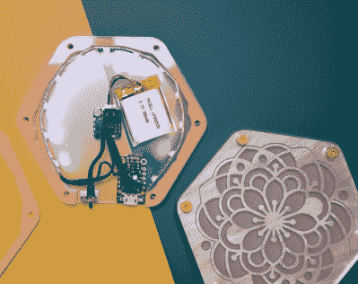

# 你的杯子会喜欢这个发光的杯垫

> 原文：<https://hackaday.com/2022/09/28/your-mug-will-like-this-glowy-coaster/>

[Charlyn]想突出他们朋友漂亮的杯子系列，于是 [Glowy 杯垫](https://charlyn.codes/glowy-coaster/)诞生了。

杯垫由六层激光切割的丙烯酸树脂制成。顶层和底层由透明的丙烯酸材料切割而成，为杯垫提供了一个平坦的表面。由珍珠丙烯酸制成的顶部图案层下面有一片薄牛皮纸，为夹在里面的 LED 灯条提供漫射。中间层由桃色丙烯酸制成，中间挖空，为内部的电子设备提供空间。正如[Charlyn]所写，顶部的珍珠丙烯酸层赋予杯垫一种“微妙的优雅感”。杯垫本身在六角的每一点都由一个 M3 螺钉拧在一起，该螺钉穿过[热定形嵌件](https://hackaday.com/2019/02/28/threading-3d-printed-parts-how-to-use-heat-set-inserts/)。

电子设备由一个短的新像素带组成，切割成包括 12 个指向杯垫中心的 led。led 由一个 Trinket M0 微控制器驱动，该微控制器带有一个 LiPo“背包”来提供电源、外露电源开关的连接点以及对 110 mAh 3.7 V 电池的充电能力。代码是一个稍微修改的新像素“彩虹”轮环(来源可作为[要点](https://gist.github.com/chardane/874d2597a331d23fbd6e592e95c50aa9))。设计文件可通过 [Thingiverse](https://www.thingiverse.com/thing:5209442) 获得。

像这样的创作凸显了在一个极不美观的项目中投入了多少关怀和工作，其中的决定，如丙烯酸树脂的不透明度和厚度，或 M3 螺丝的埋头孔，会对整体美学产生巨大的影响。[Charlyn]注重细节，为项目带来了额外的专业和润色。

杯垫是激光切割的最爱，我们已经报道了许多不同类型的杯垫，包括
[杯垫机器人](https://hackaday.com/2017/12/28/coasty-the-coaster-toaster/)、[杯垫雕刻师](https://hackaday.com/2017/05/22/evezor-robotic-arm-engraves-400-coasters/)，甚至还有一个变色、饮料感应[杯垫](https://hackaday.com/2012/03/15/color-changing-coaster-has-a-built-in-drink-detector/)。

[https://player.vimeo.com/video/668484571?h=d998e4947a&dnt=1&app_id=122963](https://player.vimeo.com/video/668484571?h=d998e4947a&dnt=1&app_id=122963)