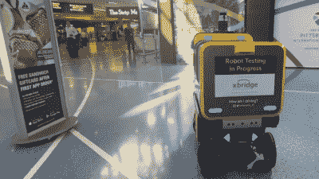

# 你的下一顿机场餐可能会由机器人送来

> 原文：<https://hackaday.com/2022/12/23/your-next-airport-meal-may-be-delivered-by-robot/>

机器人送货长期以来一直被吹捧为未来改变游戏规则的技术。然而，它仍然没有破解大的时间。无人驾驶飞机仍然不会偶然向我们的排水沟空投包裹，我们的披萨也不会通过无人驾驶汽车带给我们。

这并不是说有能力的人不去解决这个问题。在一个案例中，一组工程师正在研究一个机器人，它将承担在机场给饥饿的乘客送食物的重要任务。

## 玉米饼到 37 号门，快点！

在机场吃饭可能有点冒险。座位通常是有限的，每天都有成千上万的人通过。即使你很早就到了机场，你可能也很难找到地方坐下来吃饭。如果去得太晚，或者安检线太差，你可能就没有时间在走到登机口前点餐了。机场通常都很大，很杂乱，你想要的餐厅可能就在你登机的对面。

机器人送货可能会通过在登机口直接给乘客送食物来解决这些问题。机器人初创公司 Ottonomy 与辛辛那提/北肯塔基机场合作，着手解决这个问题。

在机场杂乱的室内环境中，GPS 和其他卫星星座根本无法用于导航。相反，Ottonomy 的 Ottobot 依靠[激光雷达](https://hackaday.com/2022/11/22/spoofing-lidar-could-blind-autonomous-vehicles-to-obstacles/)、摄像机和超声波传感器来探测障碍物并在周围环境中寻找道路。该公司开发了用于绘制室内环境地图的专有软件，以便为机器人提供必要的 3D 地图，让它们在工作空间里四处走动。

 [https://www.youtube.com/embed/oKER8Fz1nr0?version=3&rel=1&showsearch=0&showinfo=1&iv_load_policy=1&fs=1&hl=en-US&autohide=2&wmode=transparent](https://www.youtube.com/embed/oKER8Fz1nr0?version=3&rel=1&showsearch=0&showinfo=1&iv_load_policy=1&fs=1&hl=en-US&autohide=2&wmode=transparent)

机场会变得异常拥挤，早期，团队发现在这种情况下导航是困难的。这导致了 Ottobot 目前的配置，其中每个车轮都是电动的，能够转向。这使得机器人可以侧向移动，执行零半径转弯，或者在拐角处急转弯，这两种方式都有助于避开狭窄的空间。动力传动系统的灵感来自电动轮椅。就像电动轮椅一样，Ottobot 有时需要急转弯和应对肿块、颠簸和路缘石的能力。

机器人上的几个隔间用来存放顾客可能订购的各种物品。正如在食品配送中变得普遍的那样，这将允许例如冷饮和热食的必要分离。Ottobot 还能够提升和降低其行驶高度。这似乎是一个奇怪的功能，但它有助于机器人服务于更大范围的客户。机器人可以降低自己，让孩子拿起订单，或者升高自己，帮助不容易弯腰的顾客。值得注意的是，该公司保持了机舱设计的模块化，以便最终用户可以定制它，以适应不同的交付角色。

就像人类建造的大多数自主系统一样，总有出错的风险。如果一个 Ottobot 不知道它在哪里或要去哪里，工作人员可以接管控制，让机器人摆脱困境。如果机器人发现自己处于意想不到的情况下，这个功能特别有用。这些机器人还有一个特点是“我是如何驾驶的？”背面有标签，邀请对机器人性能的反馈。

Having a “How am I driving? sticker on the robots is good for accountability, and can help ease public concerns around potential safety issues. *Credit: Screenshot, [Ottonomy IO – YouTube](https://www.youtube.com/watch?v=oKER8Fz1nr0)*

订单流程依赖于一款名为 Crave 的应用。顾客可以在门口或餐厅扫描二维码，然后通过应用程序下单。客户不需要输入他们的家庭地址，而是在机场提供他们想要的送货地点，比如登机口号码。当食物准备好了，它就被餐馆装进机器人里，然后机器人就去找顾客了。根据 Ottonomy 的说法，零售小吃的订单最快可以在 10 分钟内送达，餐厅新鲜制作的订单则需要 20 到 25 分钟。

这些机器人正在几个地方进行测试，罗马机场的试点项目是未来各种部署的一部分。这些机器人最近也在匹兹堡国际机场进行了测试，乘客们可以得到一杯免费饮料来帮助测试这个系统。

Ottonomy 显然不是机器人送货领域的唯一一家公司。我们之前见过的其他著名竞争对手包括 Neubility、LG 和 Baemin。有趣的是，这些公司中有许多都采用了类似的设计。这些机器人通常具有相同类型的传感器包、驱动系统和总体布局。绝大多数类似于轮子上的冷却器，其设计具有很高的机动性，可以应对常规的城市地形。当你的竞争对手已经提出了类似的解决方案，这可能是一个信号，表明你的方向是正确的。

 [https://www.youtube.com/embed/knYMcZfIA6Q?version=3&rel=1&showsearch=0&showinfo=1&iv_load_policy=1&fs=1&hl=en-US&autohide=2&wmode=transparent](https://www.youtube.com/embed/knYMcZfIA6Q?version=3&rel=1&showsearch=0&showinfo=1&iv_load_policy=1&fs=1&hl=en-US&autohide=2&wmode=transparent)

总体而言，对于机器人初创公司来说，机场送餐似乎是一个可以实现的挑战。在相对受控的空间，如机场，风险很低。有了正确的包装选择，强效咖喱的味道应该不会污染其他顾客的沙拉。一个供客户报告问题的集成系统应该允许任何脏乱的机器人在发生泄漏时随时被送回清洗。

一个有足够传感器的慢速机器人不会碾过人，从 A 点到 b 点运送一些食物应该不会有太大的问题。也许最有可能的问题是，当客流量最大时，机器人将无法处理机场周围的导航。在这种情况下，拥挤的人流会减慢运输速度，这也是需求最大的时候。当然，从 B 点回到 A 点的时间也必须计入每次交付。

在极端情况下，如果机器人变得完全无法移动，它们可能会成为匆忙乘客的令人沮丧的路障。对机器人送货系统进行压力测试是理想的，但很难想象任何人工测试能达到洛杉矶国际机场感恩节周末的混乱程度。

无论如何，随着技术的成熟和问题的解决，机器人送货似乎会逐渐变得更加普遍。熟悉你的机器人送货伙伴，并保持友好，以免他们通过使用激光雷达找到一个特别粗糙的路面来故意刁难你！