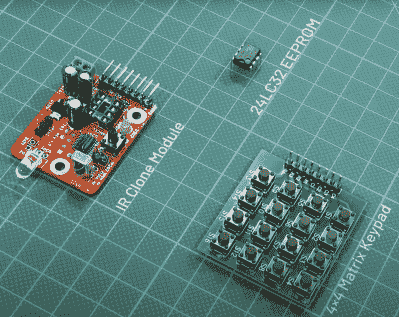

# 你自己的家庭红外克隆

> 原文：<https://hackaday.com/2022/10/03/your-own-home-ir-cloner/>

许多设备使用红外(IR)作为信号媒介，例如 RGB LED 条形控制器
模块和一些电视控制器。通常，这些信号并不意味着安全应用，这意味着可以通过简单地逐字重放接收到的信号来再现功能。有时，有进取心的黑客想要对红外信号进行逆向工程，也许是为了自动化一些任务，或者只是为了更好地了解我们日常生活中使用的电子设备。为了帮助这项工作，[迪尔山]创造了一个开源硬件[红外克隆器](http://jayakody2000lk.blogspot.com/2022/02/infrared-remote-control-clone-utility.html)设备，能够探听红外信号并转发它们。

红外克隆是一个可爱的小红外工具，可用于研究各种红外信号。
除了[源代码和设计文件](https://github.com/dilshan/ir-clone)，【迪尔山】还精心制作了详细的[文档](https://github.com/dilshan/ir-clone/wiki)，作为组装和使用视频的附录。

IR cloner 本身是一个 41 毫米乘 31 毫米的电路板，具有混合的表面贴装和通孔组件。该器件有一个 LD271 IR LED，可在 880 纳米至 950 纳米范围内发射，还有一个 TSOP181 IR 接收器，可在相同范围内接收。STM8S003F3 微控制器是该器件的核心。根据跳线、接线和电池连接，该设备可以采用 3V 或 5V 至 9V 的外部电池组。该板有一个 8 引脚 DIP，用于容纳 24LC32 32kbit EEPROM。接头引脚可连接到 4×4 按钮矩阵，用于控制装置。

主工作流程看起来是用 4×4 按钮矩阵设置功能模式，EEPROM 用作存储器。信号可以在接收后直接重放，也可以通过移除 EEPROM 并下载保存的信号数据进行更深入的分析。[dilshan]建议使用类似基于 CH341A 的编程器从 EEPROM 读取存储值。

拥有红外克隆器将是一个完美的工具，不仅可以帮助逆向工程类似于 [PixMob 可穿戴 LED 腕带](https://hackaday.com/2019/11/26/pixmob-led-wristband-teardown-plus-ir-emitters-and-how-to-spot-them/)或[宜家 LED 灯](https://hackaday.com/2022/06/18/ikea-led-lamp-gets-hacked-for-night-light-duty/)的东西，还可以自己使用和破解它们。

 [https://www.youtube.com/embed/PBt0_21yzKo?version=3&rel=1&showsearch=0&showinfo=1&iv_load_policy=1&fs=1&hl=en-US&autohide=2&wmode=transparent](https://www.youtube.com/embed/PBt0_21yzKo?version=3&rel=1&showsearch=0&showinfo=1&iv_load_policy=1&fs=1&hl=en-US&autohide=2&wmode=transparent)

