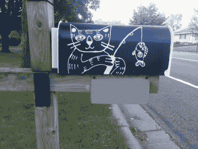

# 你有邮件吗？

> 原文：<https://hackaday.com/2019/11/30/youve-got-mail/>

生活中充满了艰难的决定，比如决定是否要去车道的尽头查看邮件是否已经到达。这些问题在冬季变得更加困难，但是[Catpin]有一个解决方案。邮箱警报使用一个电动 Imp、一个太阳能电池板和一个接近传感器来让你知道你是否收到了邮件。

 这是一个整洁的建筑，由那个[电动小鬼](https://www.electricimp.com/)提供大脑来处理大部分的重物。它每五分钟唤醒一次，检查小型接近传感器的状态是否发生变化。如果有，它会 pings 一个网站。这个单元位于邮箱的底部，所以如果你的友好的邻居邮递员放入了任何信件，它将会改变。Imp 由一个小电池供电，电池由太阳能电池板充电。这意味着它不需要任何电源线或其他布线，只要它在 WiFi 的范围内。加上 15 个小时的夜间深度睡眠，[Catpin]发现整个事情可以由一对夫妇的 18650 脂电池运行。

也许这篇文章最有趣的部分是讨论他在构建中发现的问题，例如 LiPo 电池在威斯康星州的冬天不会表现得那么好。因此，它被磷酸铁锂电池所取代，这种电池应该能更好地抵御寒冷。如果需要，还有一篇关于如何使用 ESP8266 创建相同项目的文章。